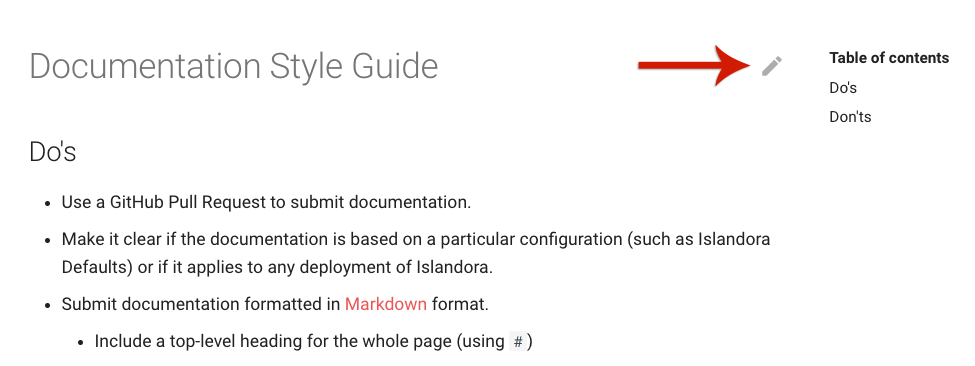
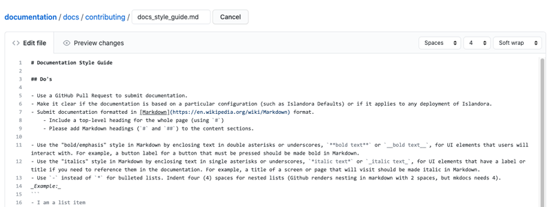
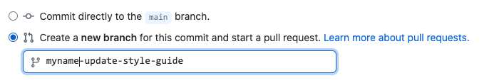

# Editing Documentation

## Overview
These documentation pages are written and maintained by volunteers from the Islandora community, and new contributions are always welcomed. The documentation that you see here is formatted in the easy to use [MarkDown](http://en.wikipedia.org/wiki/Markdown) markup language, which can add formatting such as links, headings, and bolded text. Then the documentation HTML site is built using [mkdocs](https://www.mkdocs.org/) from the MarkDown files hosted in the Islandora [documentation](https://github.com/Islandora/documentation) GitHub repo. This documentation is rebuilt automatically upon changes being committed to GitHub, so you will see changes reflected here within a few minutes of making an edit.

The [Islandora Documentation Interest Group](https://github.com/islandora-interest-groups/Islandora-Documentation-Interest-Group) holds regular meetings to discuss how to improve and expand Islandora's documentation. If you are interested in becoming involved, all are welcome to join. If you just want to make a contribution to the existing documentation, that process is outlined here.

## Before you start

To edit documentation in Islandora, you must:

- have a [GitHub](https://github.com/) account.
    - NOTE: Github accounts are free and only require a valid email address.
- have a very basic familiarity with GitHub terms such as [fork](https://guides.github.com/activities/forking/), [branch](https://guides.github.com/activities/hello-world/#branch), and [pull request](https://guides.github.com/activities/hello-world/#pr).
- be a member of the Islandora [GitHub Organization](https://github.com/orgs/Islandora/people).
    - This is only needed if you want to commit changes directly to the documentation. Non-members may still make pull requests. To request an invite, email community@islandora.ca or ask on the Islandora Slack.
- have a basic familiarity with [Markdown](http://en.wikipedia.org/wiki/Markdown), or a good [MarkDown cheat sheet](https://github.com/adam-p/markdown-here/wiki/Markdown-Cheatsheet).
    - for example, you may use MarkDown syntax to create links and section headings.
- follow the [Islandora Documentation Style Guide](docs_style_guide.md).
- have either an individual [Contributor License Agreement](https://github.com/Islandora/islandora/wiki/Contributor-License-Agreements) (CLA) on file with the Islandora Foundation, or work for an organization that has a corporate Contributor License Agreement on file with the Islandora Foundation.
    - for information on how to fill out and submit a Contributor License Agreement (CLA) for yourself and/or your organization visit the [License Agreements](https://islandora.github.io/documentation/contributing/CONTRIBUTING/#license-agreements) section of the "How to contribute" documentation page.

## How to edit documentation using a web browser

- Starting from the page you want to edit on a web browser, look for the pencil icon in the top righthand corner of the page and click on it

- You will be taken to GitHub. If you are not logged in, you will be prompted to log in or register for an account. If you are logged in, you will be taken to an in-browser editor where you will view the page in markdown.

- Make your changes directly in the browser editor, then scroll to the bottom to "commit" your changes. This is the equivalent of saving.

If you are _not_ a member of the Islandora GitHub organization, GitHub will create a new _fork_ of the documentation repository in your GitHub account. From there you can make a pull request to have your changes sent back to the main Islandora documentation repo to be reviewed and accepted.

If you _are_ a member of the Islandora GitHub organization, you will be able to create a new temporary branch within the main Islandora documentation repo, and then create a pull request by selecting _Create a new branch for this commit and start a pull request_. Give your branch a brief name starting with your username, with no spaces, indicating what it is for. Then click **Commit changes**.

- You will be taken to the [pull request template](https://github.com/Islandora/documentation/blob/main/.github/PULL_REQUEST_TEMPLATE.md) which will prompt you to fill out some basic information about what you have changed, and why. Replace all relevant instances of _Replace this text_ with your own text.
    - You will have the option to tag _Interested Parties_, or people you would like to review your work, by writing in their GitHub account name after the `@` symbol. If you don't have anyone specific in mind, you may tag `@Islandora/8-x-committers` to alert all Islandora 8 Committers that there is a new pull request for their review.

- When you have completed the template, submit your changes for review by clicking **Create pull request**.

- Once your pull request has been made, it will go into the [pull request queue](https://github.com/Islandora/documentation/pulls) and anyone tagged in the request will receive a notification. Any member of the Islandora GitHub organization can review and merge your pull request, committing your changes to the documentation, with a few exceptions:

    - Your pull request should not be merged by you.
    - Your pull request should not be merged by anyone who contributed to it (i.e, if some one collaborated with you on writing the changes, that person cannot merge those changes).
    - Your pull request should not be merged by anyone who works at the same organization as you.

Once your changes are committed, these documentation pages will be rebuilt to reflect your changes within a few minutes.

!!! note "For very minor changes"
    For members of the Islandora GitHub organization (i.e., those with _write_ access to the documentation repo): If the change you made was very small, such as a formatting or spelling correction that does not change the semantics of the document, you may push your changes into the documentation immediately by selecting _commit directly to the `main` branch_ and clicking **Commit changes**.

## How to edit documentation using Git on your computer

!!! warning
    These steps are for more advanced users that are familiar with using the Git source control software, which is different from just using the GitHub website with a web browser.

- For information on how to submit your Git software based changes see the [Contribute code](https://islandora.github.io/documentation/contributing/CONTRIBUTING/) and [Create a pull request](https://islandora.github.io/documentation/contributing/CONTRIBUTING/#create-a-pull-request) sections of the "How to contribute" page of the Islandora documentation.
