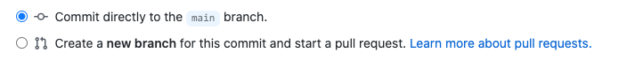

# Editing Documentation

## Overview
These documentation pages are written and maintained by volunteers from the Islandora community, and new contributions are always welcomed. The documentation that you see here is built using [mkdocs](https://www.mkdocs.org/) from files hosted in the Islandora [documentation](https://github.com/Islandora/documentation) GitHub repo. This documentation is rebuilt automatically upon change being committed to GitHub, so you will see changes reflected here within a few minutes of making an edit.

The [Islandora Documentation Interest Group](https://github.com/islandora-interest-groups/Islandora-Documentation-Interest-Group) holds regular meetings to discuss how to improve and expand Islandora's documentation. If you are interested in becoming involved, all are welcome to join. If you just want to make a quick contribution to the existing documentation, that process is outlined here. 

## Before you start

To edit documentation in Islandora, you must:

- have a GitHub account.
- be a member of the Islandora [GitHub Organization](https://github.com/orgs/Islandora/people).
    - This is only needed if you want to commit changes directly to the documentation. Non-members may still make pull requests. To request an invite, email community@islandora.ca or ask on the Islandora Slack. 
- have a basic familiarity with markdown, or a good [cheat sheet](https://github.com/adam-p/markdown-here/wiki/Markdown-Cheatsheet)
- follow the [Documentation Style Guide](docs_style_guide.md)

## How to edit this documentation

- Starting from the page you want to edit, look for the pencil icon in the top righthand corner of the page and click on it

- You will be taken to GitHub. If you are not logged in, you will be prompted to log in or register for an account. If you are logged in, you will be taken to an in-browser editor where you will view the page in markdown.

- Make your changes directly in the browser editor, then scroll to the bottom to "commit" your changes. This is the equivalent of saving.

For the next step, you have two choices:

- **Option 1: Small Changes**: If the change you made was very small, and wording and semantics are left untouched, such as a formatting or typo correction, you may push your changes into the documentation immediately by selecting _commit directly to the `main` branch_ and clicking **Commit changes**. 

- **Option 2: Substantial Changes**: If the change you made is more substantial, and involves new wording, significant formatting changes, or other changes that you would prefer to have reviewed by someone else, create a new temporary branch and pull request by selecting _Create a new branch for this commit and start a pull request_. Give your branch a brief name starting with your username, with no spaces, indicating what it is for. Then click **Commit changes**.

 
- You will be taken to the [pull request template](https://github.com/Islandora/documentation/blob/main/.github/PULL_REQUEST_TEMPLATE.md) which will prompt you to fill out some basic information about what you have changed, and why. Replace all relevant instances of _Replace this text_ with your own text.
    - You will have the option to tag _Interested Parties_, or people you would like to review your work, by writing in their GitHub account name after the `@` symbol. If you don't have anyone specific in mind, you may tag `@Islandora/8-x-committers` to alert all Islandora 8 Committers that there is a new pull request for their review. 

- When you have completed the template, submit your changes for review by clicking **Create pull request**.

Once your pull request has been made, it will go into the [pull request queue](https://github.com/Islandora/documentation/pulls) and anyone tagged in the request will receive a notification. Any member of the Islandora GitHub organization can review and merge your pull request, committing your changes to the documentation. Once your changes are committed, these pages will be rebuild to reflect those changes within a few minutes.
