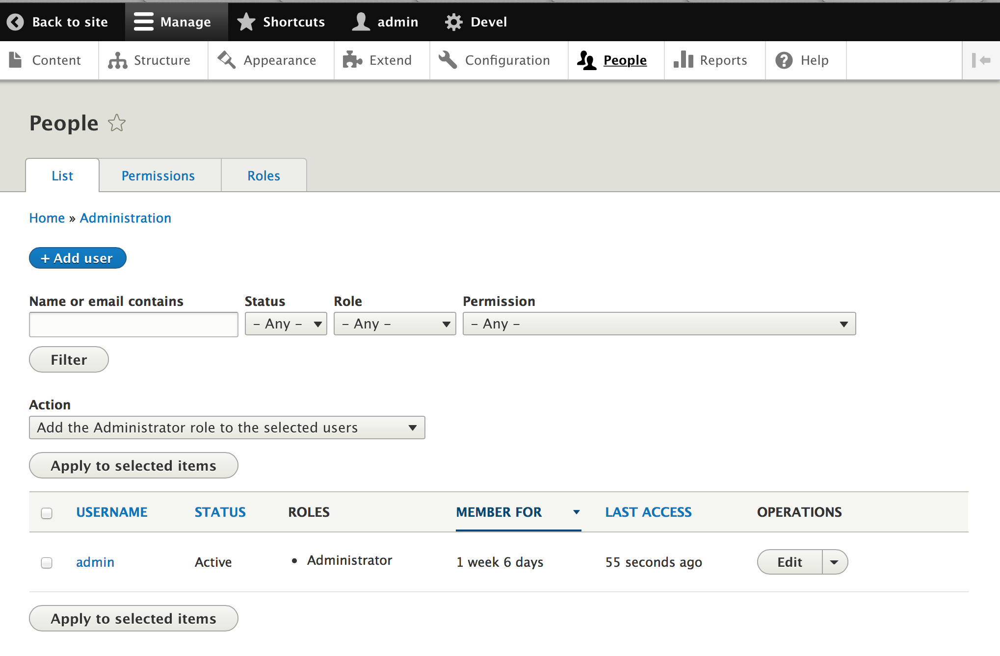
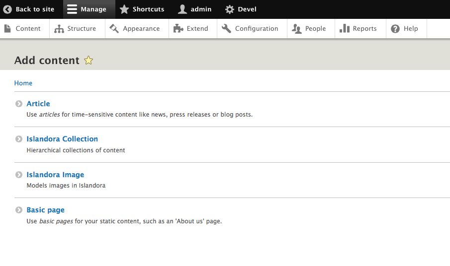

# Getting Started with Islandora CLAW

## How to Add a User
1. Log in under admin credentials.
2. Click the **Manage** tab from the top toolbar.
3. Select **People** tab from the resulting menu.

4. Enter all required fields, as indicated by red asterisks, in the *Add User* page.
5. Click on the **Create New Account** button at the bottom of the page.
6. To review/edit the permission for each role, click the **Permissions** tab in the set of tabs above the *Add User* button.

## How to Create a New User Role
1. Click the **Manage** tab from the top toolbar.
2. Select **People** tab from the resulting menu.
3. Click the **Roles** tab in the set of tabs above the *Add User* button.
4. Click the **Add role** button.

5. Name the role in a way that it can be disambiguated from related activities or similar groups
    * I.e. use the course code for a particular class of students working on a particular collection.
6. Click the **Save** button.
7. To edit the permissions for a role, click on the **Edit** dropdown menu to the right of the role and select **Edit Permissions**.
8. Scroll down until you see the *Node* section of options, then look for the options that have an *Islandora* prefix. For example, *Islandora Collection: Create new content*.

## Administrative Tasks

### How to Create a Collection
1. Click the **Manage** tab from the top toolbar.
2. Select **Content** tab from the resulting menu.

3. Click on **Add content** button. This will load the *Add content* page.

4. Click on **Islandora Collection** link. This will load the *Create Islandora Collection* page.
5. Fill out form fields. Enter all required fields, as indicated by red asterisks.
    * Title
    * Member of: Parent collection
        * This field will auto-populate
    * Description
    * Revision log message

6. Click the **Save and publish** button.

### How to Add an Item to a Collection
1. Click the **Manage** tab from the top toolbar.
2. Select **Content** tab from the resulting menu.

3. Click on **Add content** button. This will load the *Add content* page.

4. Click on **Islandora Image** link. This will load the *Create Islandora Image* page.
5. Fill out form fields. Enter all required fields, as indicated by red asterisks. [NOTE: currently the generation of image derivatives is not supported.]
    * Title
    * Description
    * Member of: Parent collection
        * This field will auto-populate
    * OBJ
    * JP2
    * MEDIUM_SIZE [NOTE: for now, just use this option to upload an object]
        * Click on "Add new media" button.
        * You must create some alternative text for the object.
        * Click "Create Media" button.
    * TN (Thumbnail)
    * Revision log message

7. Click the **Save and publish** button.
    * Once you upload a file, you can Edit or Remove it.

