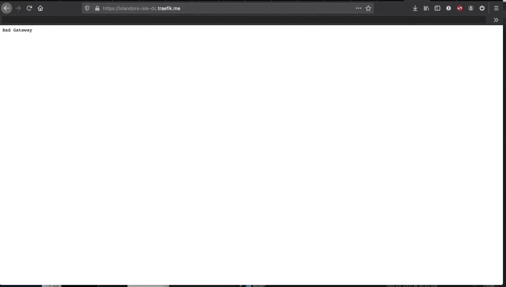

# Install Islandora on Docker (ISLE)

## Overview

This page describes using ISLE-DC to launch Islandora as a suite of Docker Containers (ISLE). This is an alternative to the [Islandora Ansible Playbook](playbook.md), which creates the Islandora stack on a single virtual machine. At the end of this tutorial, you will have a local development environment, and be able to use Docker to launch, shut down, and edit your environment.

### What is ISLE?

ISLE, or ISLandora Enterprise, is a community initiative to ease the installation and maintenance of Islandora by using Docker. It was an initiative of the Islandora Collaboration Group, first using Islandora 7.x, and later with Islandora 8.x. The code for the Islandora Enterprise 8 Prototype (ISLE 8, sometimes just ISLE) is now under the purview of the Islandora Foundation. ISLE may also refer to the [ISLE system for Islandora 7](https://islandora-collaboration-group.github.io/ISLE/).

### Why use Docker?

[Docker](https://www.docker.com/) is a way to separate out the "state" of your site (i.e. all the content, files, and configurations that you've entered) from the underlying software that runs it (e.g. webserver, database engine, etc). This allows for easier upgrades, faster development, and more flexible deployment.

### Where is ISLE 8?

ISLE 8 is a suite of Docker containers that run the various components of Islandora required by Islandora Defaults: drupal, fedora, solr, alpaca, crayfish, matomo, etc.  The individual containers are created (and automatically pushed to Docker Hub) by [ISLE BuildKit](https://github.com/Islandora-Devops/isle-buildkit).

### How do I install ISLE?

Install ISLE locally or remotely using the Docker Compose scripts (ISLE-DC) at ([Islandora-Devops/isle-dc](https://github.com/Islandora-Devops/isle-dc)). These are instructions to pull down and configure the necessary containers from Docker Hub. Unlike the [Islandora Playbook](playbook.md), this method does not require Ansible, or (for local installations) VirtualBox. Like the Playbook, it has been optimized for development environments but in theory could be used in production.

These instructions describe using ISLE-DC locally to create a development Islandora sandbox. More detailed configuration options are described in the project's [README](https://github.com/Islandora-Devops/isle-dc).


## Requirements

- A computer that can run Docker (version 19.x+) and has at least 8GB of RAM (ideally 16GB)
- An administrator account
- (Mac OS) Apple Developer Tools
- (Windows) The following setup has been tested:
    - Windows 10
    - [Windows Subsystem for Linux v. 2 (WSL 2)](https://docs.microsoft.com/en-us/windows/wsl/install-win10)
    - Ubuntu 20.04 running on WSL 2
    - GNU make, run `sudo apt update` and `sudo apt install make` to install
    - Docker Desktop for Windows, using the WSL 2 based engine (Settings > General) and with the WSL integration active for Ubuntu (Settings > Resources > WSL integration) 
- If using `make local`, see the [README](https://github.com/Islandora-Devops/isle-dc) for other requirements.


!!! Note "What are we missing?"
    Are you, or your computer, new to spinning up development sandboxes? Do you have wisdom about installing make on Windows? We suspect these requirements may be incomplete and your experience would be appreciated at [Issue #1640](https://github.com/Islandora/documentation/issues/1640).


## Installing Docker

To see if you have Docker installed, type `docker --version` in a terminal.

If you need to install Docker, we recommend using the application [Docker Desktop](https://www.docker.com/products/docker-desktop). It provides a GUI for managing Docker container in Windows and MacOS, along with the Docker engine and suite of command-line tools. Linux users don't get a desktop client, but can download the Engine and command-line tools from that same link.

There is also a legacy project called [Docker Toolbox](https://docs.docker.com/toolbox/overview/) which may be of interest if your machine cannot run Docker Desktop, or if you already have it installed.

[Download Docker](https://www.docker.com/products/docker-desktop)

!!! Warning "Memory, Processors, and Swap Requirements"
    To run ISLE on Docker Desktop, you must increase the resources allocated to the software. See Docker docs on [setting resources on Windows](https://docs.docker.com/docker-for-windows/#resources) (see note on how to allocate/restrict memory when using WSL 2) or [setting resources on Mac](https://docs.docker.com/docker-for-mac/#resources).

    **CPUs (processors)**: The CPUs allowed to Docker Desktop are still shared with the host machine, so increasing this to the maximum value should allow both the Docker containers and your host machine to run simultaneously.

    **Memory (RAM)**: This memory is completely dedicated to Docker while Docker Desktop is running, so do not allocate more than you can spare and still run your host machine. Windows users may not require as much memory for Docker as Mac users. Current suggestions for memory allocated to Docker Desktop are below, but please edit this document if you have new information.

    - Sandbox (`make demo`): 4GB
    - Development (`make local`): 8GB
    - Production or production-like development: 16GB

    **Swap**: Swap space is space borrowed from your hard disk drive to serve as makeshift RAM as needed. If you cannot provide as much RAM as you would like, increase this as is reasonable given your free disk space.

## Launching Islandora with Docker

**Summary:** Using git, clone the isle-dc project. In that directory, enter the command `make demo` to build the docker infrastructure and a demo site.  Then use the command `docker-compose up -d` to start the containers.

!!! hint "ISLE-DC variants: `make demo` vs `make local`"
    The `make demo` command alone will spin up a sandbox-like version of ISLE, but only with a front end. The code files will be inaccessible, and you will not be able to install additional modules or themes. The `make local` command creates a full-fleged development environment. It will copy the active Drupal codebase locally in a way that is also live to the ISLE site. This method takes longer (and may require multiple retries if your internet connection is spotty) but is required if you will be testing pull requests or writing code. The `make` command alone will build the infrastructure but not install anything (including Drupal!).

```bash
git clone https://github.com/islandora-devops/isle-dc
cd isle-dc
make demo
```


Results of `make demo`:
```
isle-dc$ make demo
  % Total    % Received % Xferd  Average Speed   Time    Time     Time  Current
                                 Dload  Upload   Total   Spent    Left  Speed
100  3562  100  3562    0     0  12779      0 --:--:-- --:--:-- --:--:-- 12812
  % Total    % Received % Xferd  Average Speed   Time    Time     Time  Current
                                 Dload  Upload   Total   Spent    Left  Speed
100  1708  100  1708    0     0   6809      0 --:--:-- --:--:-- --:--:--  6832
docker-compose pull
Pulling activemq   ... done
Pulling alpaca     ... done
Pulling blazegraph ... done
Pulling cantaloupe ... done
Pulling fcrepo     ... done
Pulling fits       ... done
Pulling crayfits   ... done
Pulling gemini     ... done
Pulling homarus    ... done
Pulling houdini    ... done
Pulling hypercube  ... done
Pulling mariadb    ... done
Pulling matomo     ... done
Pulling milliner   ... done
Pulling recast     ... done
Pulling solr       ... done
Pulling drupal     ... done
Pulling traefik    ... done
Pulling watchtower ... done
```

!!! Fail "Troubleshooting - make command not found"
    If you get the error `bash: make: command not found` then you need to install GNU make. Run `sudo apt update` and `sudo apt install make` to install.

!!! Fail "Troubleshooting - Docker Versions"
    If you get an error such as: `ERROR: Version in "./docker-compose.activemq.yml" is unsupported.`, then you need to upgrade Docker. Enter the command `make clean` before re-attempting to `make demo`.

!!! Fail "Troubleshooting - re-attempting `make demo`"
    If `make` fails for any reason, enter `make clean` before attempting to `make` again. If not, you may see an error such as: `ERROR: Top level object in './docker-compose.yml' needs to be an object not '<class 'NoneType'>'.`

!!! Fail "Troubleshooting - docker containers exit without warning"
    If you notice some Docker containers drop (exited(0)), and (in Docker Desktop) the isle-dc app icon is yellow instead of green, try increasing the resources allocated to Docker (see note above).

!!! hint "Development version - access the codebase"
    If you used `make local`, then you will have a new directory in the current (isle-dc) directory named `codebase`, containing the live Drupal root folder (containing your Drupal's composer files and the web/ subdirectory).


Once `make demo` has successfully completed, launch the ISLE containers using `docker-compose up`. The `-d` flag allows you to return to using the command line. Without it, your shell will be stuck in the `docker-compose` process as long as the containers are running.


```bash
docker-compose up -d
```

!!! Fail "Troubleshooting - connection timed out (Mac)."
    If you are using Docker Desktop for Mac, and get timeout errors when spinning up the containers (during `docker-compose up -d` or during `make local`) such as this:
    
    ```
    ERROR: for isle-dc_mariadb_1  UnixHTTPConnectionPool(host='localhost', port=None): Read timed out. (read timeout=480)
    ```
    
    you can try quitting Docker completely (make sure there is no whale icon in your top toolbar - may need to select "Quit" from the whale icon itself) and then restart Docker. 

## Visiting your Islandora site

Direct a browser to [https://islandora.traefik.me/](https://islandora.traefik.me/). If your containers are still "spinning up", you will see a white screen with the words "Bad Gateway". This often lasts 2-5 minutes, and should be shorter for subsequent launches. If it takes more than a few minutes, check to make sure that none of your containers have failed to launch (see note above on "Troubleshooting - docker containers exit without warning"). When all containers are ready, you should see a basic Drupal login screen.




To log in:

* username: **admin**
* password: **password**

!!! Note Docker logs and Docker Compose logs
    `docker logs -tf isle-dc_drupal_1` shows Docker logs for the "drupal" container, which will continue to have new log entries as long as the drupal box is still starting up. When it gets to `confd using 'env' backend`, you're done. `docker-compose logs` is like a firehose, showing the log messages from all containers.

## Spinning down your Islandora site

To shut down the containers without destroying your site, use `docker-compose down`. To also destroy your "state" (i.e. your content, your database, your files), use `docker-compose down -v`.

## Editing Code in Docker

If you used `make local` then the drupal root folder is in a new directory in the isle-dc folder named `codebase`. This is live and editable in whatever development environment you would like.  If you just did `make demo`, you will need to spin down your containers with `-v` to destroy your state before starting a new one with `make local`.

Editing code for the back-end processes (alpaca, milliner, etc) is more complicated. Please ask on the #isle Slack channel and help us improve this documentation!

### Testing a Pull Request

Islandora modules in the `codebase/web/contrib/modules` folder are already set up with `git` and the `origin` remote is the canonical Islandora repository. You can follow the command-line instructions for testing pull requests available on Github. When finished, don't forget to `git checkout main` (or the default branch if not named main) so you can pull new code.

## Updating ISLE

Documentation to come - see [Issue #121](https://github.com/Islandora-Devops/isle-dc/issues/121)

### Drupal Updates

to come

### Module Updates (non-Islandora)

to come

### Module Updates (Islandora)

to come

### Backend Providers (solr, mariadb, etc)

to come

### Updating the whole isle-dc repo

to come

