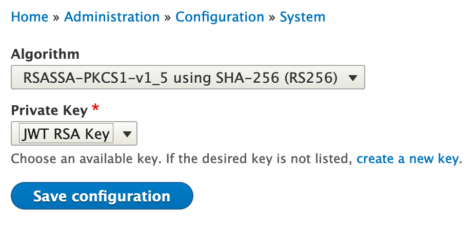
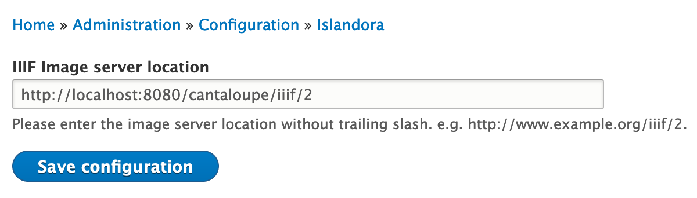
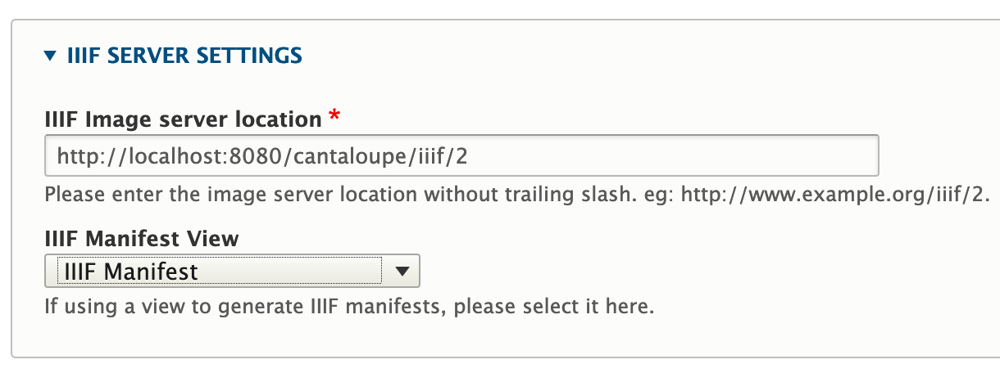

# Configuring Drupal

After all of the above pieces are in place, installed, configured, started, and otherwise prepared, the last thing we need to do is to finally configure the front-end Drupal instance to wire all the installed components together.

## Drupal Pre-Configuration

### `settings.php`

!!! notice
    By default, `settings.php` is read-only for all users. It should be made writable while this pre-configuration is being done, then set back to `444` afterwards.

Some additional settings will need to be established in your default `settings.php` before Drupal-side configuration can occur.

The below configuration will establish `localhost` as a trusted host pattern, but on production sites this will need to be expanded to include the actual host patterns used by the site.

`/opt/drupal/web/sites/default/settings.php`

**Before**:
> 789 |   'driver' => 'pgsql',

> 790 | );

**After**:
```
'driver' => 'pgsql',
);

$settings['trusted_host_patterns'] = [
  'localhost',
];

$settings['flysystem'] = [
 'fedora' => [
 'driver' => 'fedora',
 'config' => [
  'root' => 'http://localhost:8080/fcrepo/rest/',
 ],
],
];
```

Once this is done, refresh the cache to take hold of the new settings.

```bash
cd /opt/drupal
drush -y cr
```

## Islandora

### Downloading Islandora

The Islandora Drupal module contains the core code to create a repository ecosystem in a Drupal environment. It also includes several submodules; of importance to us is `islandora_core_feature`, which contains the key configurations that turn a Drupal site into an Islandora site.

Islandora also provides an [`islandora_defaults`](https://github.com/Islandora/islandora_defaults) module that contains additional configurations considered an appropriate launching point for configuring a site. We're going to first enable the `islandora_defaults` module before doing any wiring on the front-end.

Take note of some of the other comments in the below bash script for an idea of what the other components are expected, and which may be considered optional.

```bash
cd /opt/drupal
# This is a convenience piece that will help speed up most of the rest of our
# process working with Composer and Drupal.
sudo -u www-data composer require zaporylie/composer-drupal-optimizations:^1.0
# Since islandora_defaults is near the bottom of the dependency chain, requiring
# it will get most of the modules and libraries we need to deploy a standard
# Islandora site.
sudo -u www-data composer require islandora/islandora_defaults:dev-8.x-1.x
# These can be considered important or required depending on your site's
# requirements; some of them represent dependencies of Islandora submodules.
sudo -u www-data composer require drupal/pdf:1.x-dev
sudo -u www-data composer require drupal/rest_oai_pmh:^1.0
sudo -u www-data composer require drupal/facets:^1.3
sudo -u www-data composer require drupal/restui:^1.16
sudo -u www-data composer require drupal/rdfui:^1.0-beta1
sudo -u www-data composer require drupal/content_browser:^1.0@alpha
# These tend to be good to enable for a development environment, or just for a
# higher quality of life when managing Islandora. That being said, devel should
# NEVER be enabled on a production environment, as it intentionally gives the
# user tools that compromise the security of a site.
sudo -u www-data composer require drupal/console:~1.0
sudo -u www-data composer require drupal/devel:^2.0
sudo -u www-data composer require drupal/admin_toolbar:^2.0
# Islandora also provides a theme called Carapace designed to work well out of
# the box with an Islandora site.
sudo -u www-data composer require islandora/carapace:dev-8.x-3.x
```

### Enabling Downloaded Components

Components we've now downloaded using `composer require` can be enabled simultaneously via `drush`, which will ensure they are installed in the correct dependent order. Enabling `islandora_defaults` will also ensure all content types and configurations are set up in Islandora. The installation process for all of these modules will likely take some time.

!!! notice
    This list of modules assumes that all of the above components were downloaded using `composer require`; if this is not the case, you may need to pare down this list manually. It also includes `devel`, which again, should not be enabled on production sites.

```bash
cd /opt/drupal
drush -y en rdf responsive_image devel syslog serialization basic_auth rest restui search_api_solr search_api_solr_defaults facets content_browser pdf admin_toolbar islandora_defaults controlled_access_terms_defaults islandora_breadcrumbs islandora_iiif islandora_oaipmh
# If Carapace was downloaded, now is the time to enable and set it as well.
drush -y theme:enable carapace
drush -y config-set system.theme default carapace
# After all of this, rebuild the cache.
drush -y cr
```

### Adding a JWT Configuration to Drupal

To allow our installation to talk to other services via Syn, we need to establish a Drupal-side JWT configuration using the keys we generated at that time.

Log onto your site as an administrator at `/user`, then navigate to `/admin/config/system/keys/add`. Some of the settings here are unimportant, but pay close attention to the **Key type**, which should match the key we created earlier (an RSA key), and the **File location**, which should be the ultimate location of the key we created for Syn on the filesystem, `/opt/keys/syn_private.key`.


Click **Save** to create the key.

Once this key is created, navigate to `/admin/config/system/jwt` to select the key you just created from the list. Note that before the key will show up in the **Private Key** list, you need to select that key's type in the **Algorithm** section, namely `RSASSA-PKCS1-v1_5 using SHA-256 (RS256)`.



Click **Save configuration** to establish this as the JWT key configuration.

### Configuring Islandora

Navigate to the Islandora core configuration page at `/admin/config/islandora/core` to set up the core configuration to connect to Gemini. Of note here, the **Gemini URL** will need to be established to facilitate the connection to Fedora, and the appropriate **Bundles with Gemini URI pseudo field** types will need to be checked off.

!!! notice
    Any other Drupal content types you wish to synchronize with Fedora should also be checked off here.


### Configuring Islandora IIIF

Navigate to `/admin/config/islandora/iiif` to ensure that Islandora IIIF is pointing to our Cantaloupe server.



Next, configure OpenSeadragon by navigating to `/admin/config/media/openseadragon` and ensuring everything is set up properly.



### Establishing Flysystem as the Default Download Method

Navigate to `/admin/config/media/file-system` to set the **Default download method** to the one we created in our `settings.php`.


### Giving the Administrative User the `fedoraAdmin` Role

In order for data to be pushed back to Fedora, the site administrative user needs the `fedoraAdmin` role.

```
cd /opt/drupal
sudo -u www-data drush -y urol "fedoraadmin" islandora
```

### Running Feature Migrations

Finally, to get everything up and running, run the Islandora Core Features and Islandora Defaults migrations.

```bash
cd /opt/drupal
sudo -u www-data drush -y -l localhost --userid=1 mim --group=islandora
```

### Enabling EVA Views

Some views provided by Islandora are not enabled by default.

```bash
cd /opt/drupal
drush -y views:enable display_media
```
