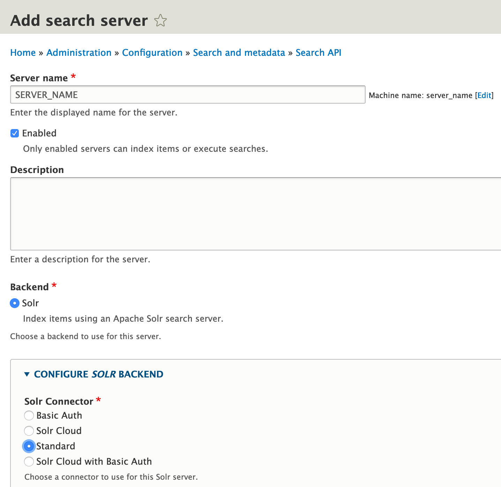
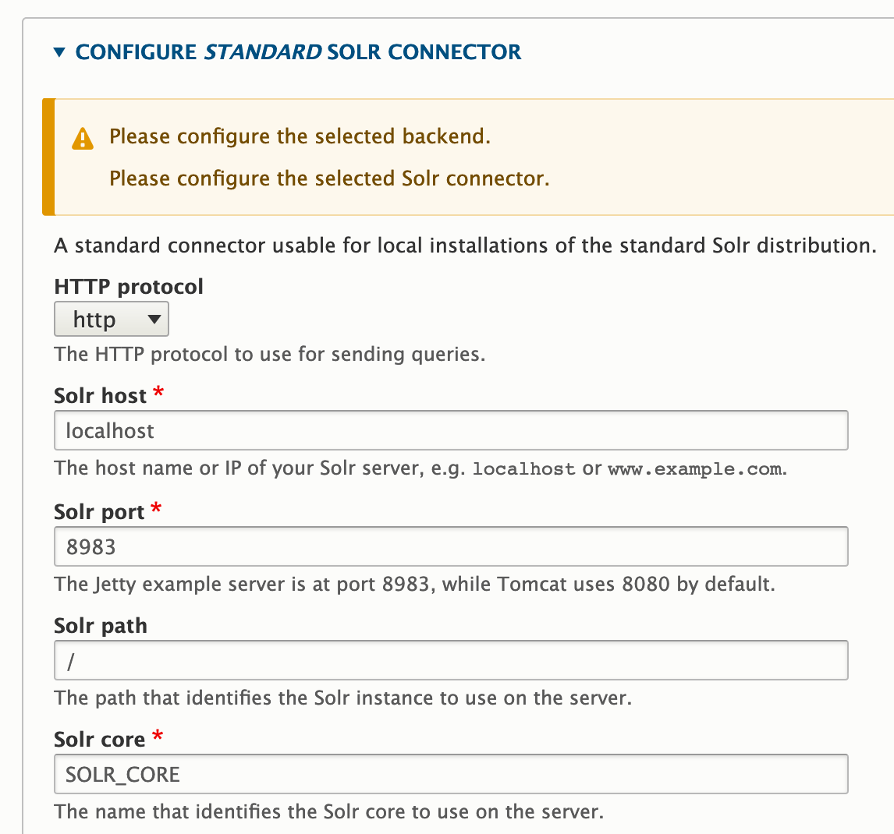
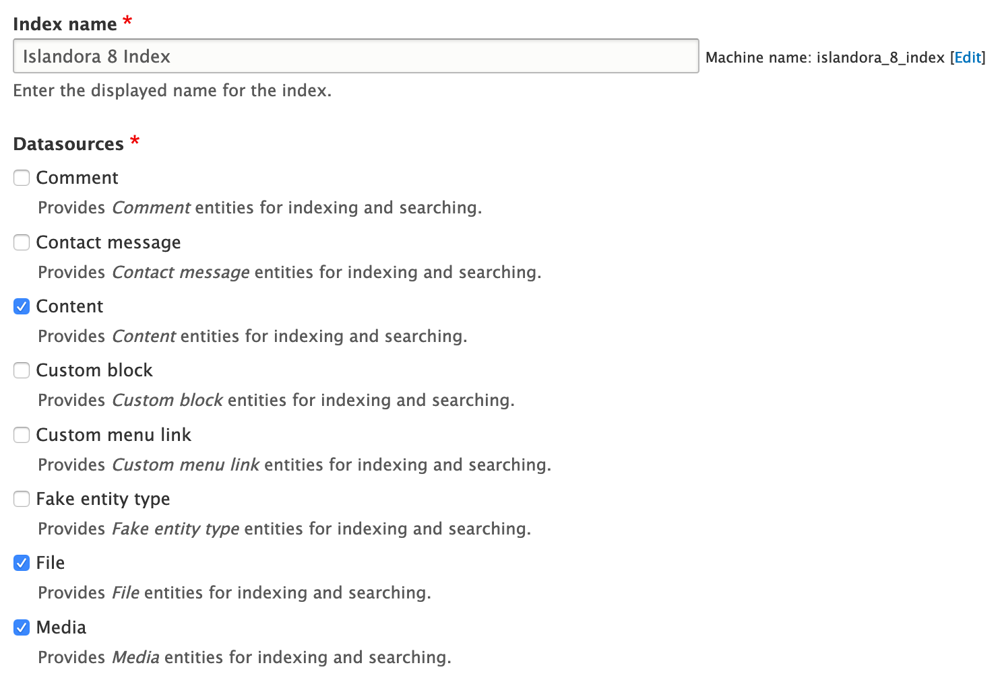

# Installing Solr

## In this section, we will install:
- [Apache Solr 8](https://lucene.apache.org/solr/), the search engine used to index and find Drupal content
- [search_api_solr](https://www.drupal.org/project/search_api_solr), the Solr implementation of Drupal's search API

## Solr 8

### Downloading and Placing Solr

The Solr binaries can be found at the [Solr downloads page](https://lucene.apache.org/solr/downloads.html); the most recent stable release of Solr 8 should be used.

```bash
# While generally we download tarballs as .tar.gz files without version
# information, the Solr installer is a bit particular in that it expects a .tgz
# file with the same name as the extracted folder it contains. It's odd, and we
# can't really get around it.
wget SOLR_DOWNLOAD_LINK
tar -xzvf SOLR_TARBALL
```
- `SOLR_DOWNLOAD_LINK`: This will depend on a few different things, not least of all the current version of Solr. The link to the `.tgz` for the binary on the downloads page will take you to a list of mirrors that Solr can be downloaded from, and provide you with a preferred mirror at the top. This preferred mirror should be used as the `SOLR_DOWNLOAD_LINK`.
- `SOLR_TARBALL`: The filename that was downloaded, e.g., `solr-8.3.0.tgz`

### Running the Solr Installer

Solr includes an installer that does most of the heavy lifting of ensuring we have a Solr user, a location where Solr lives, and configurations in place to ensure it’s running on boot.

```bash
sudo UNTARRED_SOLR_FOLDER/bin/install_solr_service.sh SOLR_TARBALL
```
- `UNTARRED_SOLR_FOLDER`: This will likely simply be `solr-VERSION`, where `VERSION` is the version number that was downloaded.

The port that Solr runs on can potentially be configured at ths point, but we'll expect it to be running on `8983`.

### Increasing the Open File Limit (Optional)

Solr's installation guide recommends that you increase the open file limit so that operations aren't disrupted while Solr is trying to access things in its index. This limit can be increased while the system is running, but doing so won't persist after a reboot. You can hard-increase this limit using your system's `sysctl` file:

`/etc/sysctl.conf`

**Before**:
> 77 | #fs.protected_symlinks=0

**After**:
> 77 | #fs.protected_symlinks=0

> 78 | fs.file-max = 65535

Then apply your new configuration.

```bash
sudo sysctl -p
```

### Creating a New Solr Core

Initially, our new Solr core will contain a configuration copied from the example included with the installation, so that we have something to work with when we configure this on the Drupal side. We’ll later update this with generated configurations we create in Drupal.

```bash
cd /opt/solr
sudo mkdir -p /var/solr/data/SOLR_CORE/conf
sudo cp -r example/files/conf/* /var/solr/data/SOLR_CORE/conf
sudo chown -R solr:solr /var/solr
sudo -u solr bin/solr create -c SOLR_CORE -p 8983
```
- `SOLR_CORE`: `islandora8`

### Installing `search_api_solr`

Rather than use an out-of-the-box configuration that won’t be suitable for our purposes, we’re going to use the Drupal `search_api_solr` module to generate one for us. This will also require us to install the module so we can create these configurations using Drush.

```bash
cd /opt/drupal
sudo -u www-data composer require drupal/search_api_solr:^3.0
drush -y en search_api_solr
```

### Configuring search_api_solr

Before we can create configurations to use with Solr, the core we created earlier needs to be referenced in Drupal.

Log in to the Drupal site at `/user` using the sitewide administrator username and password, then navigate to `/admin/config/search/search-api/add-server`.

Fill out the server addition form using the following options:






- `SERVER_NAME`: `islandora8`
    - This is completely arbitrary, and is simply used to differentiate this search server configuration from all others. **Write down** or otherwise pay attention to the `machine_name` generated next to the server name you type in; this will be used in the next step.

As a recap for this configuration:

- **Server name** should be an arbitrary identifier for this server
- **Enabled** should be checked
- **Backend** should be set to **Solr**
- Under **CONFIGURE SOLR BACKEND**, **Solr Connector** should be set to **Standard**
- Under **CONFIGURE STANDARD SOLR CONNECTOR**:
    - **HTTP protocol** is simply set to **http** since we've set this up on the same machine Drupal lives on. On a production installation, Solr should likely be installed behind an HTTPS connection.
    - **Solr host** can be set to **localhost** since, again, this is set up on the same machine Drupal lives on. On a production installation, this may vary, especially if parts of the installation live on different severs
    - **Solr port** should be set to the port Solr was installed on, which is **8983** by default
    - **Solr path** should be set to the configured path to the instance of Solr; in a default installation, there is only one Solr instance, and it lives at **/**
    - **Solr core** should be the name of the Solr core you created earlier, which is why it's listed as **SOLR_CORE** here
- Under **ADVANCED SERVER CONFIGURATION**, **solr.install.dir** should be set to the path where we installed Solr, which this guide has established at **/opt/solr**

Click **Save** to create the server configuration.

!!! notice
    You can ignore the error about an incompatible Solr schema; we're going to set this up in the next step. In fact, if you refresh the page after restarting Solr in the next step, you should see the error disappear.

### Generating and Applying Solr Configurations

Now that our core is in place and our Drupal-side configurations exist, we’re ready to generate Solr configuration files to connect this site to our search engine.

```bash
cd /opt/drupal
drush solr-gsc SERVER_MACHINE_NAME /opt/drupal/solrconfig.zip
unzip -d ~/solrconfig solrconfig.zip
sudo cp ~/solrconfig/* /var/solr/data/SOLR_CORE/conf
sudo systemctl restart solr
```
- `SERVER_MACHINE_NAME`: This should be the `machine_name` that was automatically generated when creating the configuration in the above step.

### Adding an Index

In order for content to be indexed back into Solr, a search index needs to be added to our server. Navigate to `/admin/config/search/search-api/add-index` and check off the things you'd like to be indexed.

!!! notice
    You should come back here later and reconfigure this after completing the last step in this guide. The default indexing configuration is pretty permissive, and you may want to restrict, for example, indexed content to just Islandora-centric bundles. This guide doesn't set up the index's fields either, which are going to be almost wholly dependent on the needs of your installation. Once you complete that configuration later on, re-index Solr from the configuration page of the index we're creating here.




Click **Save** to add your index and kick off indexing of existing items.
