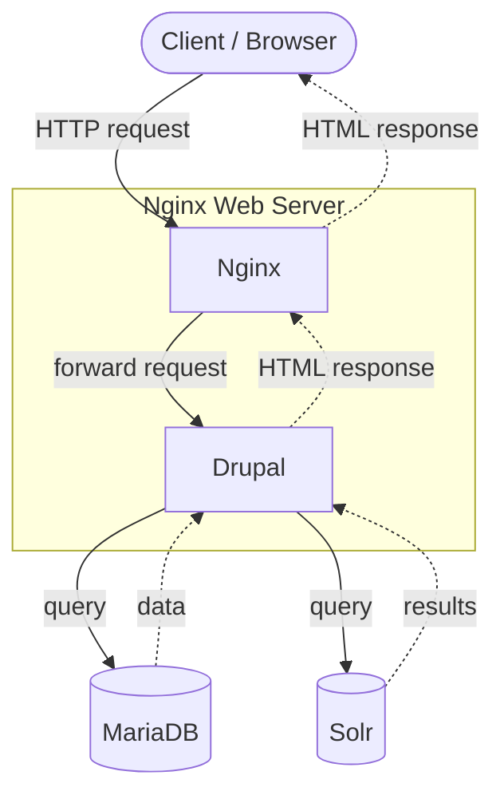
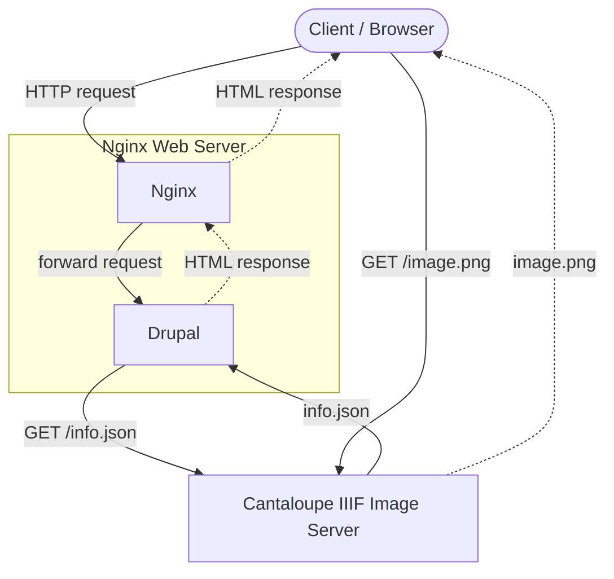
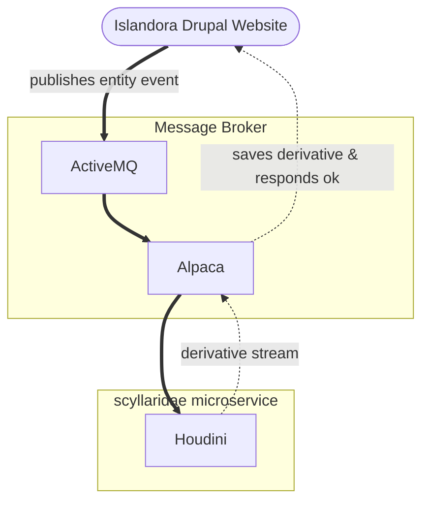

# Islandora Architecture

## Site Serving Path

When a client visits an Islandora website, the request flow looks like a typical [Drupal] request.
The request is received by an nginx web server, which forwards the request to `php-fpm` process that points to a Drupal codebase.
Drupal bootstraps and queries the backend database (Islandora ships with `mariadb`).
If the request was for a search page, Drupal make also query `solr` to include search results in the HTML response.

### IIIF manifests

For some [Resource Node]s in Islandora, the HTML response may include a [IIIF Manifest]. This typically happens when showing items that have image media. For those requests, Islandora's IIIF module may also query the [Cantaloupe] IIIF server for metadata needed to generate a [IIIF Manifest]. The HTML response will then download the images from Cantaloupe to allow a IIIF viewer (e.g. [OpenSeadragon] or [Mirador]) to render the image in the browser.

In addition to [the typical drupal request flow](##site-serving-path), Drupal may also query Cantaloupe for basic image metadata (e.g. width/height) which are needed to complete a valid [IIIF Manifest] response. The client web browser will then read that IIIF Manifest using Javascript and the IIIF viewer will `GET` the images referenced in the IIIF Manifest directly from the IIIF server.

## Event Driven System

When you create, update, or delete Drupal [entities], Drupal emits an event message which is emitted to [ActiveMQ] and put on ActiveMQ's queue.

## Event Example

As an example, when an Islandora Repository manager uploades an image to their Islandora repository, an event is emitted to generate a thumbnail for that image. That event is put on the event queue, alpaca reads the message from the queue, and forwards the event to the configured service. In the case of a thumbnail, [houdini] handles generating the thumbnail for the uploaded image 

## Components

### Islandora

The following components are microservices developed and maintained by the Islandora community. They are bundled under [Islandora Crayfish](https://github.com/Islandora/Crayfish):

* [FITS]
* [Homarus]
* [Houdini]
* [Hypercube]
* [Milliner]

### Other Open Source

The following components are deployed with Islandora, but are developed and maintained by other open source projects:

* [Apache]
    * [ActiveMQ]
    * [Tomcat]
    * [Solr]
* [Blazegraph]
* [Cantaloupe]
* [Drupal]
* [Fedora (Repository Software)]
* [MariaDB]
* Triplestore - See [Blazegraph].
