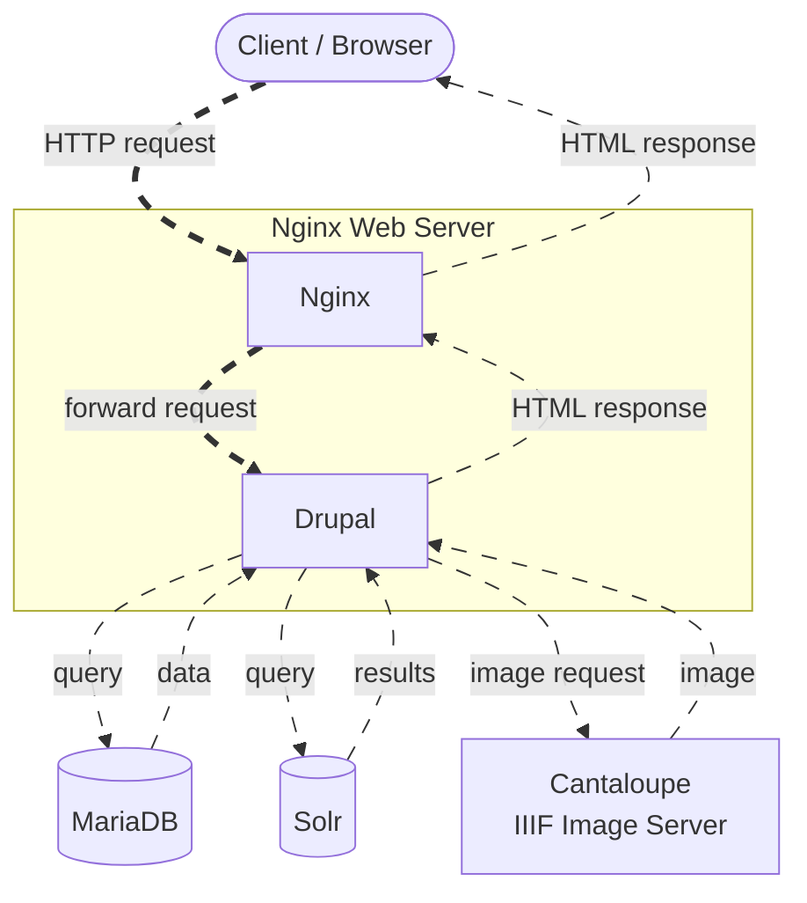
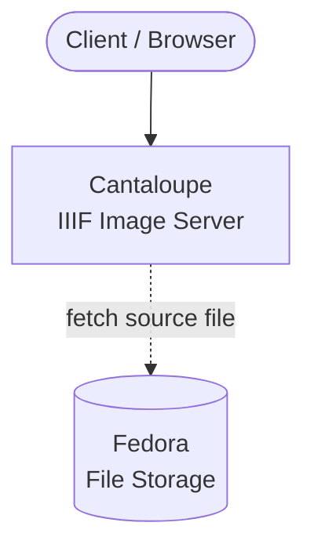
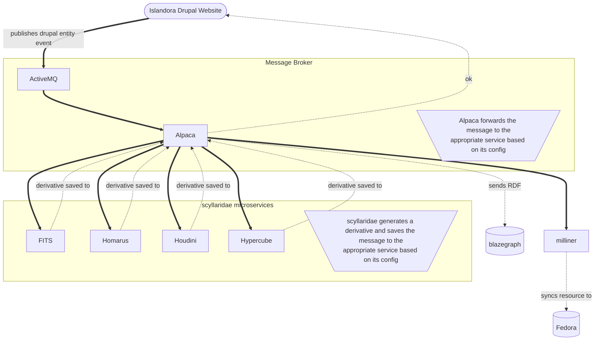
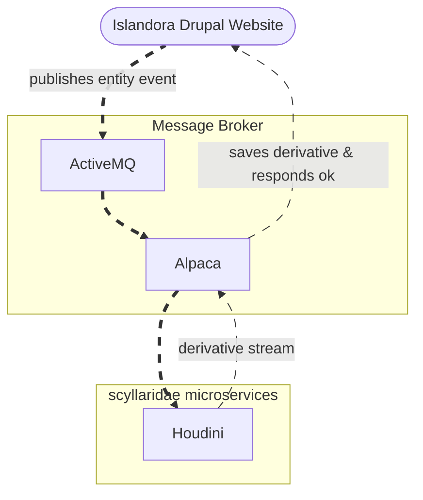

# Islandora Architecture Diagram

## Site Serving Path

### Page Request

### IIIF Image Request

## Event Driven System

## Event Example

## Components

### Islandora

The following components are microservices developed and maintained by the Islandora community. They are bundled under [Islandora Crayfish](https://github.com/Islandora/Crayfish):

* [FITS](https://github.com/roblib/CrayFits) - A Symfony 4 Microservice to generate FITS data and persist it as a Drupal media node. Works with [Islandora FITS](https://github.com/roblib/islandora_fits)
* [Homarus](https://github.com/Islandora/Crayfish/tree/dev/Homarus) - Provides [FFmpeg](https://www.ffmpeg.org/) as a microservice for generating video and audio derivatives.
* [Houdini](https://github.com/Islandora/Crayfish/tree/dev/Houdini) - [ImageMagick](https://www.imagemagick.org/script/index.php) as a microservice for generating image-based derivatives, including thumbnails.
* [Hypercube](https://github.com/Islandora/Crayfish/tree/dev/Hypercube) - [Tesseract](https://github.com/tesseract-ocr) as a microservice for optical character recognition (OCR).
* [Milliner](https://github.com/Islandora/Crayfish/tree/dev/Milliner) - A microservice that converts Drupal entities into Fedora resources.
* [Recast](https://github.com/Islandora/Crayfish/tree/dev/Recast) - A microservice that remaps Drupal URIs to add Fedora-to-Fedora links based on associated Drupal URIs in RDF.

### Other Open Source

The following components are deployed with Islandora, but are developed and maintained by other open source projects:

* [Apache](https://www.apache.org/) - The Apache HTTP Server, colloquially called Apache, is a free and open-source cross-platform web server software. Provides the environment in which Islandora and its components run.
   * [ActiveMQ](https://activemq.apache.org/) - Apache ActiveMQ is an open source message broker written in Java together with a full Java Message Service client.
   * [Karaf](https://karaf.apache.org/) - A modular open source OSGi runtime environment.
   * [Tomcat](http://tomcat.apache.org/) - an open-source implementation of the Java Servlet, JavaServer Pages, Java Expression Language and WebSocket technologies. Tomcat provides a "pure Java" HTTP web server environment in which Java code can run.
   * [Solr](https://lucene.apache.org/solr/) - An open-source enterprise-search platform. Solr is the default search and discover layer of Islandora, and a key component in some methods for [migration to Islandora from Islandora Legacy](https://github.com/Islandora-devops/migrate_7x_claw)
* [Blazegraph](https://blazegraph.com/) - Blazegraph is a triplestore and graph database.
* [Cantaloupe](https://cantaloupe-project.github.io/) - an open-source dynamic image server for on-demand generation of derivatives of high-resolution source images. Used in Islandora to support [IIIF](https://iiif.io/)
* [Drupal](https://www.drupal.org/) - Drupal is an open source content management system, and the heart of Islandora. All user and site-building aspects of Islandora are experienced through Drupal as a graphical user interface.
* [Fedora](https://wiki.lyrasis.org/display/FF/Fedora+Repository+Home) - A robust, modular, open source repository system for the management and dissemination of digital content. The default smart storage for Islandora.
* [Matomo](https://matomo.org/) - Matomo, formerly Piwik, is a free and open source web analytics application. It provides usage statistics and a rich dashboard for Islandora.
* [MySQL](https://www.mysql.com/) - MySQL is an open-source relational database management system. Used as a Drupal database in Islandora, it can be easily replaced with other database management systems such as [PostgreSQL](https://www.postgresql.org/)
* Triplestore - See Blazegraph.
