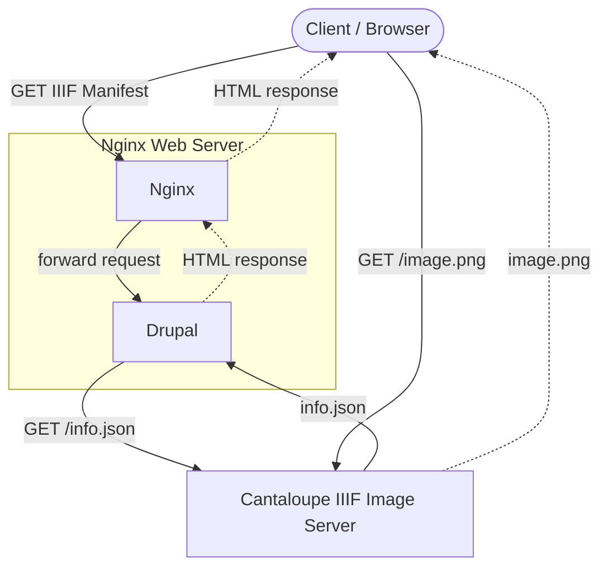
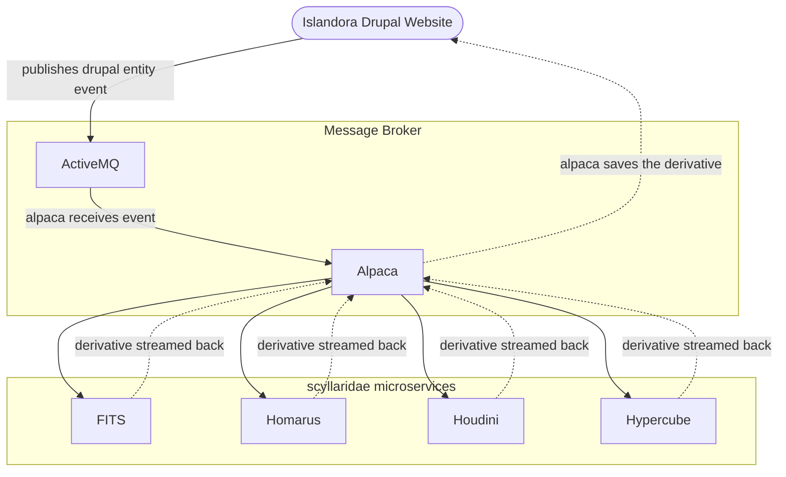
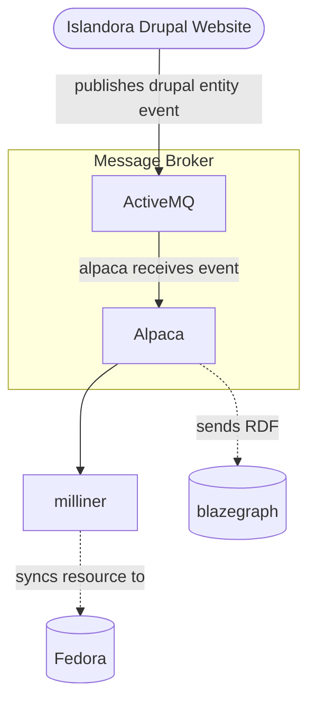

# Islandora Architecture

At its core, Islandora is a [Drupal] website that leverages a suite of [Microservices]. To help illustrate this, different site operations are described below.

- The diagram under [Islandora is a Drupal Website](#islandora-is-a-drupal-website) describes how a typical web page is displayed when a site visitor arrives at an Islandora repository on the internet. How most HTML responses are generated for Islandora sites are identical to any Drupal website that integrates with [Solr]. The exception being Islandora's [IIIF] integration, which is explained in a bit more detail in [IIIF Integration](#iiif-integration)
- The diagrams under [Microservices](#microservices) explain how events are emitted from an Islandora Drupal website and processed by Islandora's event driven architecture
- [Components](#components) is a list of software used in the Islandora tech stack

## Islandora is a Drupal Website

When a client visits an Islandora website, the request flow looks like a typical [Drupal] request.
The request is received by [NGINX], which forwards the request to [Drupal].
Drupal bootstraps and queries [MariaDB] to generate an HTML response.
If the request was for a search page, Drupal may also query [Solr] to include search results in the HTML response.

### IIIF Integration

For some [Resource Nodes] in Islandora, the HTML response may include a link to a [IIIF Manifest] that is dynamically generated by Drupal for the given node. This typically happens when rendering [Resource Nodes] that have image [media]. For these types of requests, Islandora's [IIIF] module may also query the [Cantaloupe] IIIF server for metadata needed to generate the [IIIF Manifest]. The IIIF viewer configured on the Islandora site (e.g. [OpenSeadragon] or [Mirador]) will communicate with Cantaloupe to render the image(s) included in the IIIF Manifest.

All this to say, in addition to [the typical drupal request flow](#islandora-is-a-drupal-website), Drupal may also query Cantaloupe for basic image metadata (e.g. height/width) which are needed to generate a valid [IIIF Manifest]. The client's web browser will then read that IIIF Manifest using Javascript and the IIIF viewer will `GET` the images referenced in the IIIF Manifest from [Cantaloupe].

### Fedora Flysystem Adapter

Islandora uses [Flysystem] and the [associated Drupal module](https://www.drupal.org/project/flysystem) to store Drupal managed files in [Fedora (Repository Software)].

You can read more about this in [Islandora's Flysystem documentation](../user-documentation/flysystem/).

## Microservices

In addition to all the tools Drupal provides, Islandora extends the Drupal site's capabilities using an event-driven, distributed architecture of [Microservices]. When a repository manager creates, updates, or deletes Drupal [entities], the Islandora Drupal module generates an event message which is put on Islandora's [ActiveMQ] queue.

There are two different types of events Islandora emits:

- [Derivative] Events - these types of events create [derivatives] from files uploaded to Islandora
- Index Events - these types of events create an indexed representation of a [Resource Node] in a system external to [Drupal]

### Derivative Events

Below is a full diagram of the different microservices Islandora provides. You can see as an animation in the diagram what happens when an Islandora repository manager uploads an image to their Islandora repository. First, Drupal emits an event to generate a thumbnail for that image. That event is put on the [ActiveMQ] event queue, [alpaca] reads the message from the queue, and forwards the event to the configured service. In the case of a thumbnail, [houdini] handles generating the thumbnail for the uploaded image. [Houdini] creates the thumbnail and alpaca saves the thumbnail in Drupal.

### Index Events

There are two systems that are populated using Islandora Index Events: [Blazegraph] and [Fedora (Repository Software)].

- For [Blazegraph], [Alpaca] is fully implemented to be able to index content from Drupal directly into Blazegraph using [RDF].
- For [Fedora (Repository Software)] an intermediate service is used called [Milliner] to store the metadata in Fedora.

## Components

### Islandora

The following components are microservices developed and maintained by the Islandora community. They are bundled under [scyllaridae] and [Islandora Crayfish](https://github.com/Islandora/Crayfish):

* [scyllaridae]
    * [Crayfits]
    * [Homarus]
    * [Houdini]
    * [Hypercube]
* [Milliner] (uses [Crayfish])

### Other Open Source

The following components are deployed with Islandora, but are developed and maintained by other open source projects:

* [Apache]
    * [ActiveMQ]
    * [Tomcat]
    * [Solr]
* [Blazegraph]
* [Cantaloupe]
* [Drupal]
* [FITS]
* [Fedora (Repository Software)]
* [MariaDB]
* [NGINX]
* [PostgreSQL]
* [Traefik]
* Triplestore - See [Blazegraph]
