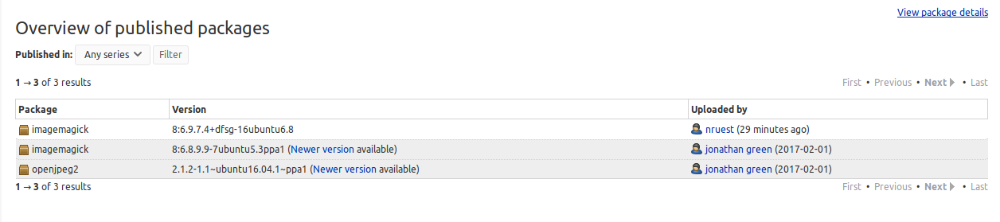

# Updating a `deb` and adding it to Lyrasis PPA

## Background

Ubuntu removed JPEG2000 support from ImageMagick since Vivid Vervet's 8:6.8.9.9-5 version. The PPA that we have created adds JPEG2000 support back into ImageMagick for Ubuntu 16.04 and 18.04. More information on why JPEG2000 support was removed can be found [here](https://bugs.launchpad.net/ubuntu/+source/imagemagick/+bug/1447968), and more information on `openjpeg` in Ubuntu can be found [here](https://bugs.launchpad.net/ubuntu/+source/openjpeg2/+bug/711061).

## Prerequisites

Review the [Ubuntu Packaging Guide](http://packaging.ubuntu.com/html/). Key items needed are in the [Getting Set Up section](http://packaging.ubuntu.com/html/getting-set-up.html):

- Basic packaging software:
  - `sudo apt install gnupg pbuilder ubuntu-dev-tools apt-file`
- Make sure you have your GPG, if you do not, follow the instructions in the guide.
- Setup `pbuilder`:
  - `pbuilder-dist bionic create`
- Configure your shell with some exports for `debuild`:
  - export DEBFULLNAME="Bob Dobbs"
  - export DEBEMAIL="subgenius@example.com"
- Contact [Jonathan Green](https://github.com/jonathangreen) to get setup on the [Lyrasis PPA team](https://launchpad.net/~lyrasis).

## Patching source

`imagemagick` is used an example. If you need to only change or patch the actual source code, then you will need to use `quilt`. More information on using `quilt` can be found in the [Patches to Packages section](http://packaging.ubuntu.com/html/patches-to-packages.html). If you are only change dependencies, or information in the `debian` directory of a package, `quilt` is not required, and [if used will cause build failures](https://stackoverflow.com/questions/29634868/adding-a-file-in-a-quilt-dquilt-patch-patch-applies-correctly-by-hand-but-brea).

- Create a directory to work in:
  - `mkdir imagemagick-bionic-jp2`
  - `cd imagemagick-bionic-jp2`
- Pull down the source:
  - `pull-lp-source imagemagick bionic`
  - `cd imagemagick-6.9.7.4+dfsg`
- Edit files as needed
- Document the fix:
  - `dch` (**Make sure to change `UNRELEASED` to the Ubuntu release name. For example: `bionic`**)
- Build the package:
  - `debuild -S`

## Example Patch

```diff
Index: imagemagick-6.9.7.4+dfsg/debian/control
===================================================================
--- imagemagick-6.9.7.4+dfsg.orig/debian/control
+++ imagemagick-6.9.7.4+dfsg/debian/control
@@ -26,8 +26,7 @@ Build-Depends: debhelper (>= 10),
  libx11-dev, libxext-dev, libxt-dev,
 # for plugins
  ghostscript, libdjvulibre-dev, libexif-dev,
- libjpeg-dev,
-# libopenjp2-7-dev, Needed for JPEG2000 but not in main see MIR #711061
+ libjpeg-dev, libopenjp2-7-dev,
  libopenexr-dev, libperl-dev, libpng-dev, libtiff-dev,
  libwmf-dev,
 # libgraphviz-dev, incompatible license against fftw
@@ -273,8 +272,7 @@ Depends: libmagickcore-6-headers (= ${so
  libmagickcore-6.q16-3 (= ${binary:Version}),
  libmagickcore-6.q16-3-extra (= ${binary:Version}),
  libbz2-dev, libdjvulibre-dev,
- libexif-dev, libfreetype6-dev, libjpeg-dev,
-# libopenjp2-7-dev, Needed for JPEG2000 but not in main see MIR #711061
+ libexif-dev, libfreetype6-dev, libjpeg-dev, libopenjp2-7-dev,
  liblcms2-dev, liblqr-1-0-dev, libltdl-dev, libopenexr-dev, libpng-dev,
  librsvg2-dev, libtiff-dev, libwmf-dev, libx11-dev, libxext-dev, libxml2-dev,
  libxt-dev, zlib1g-dev,
@@ -483,8 +481,7 @@ Depends: libmagickcore-6-headers (= ${so
  libmagickcore-6.q16hdri-3 (= ${binary:Version}),
  libmagickcore-6.q16hdri-3-extra (= ${binary:Version}),
  libbz2-dev, libdjvulibre-dev,
- libexif-dev, libfreetype6-dev, libjpeg-dev,
-# libopenjp2-7-dev, Needed for JPEG2000 but not in main see MIR #711061
+ libexif-dev, libfreetype6-dev, libjpeg-dev, libopenjp2-7-dev,
  liblcms2-dev, liblqr-1-0-dev, libltdl-dev, libopenexr-dev, libpng-dev,
  librsvg2-dev, libtiff-dev, libwmf-dev, libx11-dev, libxext-dev, libxml2-dev,
  libxt-dev, zlib1g-dev,
Index: imagemagick-6.9.7.4+dfsg/debian/control.d/noquantum.in
===================================================================
--- imagemagick-6.9.7.4+dfsg.orig/debian/control.d/noquantum.in
+++ imagemagick-6.9.7.4+dfsg/debian/control.d/noquantum.in
@@ -26,8 +26,7 @@ Build-Depends: debhelper (>= 10),
  libx11-dev, libxext-dev, libxt-dev,
 # for plugins
  ghostscript, libdjvulibre-dev, libexif-dev,
- libjpeg-dev,
-# libopenjp2-7-dev, Needed for JPEG2000 but not in main see MIR #711061
+ libjpeg-dev, libopenjp2-7-dev,
  libopenexr-dev, libperl-dev, libpng-dev, libtiff-dev,
  libwmf-dev,
 # libgraphviz-dev, incompatible license against fftw
Index: imagemagick-6.9.7.4+dfsg/debian/control.d/quantum.in
===================================================================
--- imagemagick-6.9.7.4+dfsg.orig/debian/control.d/quantum.in
+++ imagemagick-6.9.7.4+dfsg/debian/control.d/quantum.in
@@ -78,8 +78,7 @@ Depends: libmagickcore-${IMVERSION}-head
  libmagickcore-${IMVERSION}.${QUANTUMDEPTH}-${CORESOVERSION} (= ${binary:Version}),
  libmagickcore-${IMVERSION}.${QUANTUMDEPTH}-${CORESOVERSION}-extra (= ${binary:Version}),
  libbz2-dev, libdjvulibre-dev,
- libexif-dev, libfreetype6-dev, libjpeg-dev,
-# libopenjp2-7-dev, Needed for JPEG2000 but not in main see MIR #711061
+ libexif-dev, libfreetype6-dev, libjpeg-dev, libopenjp2-7-dev,
  liblcms2-dev, liblqr-1-0-dev, libltdl-dev, libopenexr-dev, libpng-dev,
  librsvg2-dev, libtiff-dev, libwmf-dev, libx11-dev, libxext-dev, libxml2-dev,
  libxt-dev, zlib1g-dev,
Index: imagemagick-6.9.7.4+dfsg/debian/rules
===================================================================
--- imagemagick-6.9.7.4+dfsg.orig/debian/rules
+++ imagemagick-6.9.7.4+dfsg/debian/rules
@@ -98,7 +98,7 @@ STATIC_CONFIGURE_OPTIONS := \
 	--with-gs-font-dir=/usr/share/fonts/type1/gsfonts \
 	--with-magick-plus-plus \
 	--with-djvu \
-        --with-openjp2 \
+  --with-openjp2 \
 	--with-wmf \
 	--without-gvc \
 	--enable-shared \
```

## Uploading to Lyrasis PPA

Once the package is built successfully, you'll upload the `changes` file to Launchpad. For example:

- `dput ppa:lyrasis/imagemagick-jp2 imagemagick_6.9.7.4+dfsg-16ubuntu6.8_source.changes`

After the package is successfully uploaded to the PPA, you'll receive an email from Launchpad. Something like this:

```
Accepted:
 OK: imagemagick_6.9.7.4+dfsg.orig.tar.xz
 OK: imagemagick_6.9.7.4+dfsg-16ubuntu6.8.debian.tar.xz
 OK: imagemagick_6.9.7.4+dfsg-16ubuntu6.8.dsc
     -> Component: main Section: graphics

imagemagick (8:6.9.7.4+dfsg-16ubuntu6.8) bionic; urgency=medium

  * Add jp2 support.
```

And you will see it in the interface for the Lyrasis PPA:



