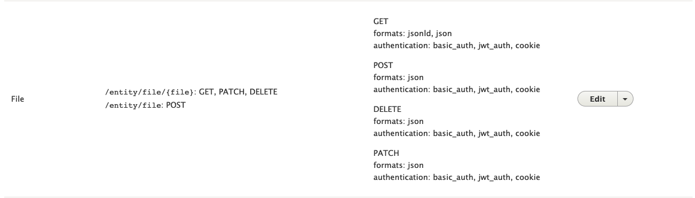

# Getting resources, media and files - GET Requests 

## Authorization

If you have restricted access to view your content, you will need to use one of the configured authorization methods to access your content, media and/or files.

These are defined under [Authorization](./using-rest-endpoints.md#authorization) on the overview.

## Content (Nodes)


The above setup shows that you can perform a GET request against a node at the `/node/{id}` endpoint. This is the same as the URL when viewed through a web browser. For example `http://localhost:8000/node/2`

It also defines the _formats_ you can access. In this example _json_ and _jsonld_ are available. 

To access a resource in a specific format use the `_format=` argument which is appended to the end of the URI after a `?`.

To get the resource located at `http://localhost:8000/node/3` in JSON, you can go to `http://localhost:8000/node/3?_format=json`.

&#x1F34E; For example:

You can do this in your web browser or with a command line client like cURL. (Note: response body here has been formatted, yours will look different)

```
vagrant@claw:~$ curl -i http://localhost:8000/node/3?_format=json

HTTP/1.1 200 OK
Date: Mon, 04 Mar 2019 21:53:50 GMT
Server: Apache/2.4.18 (Ubuntu)
X-Powered-By: PHP/7.1.26-1+ubuntu16.04.1+deb.sury.org+1
Cache-Control: must-revalidate, no-cache, private
Link: <http://localhost:8000/node/3>; rel="canonical"
Link: <http://localhost:8000/node/3/delete>; rel="https://drupal.org/link-relations/delete-form"
Link: <http://localhost:8000/admin/content/node/delete?node=3>; rel="https://drupal.org/link-relations/delete-multiple-form"
Link: <http://localhost:8000/node/3/edit>; rel="edit-form"
Link: <http://localhost:8000/node/3/revisions>; rel="version-history"
Link: <http://localhost:8000/node/3>; rel="https://drupal.org/link-relations/revision"
Link: <http://localhost:8000/node?node=3>; rel="https://drupal.org/link-relations/create"
Link: <http://purl.org/coar/resource_type/c_c513>; rel="tag"; title="Image"
Link: <http://localhost:8000/media/1>; rel="related"; title="Original File"
Link: <http://localhost:8000/media/2>; rel="related"; title="Service File"
Link: <http://localhost:8000/media/3>; rel="related"; title="Thumbnail Image"
Link: <http://localhost:8000/node/3?_format=jsonld>; rel="alternate"; type="application/ld+json"
X-Drupal-Dynamic-Cache: MISS
X-UA-Compatible: IE=edge
Content-language: en
X-Content-Type-Options: nosniff
X-Frame-Options: SAMEORIGIN
Expires: Sun, 19 Nov 1978 05:00:00 GMT
Vary: 
X-Generator: Drupal 8 (https://www.drupal.org)
X-Drupal-Cache: MISS
Content-Length: 1521
Content-Type: application/json

{
  "nid": [
    {
      "value": 1
    }
  ],
  "uuid": [
    {
      "value": "8322e36e-f8ec-4fd9-919d-52aed7b17a52"
    }
  ],
  "vid": [
    {
      "value": 1
    }
  ],
  "langcode": [
    {
      "value": "en"
    }
  ],
  "type": [
    {
      "target_id": "islandora_object",
      "target_type": "node_type",
      "target_uuid": "62189bec-3ef3-4196-b847-b17e5ce61fd5"
    }
  ],
  "revision_timestamp": [
    {
      "value": "2019-03-01T19:43:12+00:00",
      "format": "Y-m-d\\TH:i:sP"
    }
  ],
  "revision_uid": [
    {
      "target_id": 1,
      "target_type": "user",
      "target_uuid": "46a47057-de2d-4ce2-87ae-dbe4551209b8",
      "url": "\\/user\\/1"
    }
  ],
  "revision_log": [],
  "status": [
    {
      "value": true
    }
  ],
  "title": [
    {
      "value": "Custom item"
    }
  ],
  "uid": [
    {
      "target_id": 1,
      "target_type": "user",
      "target_uuid": "46a47057-de2d-4ce2-87ae-dbe4551209b8",
      "url": "\\/user\\/1"
    }
  ],
  "created": [
    {
      "value": "2019-03-01T19:42:54+00:00",
      "format": "Y-m-d\\TH:i:sP"
    }
  ],
  "changed": [
    {
      "value": "2019-03-01T19:43:12+00:00",
      "format": "Y-m-d\\TH:i:sP"
    }
  ],
  "promote": [
    {
      "value": true
    }
  ],
  "sticky": [
    {
      "value": false
    }
  ],
  "default_langcode": [
    {
      "value": true
    }
  ],
  "revision_translation_affected": [
    {
      "value": true
    }
  ],
  "content_translation_source": [
    {
      "value": "und"
    }
  ],
  "content_translation_outdated": [
    {
      "value": false
    }
  ],
  "field_alternative_title": [],
  "field_description": [],
  "field_display_hints": [],
  "field_edtf_date": [],
  "field_edtf_date_created": [],
  "field_edtf_date_issued": [],
  "field_extent": [
    {
      "value": "1 item"
    }
  ],
  "field_identifier": [],
  "field_linked_agent": [],
  "field_member_of": [],
  "field_model": [
    {
      "target_id": 24,
      "target_type": "taxonomy_term",
      "target_uuid": "e7560b68-e95a-4e76-9671-2a3041cd9800",
      "url": "\\/taxonomy\\/term\\/24"
    }
  ],
  "field_pid": [],
  "field_resource_type": [],
  "field_rights": [],
  "field_subject": []
}
```

## Media

The above steps are the same for media, it is just the URI that has changed.


For media you use `/media/{id}`

&#x1F34E; For example: 

```
curl -u admin:islandora http://localhost:8000/media/2?_format=json

{
  "mid": [
    {
      "value": 2
    }
  ],
  "uuid": [
    {
      "value": "e75e609d-510c-4764-9280-665bb7026161"
    }
  ],
  "vid": [
    {
      "value": 2
    }
  ],
  "langcode": [
    {
      "value": "en"
    }
  ],
  "bundle": [
    {
      "target_id": "image",
      "target_type": "media_type",
      "target_uuid": "3860e653-201b-4509-89dd-628c446d81cb"
    }
  ],
  "revision_created": [
    {
      "value": "2019-03-01T19:43:48+00:00",
      "format": "Y-m-d\\TH:i:sP"
    }
  ],
  "revision_user": [],
  "revision_log_message": [],
  "status": [
    {
      "value": true
    }
  ],
  "name": [
    {
      "value": "1-Service File.jpg"
    }
  ],
  "thumbnail": [
    {
      "target_id": 3,
      "alt": null,
      "title": null,
      "width": 800,
      "height": 1333,
      "target_type": "file",
      "target_uuid": "e97ad038-dcb3-4d81-aa91-c945b2fe092c",
      "url": "http:\\/\\/localhost:8000\\/sites\\/default\\/files\\/2019-03\\/1-Service%20File.jpg"
    }
  ],
  "uid": [
    {
      "target_id": 1,
      "target_type": "user",
      "target_uuid": "46a47057-de2d-4ce2-87ae-dbe4551209b8",
      "url": "\\/user\\/1"
    }
  ],
  "created": [
    {
      "value": "2019-03-01T19:43:48+00:00",
      "format": "Y-m-d\\TH:i:sP"
    }
  ],
  "changed": [
    {
      "value": "2019-03-01T19:43:48+00:00",
      "format": "Y-m-d\\TH:i:sP"
    }
  ],
  "default_langcode": [
    {
      "value": true
    }
  ],
  "revision_translation_affected": [
    {
      "value": true
    }
  ],
  "content_translation_source": [
    {
      "value": "und"
    }
  ],
  "content_translation_outdated": [
    {
      "value": false
    }
  ],
  "field_access_terms": [],
  "field_file_size": [
    {
      "value": 166608
    }
  ],
  "field_height": [
    {
      "value": 1333
    }
  ],
  "field_media_image": [
    {
      "target_id": 3,
      "alt": null,
      "title": null,
      "width": 800,
      "height": 1333,
      "target_type": "file",
      "target_uuid": "e97ad038-dcb3-4d81-aa91-c945b2fe092c",
      "url": "http:\\/\\/localhost:8000\\/sites\\/default\\/files\\/2019-03\\/1-Service%20File.jpg"
    }
  ],
  "field_media_of": [
    {
      "target_id": 1,
      "target_type": "node",
      "target_uuid": "8322e36e-f8ec-4fd9-919d-52aed7b17a52",
      "url": "\\/node\\/1"
    }
  ],
  "field_media_use": [
    {
      "target_id": 18,
      "target_type": "taxonomy_term",
      "target_uuid": "e8c698a7-8c15-47c4-8567-1c27f8f0c19e",
      "url": "\\/taxonomy\\/term\\/18"
    }
  ],
  "field_mime_type": [
    {
      "value": "image\\/jpeg"
    }
  ],
  "field_width": [
    {
      "value": 800
    }
  ]
}
```


## Files

Through the REST API you are accessing metadata about files, but not the actual binary object.



Based on the above configuration the path for a GET request is `/entity/file/{id}`

The file ID refers to the integer counter and _not_ the UUID of a file.

Through the UI you can go to the File listing at `http://localhost:8000/admin/content/files`.

For the file you want to access, choose the **USED IN** link. 

That URI has the format `http://localhost:8000/admin/content/files/usage/{file id}`

Alternatively the file ID can be found by viewing the media metadata (above section). In the above example if you look through the response from a GET request to the `/media/{id}` you will find a section like:

```
  "field_media_image": [
    {
      "target_id": 3,
      "alt": null,
      "title": null,
      "width": 800,
      "height": 1333,
      "target_type": "file",
      "target_uuid": "e97ad038-dcb3-4d81-aa91-c945b2fe092c",
      "url": "http:\\/\\/localhost:8000\\/sites\\/default\\/files\\/2019-03\\/1-Service%20File.jpg"
    }
  ],
```

**Note**: Depending on the "type" of file (image, video, audio, file) this field will have a different name.


This has both the `url` which is the URI to retrieve the binary content of the file as well as the `target_id` which is the file ID.

So we can retrieve the file with a GET request to the URI `http://localhost:8000/sites/default/files/2019-03/1-Service%20File.jpg`.

But more importantly we can retrieve the file **metadata** by making a request to `http://localhost:8000/entity/file/3` with one of the allowed _formats_

&#x1F34E; For example:

```
> curl -i -X GET "http://localhost:8000/entity/file/3?_format=json"

HTTP/1.1 200 OK
Date: Tue, 05 Mar 2019 16:52:06 GMT
Server: Apache/2.4.18 (Ubuntu)
X-Powered-By: PHP/7.1.26-1+ubuntu16.04.1+deb.sury.org+1
Cache-Control: must-revalidate, no-cache, private
X-Drupal-Dynamic-Cache: MISS
X-UA-Compatible: IE=edge
Content-language: en
X-Content-Type-Options: nosniff
X-Frame-Options: SAMEORIGIN
Expires: Sun, 19 Nov 1978 05:00:00 GMT
Vary: 
X-Generator: Drupal 8 (https://www.drupal.org)
X-Drupal-Cache: HIT
Content-Length: 634
Content-Type: application/json

{
  "fid": [
    {
      "value": 3
    }
  ],
  "uuid": [
    {
      "value": "e97ad038-dcb3-4d81-aa91-c945b2fe092c"
    }
  ],
  "langcode": [
    {
      "value": "en"
    }
  ],
  "uid": [
    {
      "target_id": 1,
      "target_type": "user",
      "target_uuid": "46a47057-de2d-4ce2-87ae-dbe4551209b8",
      "url": "\\/user\\/1"
    }
  ],
  "filename": [
    {
      "value": "1-Service File.jpg"
    }
  ],
  "uri": [
    {
      "value": "public:\\/\\/2019-03\\/1-Service File.jpg",
      "url": "\\/sites\\/default\\/files\\/2019-03\\/1-Service%20File.jpg"
    }
  ],
  "filemime": [
    {
      "value": "image\\/jpeg"
    }
  ],
  "filesize": [
    {
      "value": 166608
    }
  ],
  "status": [
    {
      "value": true
    }
  ],
  "created": [
    {
      "value": "2019-03-01T19:43:48+00:00",
      "format": "Y-m-d\\TH:i:sP"
    }
  ],
  "changed": [
    {
      "value": "2019-03-01T19:43:48+00:00",
      "format": "Y-m-d\\TH:i:sP"
    }
  ]
}
```
