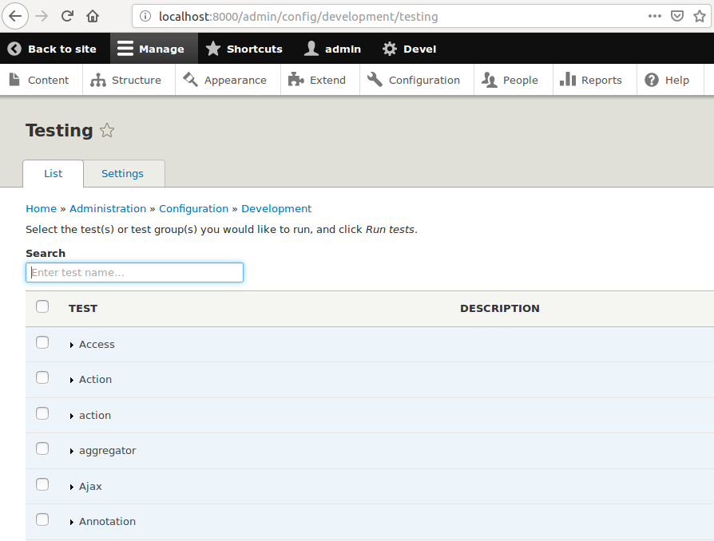

# Running Automated Tests
 
## User Interface



To run automated tests via a web browser, you can to Admin > Configuration > Testing 
(http://localhost:8000/admin/config/development/testing) in the admin toolbar.  From 
there you can browse and search for tests, select the ones you'd like to run.  Pressing
the blue "Run Tests" button will execute all tests you've selected in a batch and then
display the results.

## Command Line

Running tests from the command line utilizes the test runner script provided by Drupal core.
From Drupal's `web` directory, the full command to run is

```bash
vagrant@claw:/var/www/html/drupal/web$ sudo -u www-data php core/scripts/run-tests.sh \
--suppress-deprecations \
--url http://127.0.0.1:8000 \
--verbose \
--php `which php` \
--module "islandora"
```

Let's unpack it
- You need to run this as the apache user for filesystem access, hence `sudo -u www-data`
- Despite having a `.sh` extension, you run the command with php: `php core/scripts/run-tests.sh`
- `--suppress-deprecations` tells the script not to count deprecation warnings as test failures
- `--url http://127.0.0.1:8000` tells the script what base url to use for functional tests.  If you are using a port other than 8000, you'll need to make sure to update this accordingly
- `--verbose` is optional, but useful if you want more feedback from failures
- ``` --php `which php` ``` tells the script where to find the php executable to use
- `--module "islandora"` tells the script to run all tests from the `islandora` module

If you want to run just a single class instead of a whole module's worth, you can use the `--class` option instead of `--module`.  The `--class` option takes the fully namespaced class name as an argument.  For example, to run just the `AddMediaToNodeTest`:

```bash
vagrant@claw:/var/www/html/drupal/web$ sudo -u www-data php core/scripts/run-tests.sh \
--suppress-deprecations \
--url http://127.0.0.1:8000 \
--verbose \
--php `which php` \
--class "Drupal\Tests\islandora\Functional\AddMediaToNodeTest"
```
