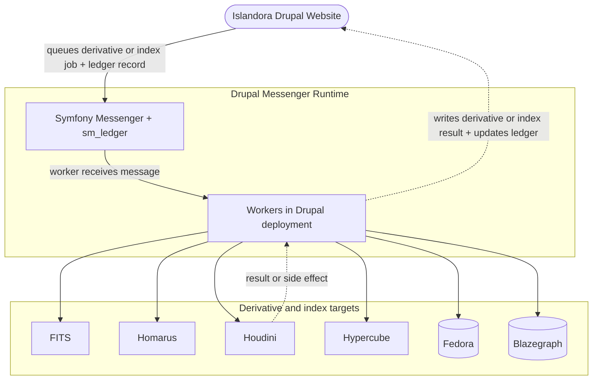
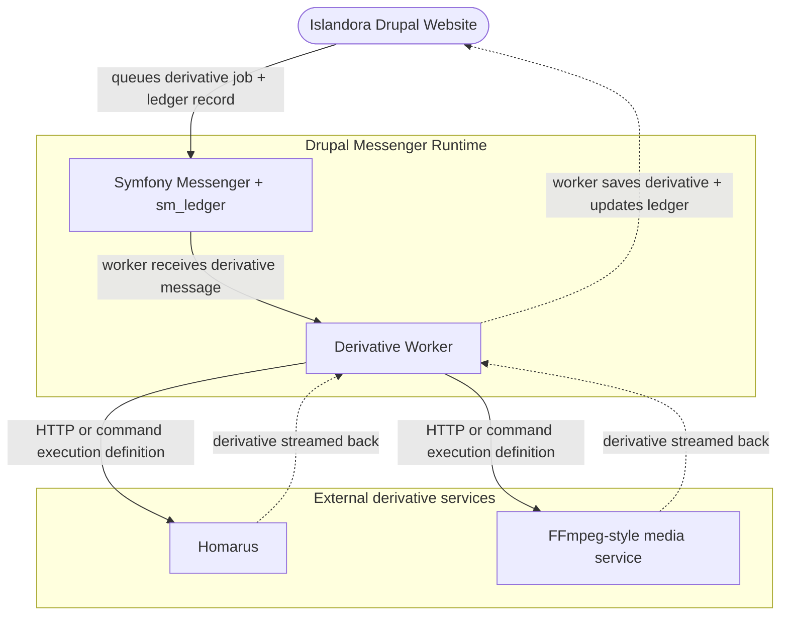
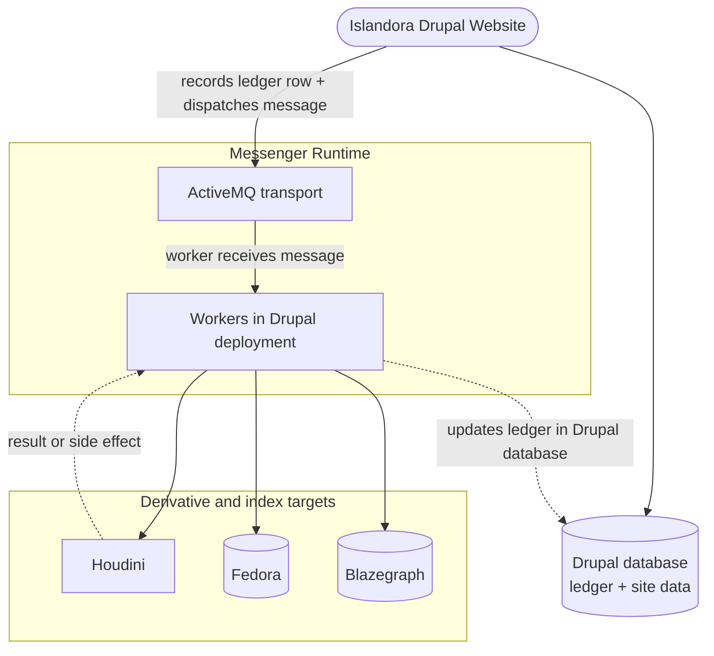

# Scaling Islandora Events

Islandora's default Islandora Events deployment keeps the worker runtime close
to the Drupal site:

- Drupal records ledger rows and dispatches Symfony Messenger messages
- workers consume those messages from the configured transport
- workers execute derivative and indexing work
- by default, the SQL transport uses the same database as the Drupal site

That default is intentionally simple and works well for small and moderate
deployments. It also means the Drupal stack, worker runtime, and SQL transport
can contend for the same CPU, memory, I/O, and database capacity during large
ingests or rebuilds.

This page explains the two main scaling levers in Islandora Events:

1. move CPU-intensive or memory-intensive execution out of the Drupal runtime
2. move the Messenger transport backend out of the Drupal database

The goal is to help operators choose a sensible starting topology and plan
benchmarking before production ingest begins.

## Baseline topology

The default topology keeps all core moving parts within the normal Drupal
deployment boundary.



## When to keep the default topology

Start with the default topology when:

- the repository is small or moderate in size
- ingest is occasional rather than continuous
- you want the simplest deployment and operational model
- queue wait stays low under expected load
- the database has enough headroom for both Drupal traffic and SQL-backed
  transport work

This is the recommended starting point for most new installations.

## Scaling option 1: move heavy execution to external services

Derivative and indexing workers can coordinate work while delegating the
heavyweight processing itself to external services.

This is useful when:

- image, video, OCR, or media processing is CPU-intensive
- command-mode derivative runners consume too much memory inside the Drupal
  deployment
- you want to isolate worker orchestration from service-specific compute spikes

In Islandora Events, this usually means keeping the worker in the Drupal
deployment while configuring the execution strategy so the heavy work happens
outside the Drupal container or host.

### Command and HTTP execution models

Islandora Events supports multiple worker execution definitions:

- `execution_mode: command` runs an approved local command, often through a
  `scyllaridae` wrapper and service-specific config
- `execution_mode: http` calls a remote service endpoint directly

Those execution definitions are transport-independent. You can keep the SQL
transport in the Drupal database while still moving derivative processing to
remote services.

### Example: move Homarus or FFmpeg-style work out of the Drupal container

The diagram below shows the same worker flow, but with the expensive derivative
step executed by an external service instead of inside the Drupal deployment.



### What scales out in this topology

- derivative or indexing compute shifts away from the Drupal deployment
- worker coordination, routing, and ledger projection remain in Drupal
- the Messenger transport backend stays the same unless changed separately

### Tradeoffs

- reduces CPU and memory pressure on the Drupal deployment
- keeps deployment simpler than introducing a new transport backend
- still leaves transport load and queue persistence in the Drupal database
- still requires enough Drupal-side capacity for worker processes and ledger
  writes

## Scaling option 2: move the Messenger transport backend out of the Drupal database

The second scaling lever is the transport backend.

The default Islandora transports use a SQL transport in the same database as
the Drupal site. At larger scale, database-backed transport throughput or queue
contention may become the limiting factor before derivative services do.

When that happens, the transport backend can be moved to a dedicated messaging
system such as ActiveMQ while keeping the worker, handler, and ledger model the
same.

### Example: swap the Drupal database transport for ActiveMQ



### What changes in this topology

- the transport queue no longer shares the Drupal site database
- workers still execute the same handlers
- `sm_ledger` still stores the durable operator projection in Drupal
- derivative and indexing services do not need redesign

### Tradeoffs

- increases transport throughput headroom
- reduces queue contention in the Drupal database
- introduces another operational dependency to deploy, monitor, and back up
- does not eliminate the need for idempotent handlers or ledger-based operator
  state

## Combining both scaling options

Large deployments may need both:

- remote derivative or indexing services for compute-heavy work
- an external transport backend for queue throughput

That combined topology keeps the same application model:

- ledger state stays in Drupal
- Messenger still owns delivery
- workers still own execution and emit lifecycle events
- downstream services do the expensive work

## Planning guidance before ingest

Choose the simplest topology that matches your expected ingest volume and
performance envelope.

### Good initial questions

- How many objects will be ingested in the first sustained load event?
- How many concurrent users need acceptable site response times during ingest?
- Are derivatives mostly images and PDFs, or larger video/audio workloads?
- Is the database already shared with other heavy Drupal workloads?
- Do you need burst throughput for backfills and reindexing, or mostly steady
  day-to-day ingest?

### Practical starting guidance

- start with the default SQL transport and in-deployment workers for small and
  moderate repositories
- move derivative execution to external services first when CPU or memory
  contention is the main problem
- move the transport backend next when queue persistence and dequeue throughput
  become the main problem
- scale by transport and workload type rather than building one undifferentiated
  worker pool

### Signals that the default topology is struggling

- queue depth remains elevated during or after ingest
- queue wait time remains high after adding transport-specific workers
- Drupal response times degrade sharply during worker activity
- the database becomes the bottleneck rather than the downstream services
- derivative runners are starved for CPU or memory inside the Drupal runtime

## Benchmarking methodology

The benchmark sections below are intended to capture repeatable measurements
for different deployment topologies. Populate them with real measurements from
your environment; do not assume one topology is always superior.

For each test run, record:

- repository size before ingest
- ingest batch size
- object mix and derivative profile
- worker counts per transport
- CPU and memory available to Drupal, the database, and remote services
- ingest duration
- time until all queued messages finish processing
- site response time during ingest

Use the same ingest process and the same content profile for each topology so
the results are directly comparable.

### Collecting benchmark data

This repository includes a benchmark harness at
[`scripts/benchmark-islandora-events.sh`](../../../scripts/benchmark-islandora-events.sh).
The harness is intended to wrap an existing ingest script rather than replace
it.

For each run, the harness:

- records the current maximum ledger row ID before ingest starts
- runs the ingest script
- polls `sm_ledger_event_record` until every new row has left `queued`
- records final status counts such as `completed`, `retry_due`, and `failed`
- samples homepage response time during the run
- samples host load and available memory during the run
- captures `docker stats` snapshots when Docker is available

Example using a Workbench ingest script:

```bash
./scripts/benchmark-islandora-events.sh \
  --url http://islandora.local/ \
  --ingest-script ./scripts/run-workbench-ingest.sh \
  --label sql-local \
  --output-dir ./benchmark-results/sql-local
```

The harness writes a `summary.md` file and raw sample TSV files in the selected
output directory. Use those raw files to populate the benchmark matrices below.

## Benchmark matrix: default SQL transport and local execution

### Environment

Populate this section with the actual resources used for the benchmark.

| Component | CPU | Memory | Notes |
|---|---:|---:|---|
| Drupal web + workers | TBD | TBD | |
| Database | TBD | TBD | |
| FITS / Homarus / Houdini / Hypercube | TBD | TBD | local to Drupal deployment or same host |

### Results

| Existing repository size | Ingest batch | Ingest duration | Time until all messages processed | Site response time during ingest | Notes |
|---:|---:|---|---|---|---|
| 10,000 items | 10,000 nodes/media | TBD | TBD | TBD | |
| 100,000 items | 10,000 nodes/media | TBD | TBD | TBD | |
| 500,000 items | 10,000 nodes/media | TBD | TBD | TBD | |
| 1,000,000 items | 10,000 nodes/media | TBD | TBD | TBD | |

## Benchmark matrix: SQL transport and remote service execution

### Environment

| Component | CPU | Memory | Notes |
|---|---:|---:|---|
| Drupal web + workers | TBD | TBD | |
| Database | TBD | TBD | |
| Remote derivative/index services | TBD | TBD | command-mode or HTTP services outside Drupal deployment |

### Results

| Existing repository size | Ingest batch | Ingest duration | Time until all messages processed | Site response time during ingest | Notes |
|---:|---:|---|---|---|---|
| 10,000 items | 10,000 nodes/media | TBD | TBD | TBD | |
| 100,000 items | 10,000 nodes/media | TBD | TBD | TBD | |
| 500,000 items | 10,000 nodes/media | TBD | TBD | TBD | |
| 1,000,000 items | 10,000 nodes/media | TBD | TBD | TBD | |

## Benchmark matrix: ActiveMQ transport

### Environment

| Component | CPU | Memory | Notes |
|---|---:|---:|---|
| Drupal web + workers | TBD | TBD | |
| Database | TBD | TBD | ledger + Drupal site data |
| ActiveMQ | TBD | TBD | transport backend |
| Derivative/index services | TBD | TBD | note whether execution stayed local or moved remote |

### Results

| Existing repository size | Ingest batch | Ingest duration | Time until all messages processed | Site response time during ingest | Notes |
|---:|---:|---|---|---|---|
| 10,000 items | 10,000 nodes/media | TBD | TBD | TBD | |
| 100,000 items | 10,000 nodes/media | TBD | TBD | TBD | |
| 500,000 items | 10,000 nodes/media | TBD | TBD | TBD | |
| 1,000,000 items | 10,000 nodes/media | TBD | TBD | TBD | |

## Benchmark matrix: legacy Alpaca and ActiveMQ comparison

Use this section for an apples-to-apples comparison with the previous
Alpaca-based architecture.

### Environment

| Component | CPU | Memory | Notes |
|---|---:|---:|---|
| Drupal web | TBD | TBD | |
| ActiveMQ | TBD | TBD | |
| Alpaca | TBD | TBD | |
| Downstream services | TBD | TBD | |

### Results

| Existing repository size | Ingest batch | Ingest duration | Time until all messages processed | Site response time during ingest | Notes |
|---:|---:|---|---|---|---|
| 10,000 items | 10,000 nodes/media | TBD | TBD | TBD | |
| 100,000 items | 10,000 nodes/media | TBD | TBD | TBD | |
| 500,000 items | 10,000 nodes/media | TBD | TBD | TBD | |
| 1,000,000 items | 10,000 nodes/media | TBD | TBD | TBD | |

## Interpreting the benchmark results

Look at all three metrics together:

- ingest duration shows how long it takes to submit the workload
- time until all messages are processed shows the actual backlog drain time
- site response time during ingest shows whether the topology remains usable for
  interactive users

A topology with the fastest ingest is not always the best choice if user-facing
response times collapse during the run.

## Related documentation

- [Islandora Architecture](diagram.md)
- [Islandora Events](islandora-events.md)
