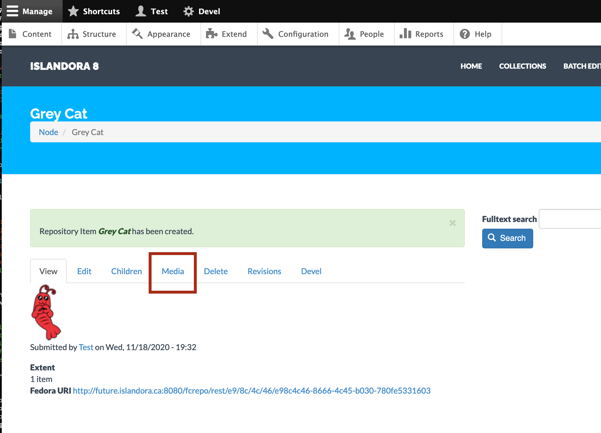
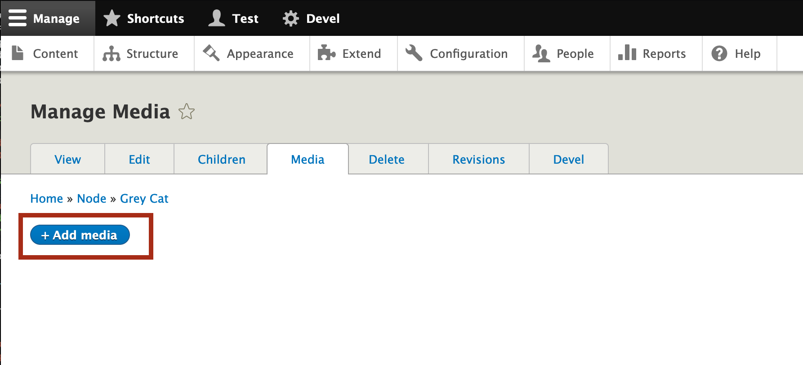
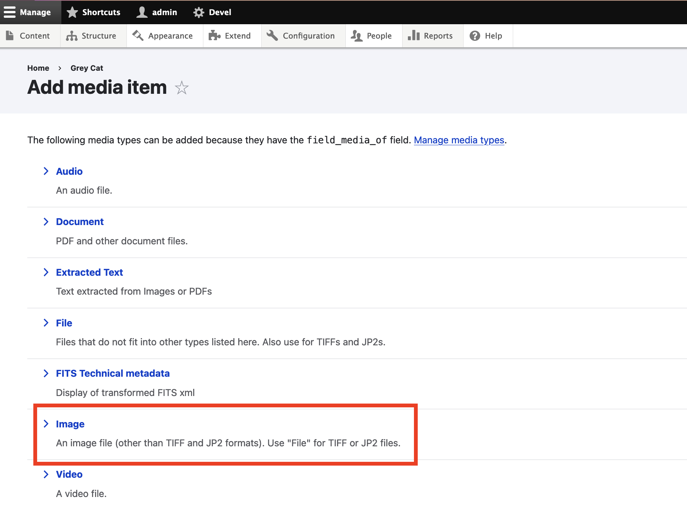
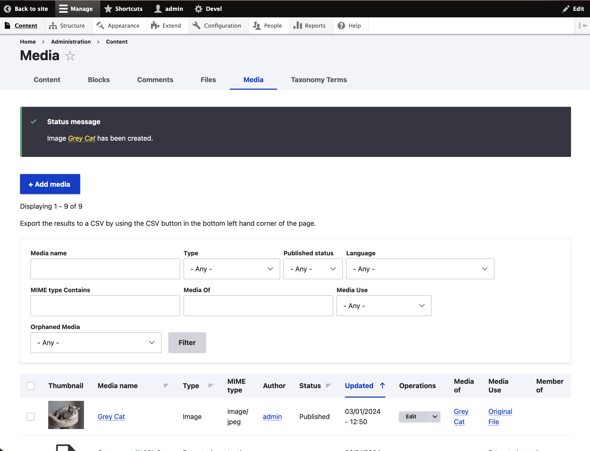
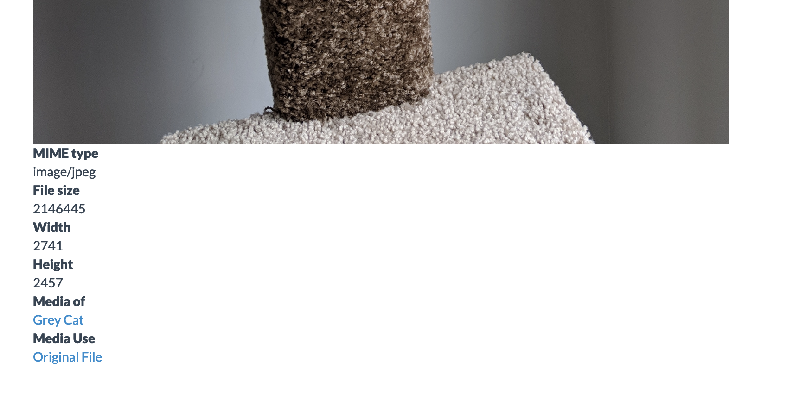
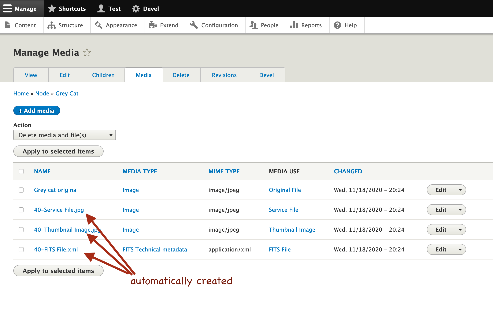

## Overview

This tutorial will walk you through adding a piece of digital content (an image and some metadata) into an Islandora repository.
At the end, you will have metadata in a Drupal node, a file stored in Fedora, and derivatives automatically created.

!!! Tip "Video version available"
    The material in this tutorial is presented in our video, [Adding Content](https://youtu.be/G52is7iFkG4).

## Tools

For this tutorial you will need an instance of [Islandora Defaults](https://github.com/Islandora/islandora_defaults). You can use the online sandbox or one of the [sandbox VMs](https://islandora.ca/try).

[Online Sandbox](http://future.islandora.ca)

* Username: Test
* Password: islandora

## Step 1: Create an Islandora Node

To add content to Islandora, start by creating a node. When logged in to Drupal as an administrator, navigate with the top menu bar to **Manage** >> **Content** >> **Add content** or click on **Add content** under the _Tools_ menu.

Next, select a content type that is configured with Islandora behaviours. In Islandora Defaults, there is Islandora content type. It is called **Repository Item**.

You are presented with a form showing a large number of metadata fields. Fill out the ones that are applicable to you.

!!! Error "Keep it simple"
    For this tutorial, do not attempt to fill out any fields with an autocomplete symbol - a small circle at the right-hand-side of the text box.

<!-- We should really include creating/adding a name here or in another tutorial!! It's a source of immediate confusion and frustration! -->

<!-- Can we get this image inside of the callout box? -->

Near the bottom of the form, the _System_ section contains mandatory fields that configure Islandora behaviours. Select **Image** from the _Model_ drop down box. This will enable image display behaviours, and cause image derivatives to be generated once we upload a file.

Then, click **Save**. You have now created a node, and since it is of an Islandora content type, we call it a "resource node."

The new node page displays, with the title, any metadata that we entered, and a _Fedora URI_ which indicates that metadata about this new node has been synced into Fedora. Congratulations, you have created a resource node!

## Step 2: Upload an Original File

Alas, your node has no files. To upload a file, click on the node's _Media_ tab.

Then, click on **Add Media**.

There are several types of Media to choose from. We want to add a jpg image, so click on _Image_.

!!! warning "Images vs .tiffs"
    Drupal considers any type of image that can be viewed natively in the browser as an _Image_.
    For other image types that require special viewers, such as tiffs, you would have to choose
    _File_. [Learn more about Media in Islandora](../user-documentation/media.md).

You are now presented with the form for the technical metadata of the file. There are three required
parts of the form:

1. _Name_, which identifies this media.
1. _Image_, the file to upload.
1. _Media Use_, describing what this file is in the context of its resource node. To trigger derivative
generation, select the checkbox for _Original File_.

With the mandatory fields filled out (do not edit the "_Media of_" field), click **Save**, and a new Media will be created attached to your resource node. You will land on the administrator's list of Media, and the new media created is at the top of the list. Select it to see the Media.

<!-- We should maybe mention that it is living in Fedora? but why doesn't the Fedora URI show up?  -->

Scroll down to see metadata below the uploaded image. The _MIME type_, _File size_, _Width_, and _Height_ were automatically populated when the file was uploaded. The value under _Media of_ is a link back to the resource node.

## Step 3: Verify derivatives were created

Now return to the node you created, and you will see the image along with its (minimal) descriptive metadata. The image you are viewing is not the one you uploaded, but a lower-resolution service file that was created and stored in the Drupal public filesystem. 

<!-- should increase the amount of descriptive metadata to make this make more sense -->

If you open the node's _Media_ tab, you should see new Media have been added - these are derivatives have been created automatically, including a service file, a thumbnail, and a FITS technical metadata file.

You now have an Islandora resource node, which is a special case of a Drupal node, and it has Media attached to it including an Original File, Thumbnail, Service File, and FITS Technical Metadata file. 

## Learn More

- Drupal documentation on [Nodes](https://www.drupal.org/docs/7/nodes-content-types-and-fields/about-nodes)
- Drupal documentation on [Media](https://www.drupal.org/docs/8/core/modules/media).
<!-- include Nodes, Media, etc once they make sense to follow this tutorial. -->

