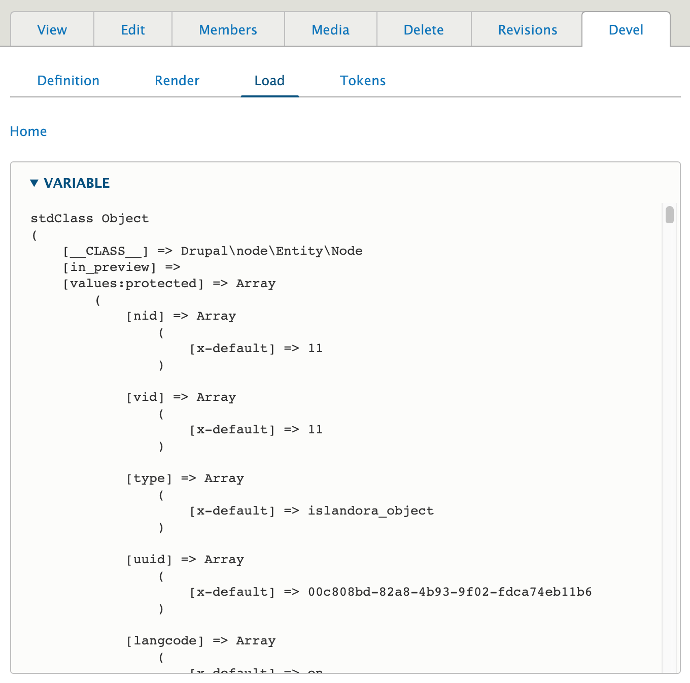
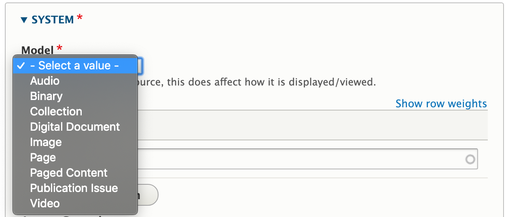
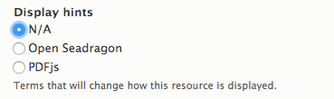
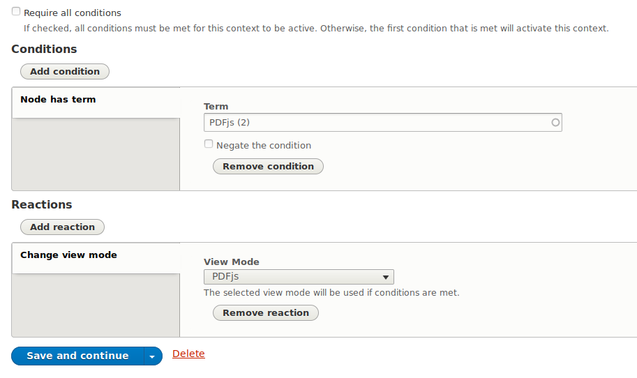
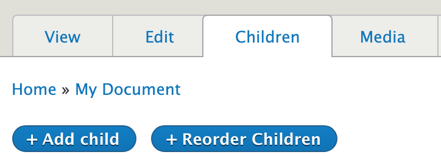

# Content models in Islandora

## Resource Nodes

This section describes the Islandora concept of a Resource Node. For a step-by-step demonstration, see the tutorial [Create a resource node](../tutorials/create-a-resource-node.md).

A resource node holds the descriptive metadata for an Islandora object, as well as groups together
the various files that are part of the object for preservation or display, such as the original file
 and various derivative files generated from it.

The model for exactly what constitutes an object in Islandora is flexible and can be adapted to the needs of specific users. For example, the Islandora Starter Site configuration considers an object as a resource node of the type "Repository Item"  which contains descriptive metadata about the object. Attached to that Node are one or more Media, each representing a file that is part of this object, such as "Original File", "Thumbnail", "Preservation Master", etc. With this model, every original file uploaded into Islandora has its own resource node.

Multi-file Media configurations also attach Media to a parent node, but allow for that node to be represented by multiple "Original File"s. In this model, a Media contains the original file as well as any derivative files created from it (thumbnail, service file, etc.).

For an example of where these two different approaches could apply, the basic configuration might make sense for a book that has rich page-level metadata, so that each page would be its own Node with its own metadata record; the multi-file media configuration might be a better fit for a book that does not have page-level metadata (except an ordering or page numbers), so that each Media would represent one page, and all pages (Media) would be attached to a single parent Node/metadata record for the entire book.


As we learned in the [introduction](user-intro.md), objects in an Islandora repository are
represented as a combination of resource nodes, media, and files in Drupal.
Because of this, their metadata profile, display, form (and much more) are configurable through
the Drupal UI.  This gives repository administrators a huge degree of control over their repository
without any need for coding. Much more so than ever before. And since we're using a core Drupal
solution for modeling our resource nodes and media, compatibility with third-party modules is virtually guaranteed.
This opens up a plethora of solutions from the Drupal community that will save you untold time
and effort when implementing your repository with Islandora.

### Properties

Resource nodes, as Drupal nodes, have some common basic properties regardless
of content type. These properties are not fields.  This means that they
cannot be removed and have limited configurability. Their name, what type of
data they hold, etc... are all baked in.
Here's an example of the basic properties on nodes:

```
nid: 1
uid: 1
title: "I am an Islandora object"
created: 1550703004
changed: 1550703512
uuid: 02932f2c-e4c2-4b7e-95e1-4aceab78c638
type: islandora_object
status: 1
```

As you can see, it's all system data used at the Drupal level to track the basics.

Property | Value
------------ | -------------
nid | The local ID for the node
uid | The ID of the Drupal user who created the node
uuid | The global ID for any entity
title | The title for the node
created | Timestamp of when the node was created
changed | Timestamp of when the node was last updated
type | Content type (e.g. which group of fields are present on the node)
status | Published, unpublished, etc...

!!! note "Compared to Islandora Legacy"
    These node properties are analogous to following Islandora Legacy object properties:

    Islandora Legacy | Islandora
    ----------- | -----------
    owner | uid
    dc.title | title
    PID | uuid
    status | status

The small amount of configurability available for these properties is found on the
content type editing form where a user can choose to change the label of the
title field, whether to display author information on the node's page,
etcetera. These settings will only apply to nodes of that particular content type.


To view all of a node's property and field values administrators can use the 'Devel'
tab's 'Load' section:



### Fields

In addition to the basic node properties identified above, resource nodes (like all Drupal nodes) can have fields.
Most of what we would think of as descriptive metadata is stored as fields. Resource nodes use 'content types' to define a specific set of required and optional
fields it has; we can think of content types as metadata profiles for our objects.
For example, you might have a content type for a set of repository objects that have very specialized metadata requirements but
another content type for generic repository objects that share a more general set of metadata fields.
A resource node's content type is set on its creation and is immutable.
The section on [metadata](metadata.md) describes in more detail how fields on Islandora objects work.

Configuring fields (adding, editing, removing) is usually done through the Manage > Content types interface, as is described in the tutorial, [Create/Update a Content Type](content_types.md).

Islandora has a notion of a _content model_, which is used to identify what type of content is
being represented by a node (e.g. an image, a video, a collection of other items, etc...). This is done
using a special field, _Model_, which accepts taxonomy terms from the _Islandora Models_ vocabulary.
By applying a term from the Islandora Models vocabulary to a node, Islandora will become aware
of how to handle the node in response to certain events, like choosing a viewer or generating derivatives.



!!! note "Compared to Islandora Legacy"
    Content models in Islandora Legacy were immutable and contained restrictions as to what
    types of datastreams could be associated with an object.  Islandora imposes no such
    restrictions. Content models can be changed at any time, and they in no way dictate what
    types of media can be associated with a node.

### Media

All resource nodes can be linked to any number of media.  The media associated with a resource node can be managed using the "Media" tab when viewing a node.  Much like
the "Members" tab, Actions can be performed in bulk using the checkboxes and Actions dropdown.


See [the media section](media.md) for more details.

### Display modes

Drupal uses "display modes" (also called "view modes") as alternative ways to present content to users. You may be familiar with the "full" and "teaser" versions of nodes, which are rendered using two corresponding display modes. Islandora makes use of display modes to control how media content is displayed. Islandora Starter Site provides two display modes for Media, one which renders the OpenSeadragon viewer and the other which renders the pdf.js viewer. These two display modes can be enabled by using "Display hints" in the node edit form, or you can configure Islandora to use a specific display mode for all media based on the file's Mime type. Both methods make use of [Contexts](context.md).

To set the display mode on the resource node's edit form, select the display mode you want to use for that node in the _Display hints_ field:



Due to the associated Context configurations ("OpenSeadragon" and "PDFjs Viewer") that are shipped with the Islandora Starter Sitee, the selected display mode will then be used when the resource node's page is rendered.

At a global level, there are a couple of ways to tell Drupal to use the PDFjs viewer to render the content of the media field whenever the media has a Mime type of `application/pdf`.

The first way is to edit the "PDFjs Viewer" Context. By default, this Context tells Drupal to use the PDFjs viewer if the node has the term "PDFjs" (yes, that's a taxonomy term):



If you add the Condition "Node has Media with Mime type" and configure it to use `application/pdf` as the Mime type, like this:


Context will use whichever Condition applies (as long as you don't check "Require all conditions"). That is, if the "PDFjs" display hint option in the node edit form is checked, *or* if the node's media has a Mime type of `application/pdf`, the media content will be rendered using the PDFjs viewer.

The second way to use the media's Mime type to render its content with the PDFjs viewer is to create a separate Context that will detect the media's Mime type and use the configured display mode automatically. To do this, create a new Context. Add a "Node has Media with Mime type" condition and specify the Mime type, and then add a "Change View mode" Reaction that selects the desired display mode:


Finally, save your Context. From that point on, whenever the media for a node has the configured Mime type, Drupal will render the media using the corresponding display mode.

The node-level and global approaches are not exclusive to one another. One Context can override another depending on the order of execution. Contexts are applied in the order they are displayed on the Contexts page, which is editable through a drag-and-drop interface. Whichever Condition appears last in the list of Contexts between the node-level Condition (which in this case is the "Node has term" condition) the global Condition (which is "Node has Media with Mime type"), that one will override the other. An example of having the display mode specified in the node edit form intentionally override the display mode based on Mime type is to have media with the `image/jp2` mime-type configured to use the OpenSeadragon viewer, but to manually select the OpenSeadragon display mode for nodes with JPEG media (for example, a very large JPEG image of a map, where the OpenSeadragon's pan and zoom features would be useful).

### Members

Islandora has a notion of _membership_, which is used to create a parent/child relationship between
nodes. Membership is denoted using another special field, "Member Of". This is used to create the link
between members and their parent collection, pages and their book ("paged content"), or members of a
compound object and the compound object itself.

Any two nodes can be related in this way, though typically, the parent node has a content
model of [_Collection_](../concepts/collection.md) or [_Paged Content_](paged-content.md) (see their respective pages for more details).
The "Member Of" field _can_ hold multiple references, so it is possible for a
single child to belong to multiple parents, but may also complicate the creation of breadcrumbs.

!!! Note "Compared to Islandora Legacy"
    In Islandora Legacy, there was a distinction between belonging to a collection and belonging to
    a compound object.  In Islandora, this distinction is not present. Since all nodes can have members
    , essentially every node has the potential to be a compound object or collection.

!!! Note "Child v. Member"
    Islandora uses the "child" and "member" descriptor for resource nodes that
    store a reference to another resource node in the "Member Of" field interchangeably.
    Administrators will more often see the "member" terminology more often while
    front-end users will usually see "child" terminology.

For any node, its **Children** tab can be used to see all its members.  You can also perform Actions in
bulk on members using the checkboxes and the Actions dropdown as well as clicking
on the **Reorder Children** tab to adjust the order in which they display.



### More information

The following pages expand on the concepts discussed above:

- [Media](media.md)
- Content Types: [Metadata](metadata.md#content-types) -- [Create / Update a Content Type](content_types.md)

### Copyright and Usage

This document was originally developed by [Alex Kent](https://github.com/alexkent0) and has been adapted for general use by the Islandora community.

[](https://creativecommons.org/licenses/by-nc/4.0/)

[^1] In the Islandora Starter Site, this is the `field_model` field, which is populated by taxonomy terms in the `islandora_models` taxonomy vocabulary provided by the `islandora_core_feature` submodule of `Islandora/islandora`

[^2] In the Islandora Starter Sitee, this is the `field_member_of` field.

## Islandora Legacy Objects versus Islandora Resource Nodes

The conventional Islandora Legacy definition of an object is a file loaded in the repository with associated derivatives. In Islandora Legacy, objects (video files, audio files, PDFs, etc.) are loaded through the user interface, and Datastreams are generated automatically. These consist of access and display copies, the metadata, OCH/HOCR, technical metadata, and more. All of these Datastreams are directly connected to the object and accessed through the admin interface.

In Islandora, the traditional Islandora Legacy objects (video files, audio files, etc. that were represented in different content models) are now Drupal nodes. Islandora object nodes are a special kind of Drupal node, distinct from nodes that exist for other content types such as a blog post, an article, a page (like the About page on a site), and others. These Islandora objects are still loaded through the interface and described with the data entry form, and derivatives are still generated. However, the Datastreams are no longer connected to the original object in the same immutable way. Each of these Datastreams can be manipulated through Drupal by non-developers. You can create a variety of ways to view this metadata and information related to the objects. Doing so requires knowledge of Drupal 8, but this essentially means that there are many ways to view the metadata and access the related objects in Islandora.

In Islandora it is therefore helpful to think of objects as resource nodes. The term reflects the new nature of objects in Islandora. A resource node does not just refer to the individual object file, but encompasses multiple elements that all relate to each other, even if they are no longer directly connected like objects in Islandora Legacy.

The typical elements of a resource node:

-   A content type defining metadata fields defined for the node. A content type may include any number of custom fields defined to store descriptive metadata about the object represented by the node. To function as an Islandora resource node, a content type must define two further fields:
    - A field denoting the 'type' of thing represented by the node (image, book, newspaper, etc.). The value of this field is used by Islandora to control views, derivative processing, and other behavior.[^1]
	- A field in which to record the node's [membership](content_models.md#members) in another node. If populated, this field creates a hierarchical relationship between parent (the node recorded in the field) and child (the node in which the parent is recorded). This may be left empty, but is required for building hierarchies for collections, subcollections, and members of collections, as well as objects (books, "compound objects", etc.) consisting of [paged content](paged-content.md).[^2]
-   Media files (the actual files of JPEGs, MP3s, .zip, etc.) that get loaded through the form
-   Derivative files (thumbnails, web-friendly service files, technical metadata, and more)

These resource nodes are what the librarian, student, archivist, technician, or general non-developer creates through the data entry form. It is possible to configure all elements of a resource node in Islandora through Drupal. This fact allows control over how one accesses the node and how nodes are displayed and discovered online by non-developers. It also allows a repository to take full advantage of all third-party Drupal modules, themes, and distributions available.
