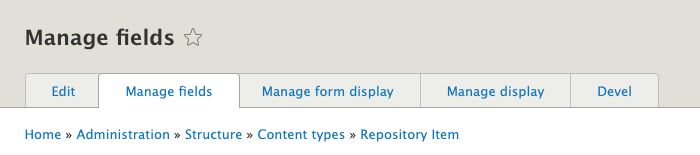
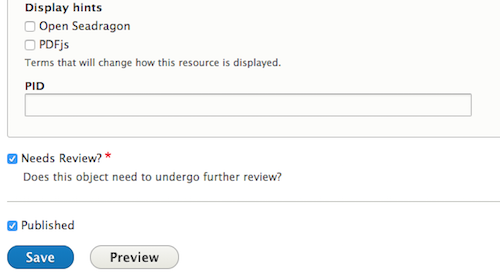

# Create / Update a Content Type

## Overview

Since objects in Islandora 8 are stored in Drupal as Nodes, we use the standard Drupal Content Types system to create and edit our ‘ingest forms.’ For more information about Content Types in general, please see [Content Types in Drupal 8](https://www.drupal.org/docs/8/administering-drupal-8-site/managing-content-0/working-with-content-types-and-fields). Islandora 8 forms are Drupal forms, and if you are already familiar with Drupal Field UI, you’re already well equipped to create and modify your own ingest forms in Islandora 8.

This page will address how to create and modify ingest forms (or rather, Content Types) via the graphical user interface (GUI). For help working with forms via the API, please check out the _Further Reading_ section for links to more advanced Drupal documentation.

## Before you start

- The following How-To assumes that you are using the optional [islandora_defaults](https://github.com/Islandora/islandora_defaults) configuration. This configuration is deployed automatically if you build your Islandora site using the [Ansible Playbook](https://islandora.github.io/documentation/installation/playbook/), ISLE (documentation pending), or are using the [sandbox or a Virtual Machine Image](https://islandora.ca/try)
- This How-To assumes familiarity with Drupal terms such as [Node](https://www.drupal.org/docs/7/nodes-content-types-and-fields/about-nodes), [Content Type](https://www.drupal.org/docs/7/nodes-content-types-and-fields/working-with-content-types-and-fields-drupal-7-and-later), and [Media](https://www.drupal.org/docs/8/core/modules/media).

## How to Modify a Content Type

If you have deployed your Islandora 8 with the Islandora Demo configuration, you will already have a Repository Item content type available, with pre-configured fields. 

1. In the Admin menu, go to **Structure** >> **Content Types** and find the _Repository Item_ content type. 
1. Select *Manage Fields*.


There are multiple tabs with different options to configure your Content Type:



- _Manage Fields_: A list of the fields available in this form. This is where you can add new fields and make adjustments to existing fields, such as whether the field has access restrictions or is required.
- _Manage form display_: Set the order in which fields appear in a form, including nesting; set how the user will enter data into a field (i.e., text field, drop-down list, radio butons, etc); set fields to be hidden in the display
- _Manage display_: Set how the data stored in the fields will be displayed on the Node. Custom display settings can be set for different "view vodes." For instance, a different view mode is applied for items using the Openseadragon viewer, which includes a field that displays the Media in Openseadragon instead of the standard Drupal image viewer.

!!! note "Changes not displaying?" 
    If you make changes under _Manage display_ and don't see them reflected in your Node, double check that you have edited the right _view mode_
- _Devel_: This tab is generated by an optional module that is useful for development and troubleshooting; it can be ignored in this How-To. For more information, see [Devel](https://www.drupal.org/project/devel).

### Add a Field

This example adds a new field where a user can indicate if the repository item needs to be reviewed:

1. Click **Add Field**
1. In some cases an existing field may be available to use instead of creating a new one. The dropdown box labeled _Re-use an existing field_ has a list of available fields. For this example we will create a brand-new field. Since the example field is a “yes/no” decision (whether the item needs review or not), choose "Boolean" from the dropdown menu and give the Label field a name. [See the list of Drupal 8 FieldTypes, FieldWidgets, and FieldFormatters](https://www.drupal.org/docs/8/api/entity-api/fieldtypes-fieldwidgets-and-fieldformatters) for descriptions of the different types available by default. Additional modules, such as the controlled_access_terms module, can provide their own Field types to choose from as well.
1. Click **Save and continue.**
1. Next, configure how the field is stored in the Drupal database. For this field type you can select how many values will be allowed. The default settings, "Limited" in the dropdown box and "1" for the allowed number of values works for our example.
1. Click **Save field settings.**
1. Configure how the field is described (including its display label and the help text for when it appears on a form) and constraints on its use. In this screenshot, the field will be required for this Content Type, and will be set to “on” by default. In the _Default Value_ section, click the checkbox next to _Needs Review_ to indicate all new repository items need review by default.
1. Click **Save settings.**


The new field has been added:


It appears in the ingest form when creating a new repository object. To test this, go to **Content** >> **Add content** >> **Repository item**:



!!! note "RDF Mappings"
    New fields, with the exception of Typed Relation fields, are not automatically indexed in Fedora and the triple-store. Update the    Content Type's RDF Mapping to enable indexing the field (see below).

!!! note "Search"
    New fields will not automatically be searchable. They need to be added to the Solr index configuration. See the ['Setup and Configure Search'](searching.md) page for more information.

!!! note "Context"
    To add new behavior based on the results of this new field, check out [Context](context.md).

### Change the Form Display

To change where in the form a field is displayed, go to the Admin menu, return to **Structure** >> **Content Types**, and find the _Repository Item_ content type again. Select _Manage form display_ from the dropdown menu or select the _Manage form display_ tab.

1. All of the fields in this content type are available, in a list, with a simple drag-and-place UI. Drag the new field to the top of the form. You can also change the way the Boolean options are displayed, with radio buttons as opposed to a single checkbox. Different display options will be available from the dropdown menu depending on field type. For more information, please check out [List of Drupal 8 FieldTypes, FieldWidgets, and FieldFormatters](https://www.drupal.org/docs/8/api/entity-api/fieldtypes-fieldwidgets-and-fieldformatters)
1. Click **Save**.

When creating a new Repository Item, the new field appears at the top, as a set of radio buttons.

### Change the Content Display

Finally, change how the results of this example field are displayed. Initially the new field shows up at the bottom of repository object pages:


In the Admin menu, return to **Structure** >> **Content Types** and find the _Repository Item_ content type again. Select _Manage display_ from the dropdown menu or select the _Manage display_ tab.

1. Find the new field. You can change how the field title or label is displayed. 
1. Click the dropdown menu to choose from inline/above/hidden/visually hidden. 
    - You can also replace the options displayed with variations on a binary choice. Click the gear to choose from the following: _On/Off_, _Yes/No_, _Enabled/Disabled_, _1/0_, _checkmark/X_, or hide the field completely.
    - You can also drag the field into the _Disabled_ section so that neither its label or its contents appear in the display, although the field is saved on the Node.
1. Drag the field to "Disabled" and save.
1. The contents of the field are no longer displayed on the Node, but it is available when editing the node.

## Create a Content Type

To create your own custom content type from scratch, please refer to [this guide](https://www.drupal.org/docs/8/administering-drupal-8-site/managing-content-0/create-a-custom-content-type) on Drupal.org.

Custom content types are not synced to Fedora or indexed by the triple-store by default. Repository managers must add them to the "Content" ('repository_content') context before their nodes are synced to Fedora and indexed by the triple-store.

1. Navigate to the _Contexts_ configuration page ('/admin/structure/context').
1. Find the _Content_ context and click the corresponding **Edit** button ('/admin/structure/context/repository_content').
1. Find the _Node Bundle_ condition in the _Conditions_ section.
1. Click the checkbox for the new Content Type.
1. Scroll down to the bottom of the page and click **Save and continue**.

Updating contexts does not retroactively fire any actions. Any of the custom content type's nodes that were created before updating the context will need to have the indexing action manually triggered.

## Update / Create an RDF Mapping

RDF mapping aligns Drupal fields with RDF ontology properties. For example, the title field of a content model can be mapped to `dcterms:title` and/or `schema:title`. In Islandora 8, triples expressed by these mappings get synced to Fedora and indexed in the Blazegraph triplestore. RDF mappings are defined/stored in Drupal as a [YAML](https://yaml.org/) file (to learn more about YAML, there are [several tutorials on the web](https://duckduckgo.com/?q=yaml+tutorial). Currently, Drupal 8 does not have a UI to create/update RDF mappings to ontologies other than Schema.org. This requires repository managers to update the configuration files themselves. Consider using the RDF mappings included in [islandora_defaults](https://github.com/Islandora/islandora_defaults) as templates by copying and modifying one to meet your needs.

The Drupal 8 Configuration Synchronization export (e.g. `http://localhost:8000/admin/config/development/configuration/single/export`) and import (e.g. `http://localhost:8000/admin/config/development/configuration/single/import`) can be used to get a copy of the mappings for editing in a text editor before being uploaded again. Alternatively, a repository manager can update the configuration on the server and use [Features](https://www.drupal.org/project/features) to import the edits.

An RDF mapping configuration file has two main areas: the mapping's metadata and the mapping itself. Most of the mapping's metadata should be left alone unless you are creating a brand new mapping for a new Content Type or Taxonomy Vocabulary. A _partial_ example from [islandora_default's islandora_object (Repository Item)](https://github.com/Islandora/islandora_defaults/blob/8.x-1.x/config/install/rdf.mapping.node.islandora_object.yml) is included below:

```
langcode: en
status: true
dependencies:
  config:
    - node.type.islandora_object
  enforced:
    module:
      - islandora_demo
  module:
    - node
id: node.islandora_object
targetEntityType: node
bundle: islandora_object
types:
  - 'pcdm:Object'
fieldMappings:
  title:
    properties:
      - 'dc:title'
  field_alternative_title:
    properties:
      - 'dc:alternative'
  field_edtf_date:
    properties:
      - 'dc:date'
    datatype_callback:
      callable: 'Drupal\controlled_access_terms\EDTFConverter::dateIso8601Value'
  field_description:
    properties:
      - 'dc:description'
```

The required mapping metadata fields when creating a brand-new mapping include the `id`, `status`, `targetEntityType`, and `bundle`. (`uuid` and `_core`, not seen in the example above but may be present in exported copies,  will be added by Drupal automatically.) `bundle` is the machine name for the Content Type or Taxonomy Vocabulary you are creating the mapping for. `targetEntityType` is `node` for Content Types or `taxonomy_term` for Taxonomy Vocabularies. The `id` configuration is a concatenation of target entity type and bundle ('node' and 'islandora_object' in the example above). The `id` is also used to name the configuration file: e.g. `rdf.mapping.node.islandora_object.yml` is `rdf.mapping.` plus the id (`node.islandora_object`) and then `.yml`.

The mapping itself consists of the `types`' and `fieldMappings` configurations.

All the mappings use RDF namespaces instead of fully-qualified URIs. For example, the type for islandora_object is `pcdm:Object` instead of `http://pcdm.org/models#Object`. Unfortunately, the available namespaces are defined in module hooks (hook_rdf_namespaces) rather than in a configuration file. Repository managers wanting to add additional namespaces need to create their own module and implement hook_rdf_namespaces. See the [islandora_defaults](https://github.com//Islandora/islandora_defaults/blob/8.x-1.x/islandora_defaults.module) hook implementation for an example.

Namespaces currently supported (ordered by the module that supplies them) include:

- rdf
    - content: http://purl.org/rss/1.0/modules/content/
    - dc: http://purl.org/dc/terms/
    - foaf: http://xmlns.com/foaf/0.1/
    - og: http://ogp.me/ns#
    - rdfs: http://www.w3.org/2000/01/rdf-schema#
    - schema: http://schema.org/
    - sioc: http://rdfs.org/sioc/ns#
    - sioct: http://rdfs.org/sioc/types#
    - skos: http://www.w3.org/2004/02/skos/core#
    - xsd: http://www.w3.org/2001/XMLSchema#
- islandora
    - ldp: http://www.w3.org/ns/ldp#
    - dc11: http://purl.org/dc/elements/1.1/
    - nfo: http://www.semanticdesktop.org/ontologies/2007/03/22/nfo/v1.1/
    - ebucore: http://www.ebu.ch/metadata/ontologies/ebucore/ebucore#
    - fedora: http://fedora.info/definitions/v4/repository#
    - owl: http://www.w3.org/2002/07/owl#
    - ore: http://www.openarchives.org/ore/terms/
    - rdf: http://www.w3.org/1999/02/22-rdf-syntax-ns#
    - islandora: http://islandora.ca
    - pcdm: http://pcdm.org/models#
    - use: http://pcdm.org/use#
    - iana: http://www.iana.org/assignments/relation/
- islandora_demo
    - relators: http://id.loc.gov/vocabulary/relators/
- controlled_access_terms
    - wgs84_pos: http://www.w3.org/2003/01/geo/wgs84_pos#
    - org: https://www.w3.org/TR/vocab-org/#org:
    - xs: http://www.w3.org/2001/XMLSchema#

The `types` corresponds to the `rdf:type` predicate (which corresponds to JSON-LD's `@type`) and can have multiple values. This type value will be applied to every node or taxonomy term using the mapped content type or vocabulary.

In some cases a repository may want a node or taxonomy term's `rdf:type` to be configurable. For example, the Corporate Body Vocabulary (provided by the Controlled Access Terms Default Configuration module) has `schema:Organization` set as the default type in the RDF mapping. However, more granular types may apply to one organization and not another, such as `schema:GovernmentOrganization` or `schema:Corporation`. The `alter_jsonld_type` Context reaction allows Content Types and Taxonomy Vocabularies to add a field's values as `rdf:types` to its JSON-LD serialization (the format used to index a node or taxonomy term in Fedora and the triple-store).

`fieldMappings` specifies the fields to be included, their RDF property mappings, and any necessary data converters (the `datatype_callback`). One field can be mapped to more than one RDF property by adding them to the field's properties list. The `datatype_callback` is defined by the 'callable' key and the fully qualified static method used to convert it to the desired data format. For example, fields of the Drupal datetime type need to be converted to ISO 8601 values, so we use the `Drupal\rdf\CommonDataConverter::dateIso8601Value` function to perform the conversion.

!!! Tip "Islandora Quick Lessons"
    Learn more with this video on [Customizing a Form](https://youtu.be/tOW27DZY9hs).
