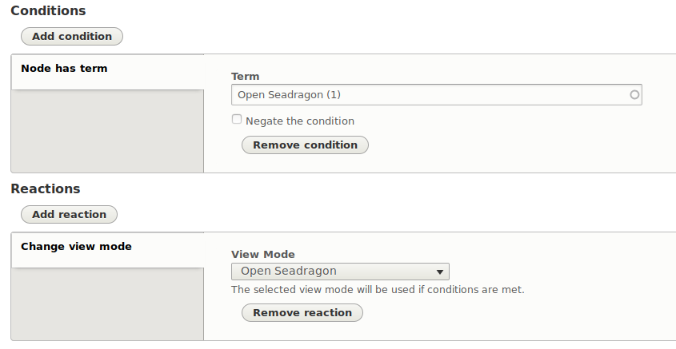
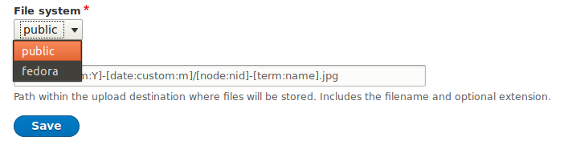

## Context in Islandora 8

[Context](https://www.drupal.org/project/context) is a Drupal contrib module that allows configuration of "if this, then that" logic using an administrative user interface. Context defines "conditions" and "reactions" to enact the "if this [condition], then that [reaction]" logic. Some Islandora 7.x repositories use the community-contributed [Islandora Context](https://github.com/SFULibrary/islandora_context) module to apply this sort of logic to Islandora objects. An example Context from Islandora 7.x is

> If an object's namespace is 'customnamespace', render the block containing the rights statement "Please contact Special Collections before reusing this item".

The Context project page on drupal.org says "You can think of each context as representing a 'section' of your site", but that doesn't tell the whole story, since it gives the impression that Context is all about defining subsites. Context in Drupal 8 is much more powerful in Drupal 8 than in Drupal 7 due to how it interacts with the rest of Drupal (specifically, through Drupal 8's new plugin API). Because of this increased flexibility and power, and because Context provides a ready-made user interface for site administrators to combine conditions and reactions, Islandora 8 uses Context to drive the logic underlying many important aspects of Islandora, including which derivatives get generated and how objects are displayed. In Islandora 7, many of these things were managed (and often hard-coded) within solution packs and utility modules.

### An Example

Let's look at the example of how Context can determine how an object is diplayed. Drupal 8 has the idea of "view modes", which allow site builders to choose what happens when an object is viewed by the user (it has nothing to do with Drupal Views). In the node edit form for Islandora objects, there is a checkbox that, if checked, tells Drupal to render the image using the OpenSeadragon viewer:

 This  functionality is accomplished via the "Open Seadragon" Context, which, as its configuration suggests, checks as its condition whether the node as the "Open Seadragon" tag and if so, reacts by using the view mode "Open Seadragon":

### Context and Actions

Context in Drupal 8 uses Drupal Actions to execute the "then that" part of their logic. An implication of this is some configuration options relevant to the outcome of the "then that" reaction are configured in the Action admin interface (located at `admin/config/system/actions`), not within the Context admin interface (located at `admin/structure/context`). While this makes for a clunky admin experience, the advantage is that it allows the reuse of a single piece of Drupal code in multiple Contexts.

One important group of functionality in Islandora 8 repositories that admins might want to control is what types of [media](datastreams.md) get persisted to Fedora. Islandora 8 allows administrators to choose what types of media get persisted to Fedora and what types of media get persisted to the Drupal public file system. For example, you may want to persist your thumbnails to Fedora along with your "Preservation Master" and "Original File" files. This can be accomplished using Context.

By default Islandora 8 stores thumbnails in Drupal's public file system, not in Fedora. Thumbnails are automatically gererated by a Context (the "Image Service File" Context to be specific), but if you want to change the file system where your thumbnails are stored to the Fedora file system, you need to change that setting in the "Image - Generate a thumbnail from a service file" Action, not in the Context that uses that action:

This configuration should be done as part of your initial Islandora 8 setup, since there is currently no way to move thumbnails that were persisted to Drupal's public file system to Fedora, or vice versa. But, at least site admins can choose one or the other using this Action.

### Increased Flexibility

Most Islandora 8 repository administrators will not need to alter or configure any Contexts. But since much of Islandora 8's underlying functionality is governed by this powerful Drupal contib module, administrators should become comfortable using it to customize their repositories. Also, since Islandora 8 objects are ordinary Drupal nodes, Islandora objects can take advantage of standard Drupal 8 Context functionality out of the box.
