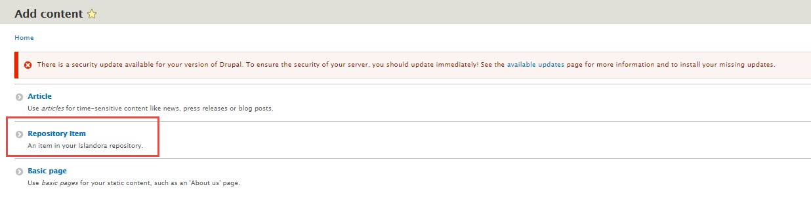
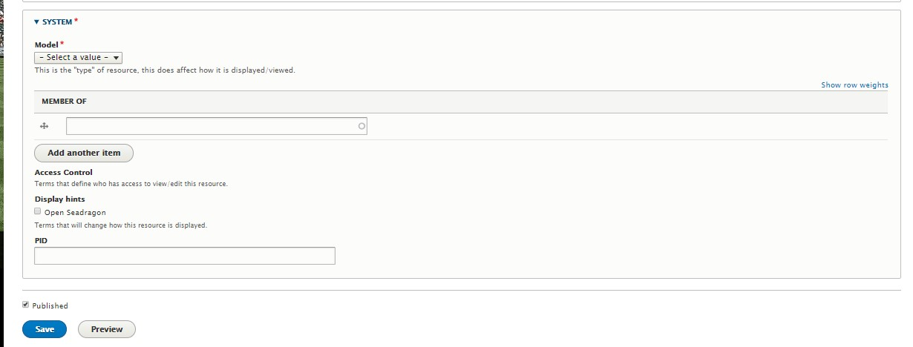

To create a new item in your Islandora 8 digital repository, we start by creating a node.
A node holds the descriptive metadata for content, as well as grouping together an original file and
all of the derivatives files generated from it. To create a new node, click on Add content.
This is under Tools.

Then click on Repository Item. This will assign the default metadata profile to your item.

Fill out the form. We're going to create an image, so under System, select "Image" from the "Model"
drop down box. Selecting different models will impact how Islandora handles content, dictating
important behaviours such as display and derivative generation.

When done, click Save.

## Upload an Original File

Congratulations, you have created a Node! But alas, it has no files.  To upload a file, click on the
node's Media tab.

Then click on Add Media (a blue button).

We want to add an image, so clicking on "Image" is appropriate in most circumstances. Drupal considers
any type of image that can be viewed natively in the browser as an "Image".  For other image types that
require special viewers, such as Tiffs, you have to choose "File"

You are now presented with the form for the technical metadata of the file.  There are three required
parts of the form:

1. The media's name.
1. The file to upload.
1. The usage of the file, which dictates how Islandora interprets the file. To trigger derivative
generation, select "Original File" from the drop down box.

Click save when done, and the file will be uploaded (to Fedora by default).  Now return to the node
you created and you should see the image along with its descriptive metadata.

