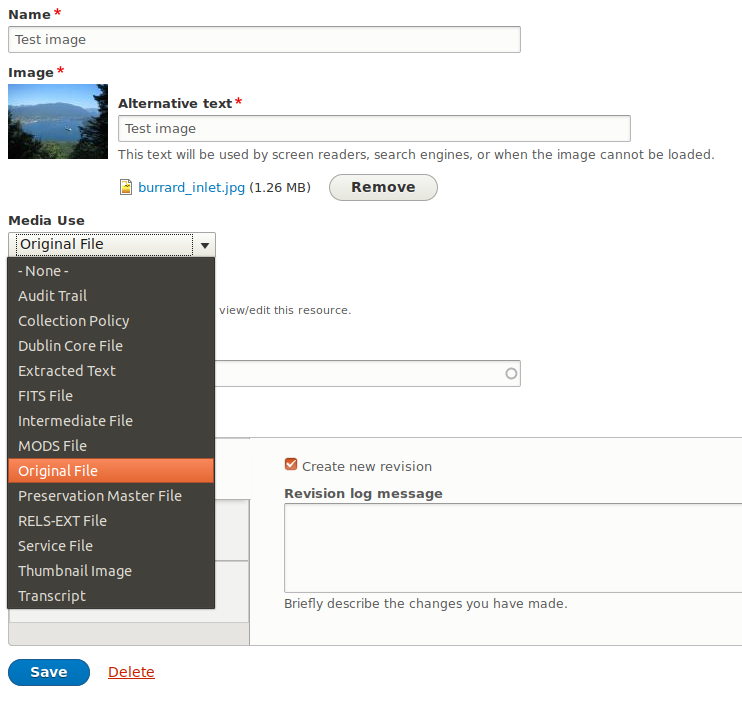

Drupal 8 recognizes files (such as images, audio files, video files, etc.) but wraps each file in an intermediate structure called a
"media" to allow us to attach fields to files. It is in a media's fields that we store information about the media's file, such as file
size, width and height (for images), alt text (for images), creation date, and so on.

!!! Note
    In Islandora 7, this sort of technical metadata would have been stored in a single RELS-INT datastream.
    In Islandora 8, each datastream holds its own technical metadata using media entities.

## Media Ownership

Islandora 8 objects can have any number of media associated with them. Media advertise which object they belong to using a special field,
"Media Of". By editing this field, you can change the what node owns the media, and therefore, where it gets displayed or managed.

!!! Note
    The direction of the relationship between objects and datastreams is reversed when compared to Islandora 7.  Generally speaking,
    objects are unaware of their datastreams, and it's a Drupal view that lists datastreams for an object.

## Media Usage

Islandora 8 media express their intended use with a special "Media Use" field, which accepts taxonomy terms from the "Media Usage"
vocabulary. Because the Media Usage vocabulary is an ordinary Drupal vocabulary, Islandora 8 site administrators can add their own
terms, and in turn, these local terms can be used to identify media that have some custom local purpose.

!!! Note
    Terms from the Media Usage vocabulary are very similar to DSIDs in Islandora 7.  The only difference is that a DSID is immutable,
    but a media's usage can be changed at any time through the media's edit form.

## Derivatives

Islandora generates derivatives based on Media Usage for a Media and the Model of the node that owns it.  All of this is configurable
using context, but by default, derivatives are generated from "Original Files". When an Original File is uploaded, if the node that
owns it has an "Image" model, image derivatives are created.  If it's a "Video", then video derivatives are generated, etc...

Within an node's media tab, you can see all of its media, including derivatives, listed along with their usage. For example, from the
Original File, a lower quality "Service File" and a smaller "Thumbnail Image" file were generated.

For more information on how to set configure derivatives, see the section on context.

## Media revisions

To be completed on resolution of https://github.com/Islandora-CLAW/CLAW/issues/1035.
