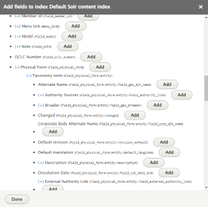

## Overview
This tutorial contains are step-by-step instructions for adding a facet on a vocabulary reference field. After a search, a block containing the configured facets appears letting the user filter their search.

This is a walkthrough. For a more in-depth discussion of creating facets, see [Configure Advanced Search](advanced-search.md)

This tutorial currently works best with the "standard" install of the Islandora and Islandora Default modules which can be obtained from the playbook (as opposed to the install profile, which handles facet blocks differently).

## Step 1: Add Vocabulary Bundles

Steps 1 and 2 add the field to the Solr index.

1. Go to **Admin**  >> **Configuration** >> **Search and Metadata** >> **Search API** (or, /admin/config/search/search-api)
1. Edit the *Default Solr content index*
1. Open the *Configure the Taxonomy term datasource* fieldset, choose the vocabulary bundles you want to add to be indexed
1. Click **Save**

## Step 2: Add Fields

1. Back at the edit *Default Solr content index*, choose **Fields** from the tabs across the top
1. Click on the **Add fields** button
1. Scroll down to *Content*
   1. Click on the **+** next to the field you want to add.
   1. Click on the **+** next to "Taxonomy term". A bunch of subfields will appear.
   1. Look for the field that contains "YOUR_FIELD:entity:name" and click on the "Add" button at the end of the bulleted point.
   1. Click “Done.”
1. Find your newly added fields In the list, and ensure the "Type" of the new field is "string" so it can be compatible with Facets.
1. If the "Machine name" of the new field is generic, like "name_1", change it to be the same as the part of the "Property path" up to the first : (this will be the same as the field's machine name).
1. Click on the **Save changes** button.

## Step 3: Rebuild Solr Index

Now that you've added the field, you need to rebuild your Solr index.

1. Go back to *Default Solr content index* (admin/config/search/search-api/index/default_solr_index)
1. Click on the **Index now** button.

## Step 4: Add & Configure Facet
Step 4 adds and configures the facet itself.

1. Go to **Admin**  >> **Configuration >> *Search and Metadata* >> **Facets** (admin/config/search/facets)
1. Click on the **Add facet** button
1. Select the *View Solr search content* source
1. In the Field list, select the field you added above
1. You can adjust the admin Name of the facet
1. Click **Save".
1. Choose your configuration options (for example, "List item label")
1. Click **Save**.

## Step 5: Add Facet as a Block
This step adds the facets in a single block.

1. To place a Facets block for the facets you have created, go to **Admin** >> **Strucure** >> **Blocks layout** (admin/structure/block).
1. Click **Place block** in the desired block region, for example, *Sidebar second*.
1. Start typing the facets block in the Filter and click **Place block**
1. Choose the facets to include
1. Choose other configuration options for the block, for example change the title that displays and restrict by content type, etc.
1. Click **Save**.

At this point, searching for content that has facet values should cause the block to appear. For more in-depth overview of search, see [Configure Advanced Search](advanced-search.md)

!!! note "Facets aren't necessarily searchable"
    While this will create facets, the values that appear won't work (won't necessarily bring back any content) if you type them in the search box. This is because the fulltext search box uses only fulltext fields, and facets, as mentioned above, requires string fields.

    If you want to be able to search for taxonomy term values and bring up the related nodes, you could either include the full rendered item for your content type, or you may wish to repeat step 2 for each entity reference field, and set the new fields to fulltext so that searching for term values brings back node results.
