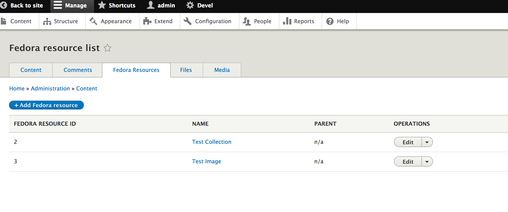

# Getting Started with Islandora CLAW

## How to Add a User
1. Log in under admin credentials.
2. Click the **Manage** tab from the top toolbar.
3. Select **People** tab from the resulting menu.
 
4. Enter all the required fields, as indicated by red asterisks, in the Add User page.
5. Click on “Create New Account” button at the bottom of the page.
6. To review/edit the permission for each role, click the **Permissions** tab in the set of tabs above the Add User button.

## How to Create a New User Role
1. Click the **Manage** tab from the top toolbar.
2. Select **People** tab from the resulting menu.
3. Click the **Permissions** tab in the set of tabs above the Add User button.
4. Click the blue botton “Add role”
 
5. Name the role in a way that it can be disambiguated from related activities or similar groups
    1. I.e. use the course code for a particular class of students working on a particular collection.
6. Click the **Save** button.
7. To edit the permission for a role, click on the **Edit** dropdown menu to the right of the role and select **Edit Permissions**.
8. Scroll down until you see the “Islandora section” of options. (Currently this is the very bottom of a very long page)
    1. Resource ‘type’ is what you’ll most often deal with
    2. Resource entities are your baseline from which you build
    3. RDF is a Fedora resource
    4. RDF Source (i.e. descriptive information) is a Resource
    5. Collections are now considered a type
    6. Audio, Images, etc are also going to be types (this might require changes in the vocabulary we use Drupal “entities” (i.e. your core set of elements) and Drupal “bundles” (includes your entities plus other elements)

## Administrative Tasks

### How to Add an Item to a Collection
1. Click the **Manage** tab from the top toolbar.
2. Select **Content** tab from the resulting menu.
3. Click on **Fedora Resources*** tab (3rd tab).

4. Click on "Add fedora resource" button.
5. Click on "Islandora image" link. This will load the "Create of bundle Islandora image" page.
6. Fill out form fields.  [NOTE: currently the generation of image derivatives is not supported.]
    1. Name
    2. Authored by
    3. memberOf
        1. This field will auto-populate
    4. Description
    5. OJB
    6. JP2
    7. MEDIUM_SIZE [NOTE: for now, just use this option to upload an object]
        1. Click on "Add new media" button.
        2. You must create some alternative text for the object.
        3. Click "Create Media" button.
    8. TN (Thumbnail)
    9. "Promoted to front page" checkbox.
    10. "Sticky at top of lists" checkbox.
    11. Revision log message
    12. Click "Save" button.
    13. Once you upload a file, you can Edit or Remove it.

