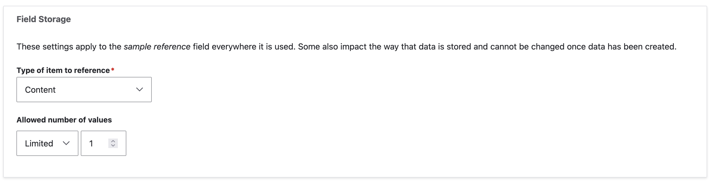
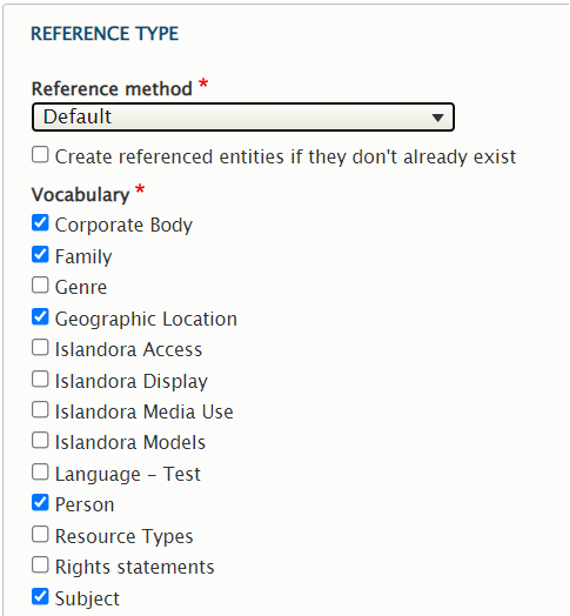

# Metadata in Islandora

> TL;DR: In Islandora, metadata is stored in Drupal, in _fields_ attached to _entities_ (nodes or media). This allows us to interact with metadata (add, edit, remove, display, index in a search engine...) almost entirely using standard Drupal processes. If exporting this metadata to Fedora and/or a triplestore, the values are serialized to RDF using mappings that can be set for each bundle.

!!! note "Drupal 8 Terminology"
    In Drupal 8, Fields can be attached to _bundles_ (sometimes called _entity sub-types_ -- e.g. Content types, Media types, Vocabularies) or _entities_ (e.g. Users). For more on Fields, see ["2.3 Content Entities and Fields"](https://www.drupal.org/docs/user_guide/en/planning-data-types.html) and ["6.3 Adding Basic Fields to a Content Type"](https://www.drupal.org/docs/user_guide/en/structure-fields.html) in the Official Drupal Guide.

<!-- Next revision: check status of changing 'bundles' to 'entity sub-types' (https://www.drupal.org/project/drupal/issues/1380720). -->

As described in the [resource nodes section](content_models.md#resource-nodes), Islandora digital objects are comprised of _Drupal nodes_ for descriptive metadata, _Drupal media_ for technical metadata, and _Drupal files_ for the binary objects. This section describes how Islandora uses and extends Drupal fields to manage descriptive metadata.

## Content Types

In Drupal, Nodes come in different subtypes called [Content Type](../user-documentation/glossary#content-type). These let you define a type of content ("Article" and "Basic Page" are Drupal defaults and "Repository Item" is an Islandora specific example), the set of metadata fields that are attached to that content, and how those fields can be edited and displayed. Each [Content Type](../user-documentation/glossary#content-type) is essentially a metadata profile that can be used for a piece of web content, or to describe a digital resource. You can create your own [Content Types](../user-documentation/glossary#content-type) for your Islandora project or use a pre-defined one like Repository Item from the Islandora Starter Site. We will go over the metadata specific aspects of Content Types below, but for a fuller walk-through of creating a [Content Type](../user-documentation/glossary#content-type) [see here](content_types.md#create-a-content-type).

Not all [Content Types](../user-documentation/glossary#content-type) in your Drupal site need be [Islandora Resource Nodes](content_models.md#resource-nodes). Making a [Content Type](../user-documentation/glossary#content-type) a Resource Node will associate Islandora specific behaviours (such as syncing to Fedora or causing derivatives to be generated) with it. The decision to make a content an Islandora resource node is left to the discretion of the site manager. In Islandora, a "resource node" is usually considered a descriptive record for "a thing", and is conceptually similar to an "Islandora Object" in 7.x, i.e. a "Fedora Object" in Fedora 3.x and below. Read more on configuring a [Content Type](../user-documentation/glossary#content-type) to be treated as a [Resource Node](content_types.md#create-a-content-type).

### Fields

The administrator will define the fields that are associated with a specific [Content Type](../user-documentation/glossary#content-type). The same fields can be applied to different [Content Type](../user-documentation/glossary#content-type), but the field display and editing configurations are unique to each [Content Type](../user-documentation/glossary#content-type). The names and definitions of these fields are specific to Drupal and do not have to correspond to an outside metadata schema. You will give each field a Label, Machine Name, and a specific [Field Type](#field-types), like Text, Integer, EDTF, or Entity Reference (see below). Specific to the Field Type you will then define the maximum length of the field, the number of values it can contain, and what taxonomies it might link to.

Fields can be added under **Administration** >> **Structure** >> **Content types** >> _Your Content Type's Name_ >> **Manage fields** (/admin/structure/types/your_type/fields). This tab will list all Fields, their Label, Machine Name, Field Type, and give you the option to make what edits to the definition of that field that you can.

Certain decisions must be made when fields are created, and before any content is added, because they can not be changed later. Field Type can not be changed, so you wouldn't be able to change a text field to a taxonomy field after creation. The field's machine name also can't be changed. The number of values allowed in a field or its maximum length or type of item to reference (in the case of Entity reference fields) can not be changed after content has been added. You can, however, always add new fields to a [Content Type](../user-documentation/glossary#content-type), even after content has been added.

!!! islandora "7.x Migration Note: What About My MODS XML?"
    Even when using the Islandora Starter Site, there is no "official" metadata schema in Islandora. Where Islandora 7.x used MODS, and took advantage of its hierarchical/extensible structure, Drupal Fields are a flat structure working with distinct, individual elements. You can base your fields on those in MODS, or any other schema, but that structure is up to you. The Metadata Interest Group has developed a sample [MODS-Drupal-RDF mapping](https://docs.google.com/spreadsheets/d/18u2qFJ014IIxlVpM3JXfDEFccwBZcoFsjbBGpvL0jJI/edit?pli=1#gid=0), which provides a structure upon which you can build your Drupal fields. It is used by the Repository Item [Content Type](../user-documentation/glossary#content-type) in the Islandora Starter Site.


!!! tip "You Cannot Change The [Content Type](../user-documentation/glossary#content-type) Of A Node"
    Once a node is created, its [Content Type](../user-documentation/glossary#content-type) cannot be changed. Just as you are unable to change many aspects of a Field once it has been created, once a node has been created it is now permanently of that [Content Type](../user-documentation/glossary#content-type) and the fields associated with it. At that point your only option would be to create a new node of the intended content type, map the field values (programmatically or by copy-paste), and update any media or children that refer to the old node to refer to the new one.


The Islandora Starter Site provides a **Repository Item** [Content Type](../user-documentation/glossary#content-type) that can be used as a structure to build your collection around, or it can be used as a sample to see how fields in [Content Type](../user-documentation/glossary#content-type) work. It pre-defines fields, including **Alternative Title** and **Date Issued** that could be of use in many digital repositories. The full list of fields and their field types can be seen in the screenshot below.

 from Islandora Starter Site.](../assets/metadata_content_type_screenshot.png)

!!! tip "Titles Aren't Conventionally-Configurable Fields"
    The field *title* is built-in to each [Content Type](../user-documentation/glossary#content-type) by default, and can be referenced in views, templates, and indexing like other fields, but it cannot be configured like other fields. The only aspect you can change about *title* is its label. It has a built-in maximum length of 255 characters which cannot be changed. If your content requires longer titles we recommend you create a separate "long_title" field to store the full title and reserve the default title field for a display title.
    There is a contributed module called [Node Title Length](https://www.drupal.org/project/title_length), which allows an administrator to configure the length of the title field in the core node table. However, this only works on nodes (not media or other entities) and involves meddling in a core Drupal database schema, which makes some people uneasy.


### Content Entry Form/Manage Form Display

After creating the Fields for a [Content Type](../user-documentation/glossary#content-type) you'll be able to manage the form used by content creators to create Nodes of that [Content Type](../user-documentation/glossary#content-type). On the **Manage form display** tab you'll be able to edit this form by arranging the order of the fields, choose what Widget will define the entry options for a field, and then set certain settings for that Widget. Fields are arranged by dragging the cross to the left of the **Label**. They can also be removed from the form, but not the [Content Type](../user-documentation/glossary#content-type), by dragging them to the bottom of the list under the **Disabled** heading. Widgets are defined by Field Type, so an Entity reference field could use auto complete, a select list, or even checkboxes, and are chosen from a drop-down list. The widget settings are accessed through the gear on the far right of a row and may allow you to set the size of an entry field, whether the field *Label* is displayed, or if you use placeholder text.


### Content Display/Manage Display

The **Manage display** tab is where you will make decisions about how to
display the metadata. Order is arranged as above, and can again be
dragged to the **Disabled** section to hide the field from display. You can
choose whether a field's label is displayed above the value, in-line, or
hidden.

## Vocabularies

See also: [MIG Presentation on Taxonomies](https://docs.google.com/presentation/d/1LfpU6H4qxXtnYQPFntwMNtsgtU30yzp2MxwKKAllUOc/edit?usp=sharing) by Kristina Spurgin, 2021-07-19

In Drupal, _Taxonomy Vocabularies_ (or simply _Vocabularies_) are also entity subtypes that define a set of fields and their configurations. Whereas instances of content types are called _nodes_, items in a vocabulary are called _taxonomy terms_ (or simply _terms_). Traditionally, taxonomy terms are used to classify content in Drupal. For instance, the Article [Content Type](../user-documentation/glossary#content-type) includes a field `field_tags` that can refer to terms in the Tags vocabulary.

There are two ways that users can interact with taxonomies: they can be "closed," e.g. a fixed list to pick from in a dropdown, or "open," e.g. `field_tags` where users can enter new terms, which are created on the fly. This is not set on the _vocabulary_ itself, but in the configuration of the field (typically on a node). Terms within vocabularies have an ordering, and can have hierarchical structure, but do not need to.

Islandora (through the Islandora Core Feature) creates the 'Islandora Models' vocabulary which includes the terms 'Audio', 'Binary', 'Collection', 'Compound Object', 'Digital Document', 'Image', 'Newspaper', 'Page', 'Paged Content', 'Publication Issue', and 'Video'. Islandora Starter Site provides contexts that cause certain actions (e.g. derivatives to happen, or blocks to appear) based on which term is used.

<!-- Is it possible to add your own terms to this vocabulary? Is it recommended? -->

<!-- field_model is a "special field" in terms of the RDF mapping, because the drupal URI gets replaced by the 'external URI' but I'm not sure if this is where to mention this.-->

The Controlled Access Terms module provides additional vocabularies:

- Corporate Body
- Country
- Family
- Form
- Genre
- Geographic Location
- Language
- Person
- Resource Types
- Subject

Each of these vocabularies has its own set of fields allowing repositories to further describe them. The Repository Item [Content Type](../user-documentation/glossary#content-type) has fields that can reference terms in these vocabularies. See 'Entity Reference fields' in the 'Field Types' section below.

The vocabularies provided by default are a starting point, and a repository administrator can create whatever vocabularies are desired.

!!! warning "Large Taxonomy Vocabularies"
    The Drupal Taxonomy UI is known to break down when your vocabularies get large (e.g. over 20,000 terms). Jonathan Hunt created the [CCA Taxonomy Manager](https://github.com/catalyst/cca_taxonomy_manager) module for SFU to solve this problem.

## Field Types

Fields are where descriptive and administrative metadata about Drupal entities is stored. There are different *types* of fields including boolean, datetime, entity reference, integer, string, text, and text_with_summary. These field types also have *widgets* (controlling how data is entered) and *formatters* (controlling how data is displayed). The [Drupal 8 documentation on FieldTypes, FieldWidgets, and FieldFormatters](https://www.drupal.org/docs/8/api/entity-api/fieldtypes-fieldwidgets-and-fieldformatters) includes a list of the core field types with brief definitions, along with a list of core widgets and formatters. [Custom field types can be created](https://www.drupal.org/docs/creating-custom-modules/creating-custom-field-types-widgets-and-formatters) to represent data in ways not provided by these core options.

More field types, formatters, and widgets are available in various modules. For example, the controlled_access_terms module provides two additional field types designed specifically for use with Islandora: ETDF, and Typed Relation. These and the Entity Reference field type are described in more detail below, since they are of particular interest for Islandora users.

### Authority Link

The Authority Link data type configures fields to hold two associated values:

- An external source authority (selected from a pre-configured list of external authority options).
- A link for a specific term from the selected external source authority.

Within Islandora, this data type is used by a metadata field in Taxonomy Vocabularies called Authority Sources to capture equivalent representations of terms from external authority sources.

!!! tip
    The term external authority source refers to both controlled vocabularies like Art & Architecture Thesaurus or FAST as well as Name Authority Files like Library of Congress Name Authority File or VIAF.

For instance, if you are creating a term called Red squirrels within the default Taxonomy Vocabulary Subject, you may want to include the URI for Tamiasciurus from the FAST (Faceted Application of Subject Terminology) vocabulary. If you configured the field Authority Sources to list FAST (Faceted Application of Subject Terminology) as an external source authority option, you can select this source and add the associated URI (http://id.worldcat.org/fast/1142424).


#### Configurations for Authority Sources field

Each Taxonomy Vocabulary can have different external source authority options for its Authority Sources field. To configure the Authority Sources field to change these options, navigate to Home-->Administration-->Structure-->Taxonomy-->Edit *Taxonomy Vocabulary Name*-->*Taxonomy Vocabulary Name* and select "Edit" for the Authority Sources field. Then enter your options in the Authority Sources text box, entering one value per line in the format key|label.
The key is the stored value (typically an abbreviation representing the authority source). The label will be used in displayed values and editing forms.


By default, this field is repeatable. To change this, edit the "Field settings" and change Allowed numbers of values from "Unlimited" to "Limited" and enter the number of allowable values. This will apply to every instance of the Authority Sources field across your Taxonomy Vocabularies. You cannot change the repeatability of Authority Sources after data has been entered in the field.

### Entity Reference

Entity Reference fields are a special type of field built into Drupal core that creates relationships between entities. The field's configuration options include (but are not limited to):

- Which kind of entity can be referenced (*only one type of item to reference can be defined per field*)
- The allowed number of values (limited or unlimited)
- Whether to use Views for filtering
- Whether to allow users to create new referenced entities while inputting data, if they don't already exist

The *Repository Item* content type, provided by the Islandora Starter Site, includes several entity reference fields that reference vocabularies defined by the *islandora* and *controlled_access_terms* modules.

#### Configurations for Entity Reference field

The screenshots below show how you can configure an entity reference field (in this case the Subject field on the Repository Item content type).

!!! tip
    Note that once the type of entity to reference has been defined, and data has been created, it cannot be changed.

Storage settings for entity reference field where you set whether the field will reference content nodes or taxonomy terms:



Reference type settings for entity reference field where you select which vocabularies the autocomplete utility should query when editors are entering data:



!!! tip "Data Consistency"
    Selecting which vocabularies can be referenced from an entity reference field only affects which vocabularies will be searched when a user types into the autocomplete field in the Drupal form for adding a new item. These settings do not impose constraints on the underlying database, so it is still possible to load references to other vocabularies without being stopped or warned when ingesting data through [various migration methods](../technical-documentation/migration-overview.md).

### EDTF

The EDTF field type is defined in the *controlled_access_terms* module, and designed for recording dates in [Extended Date Time Format](https://www.loc.gov/standards/datetime/edtf.html), which is a format based off of the hyphenated form of ISO 8601 (e.g. 1991-02-03 or 1991-02-03T10:00:00), but also allows expressions of different granularity and uncertainty. The Default EDTF widget has a validator that only allows strings that conform to the EDTF standard. The Default EDTF formatter allows these date strings to be displayed in a variety of human-readable ways, including big- or little-endian, and presenting months as numbers, abbreviations, or spelling month names out in full. Close review of the [EDTF Specifications](https://www.loc.gov/standards/datetime/edtf.html) is recommended when configuring this field type.

!!! tip "Endianness"
    Big-endian = year, month, day. Little-endian = day, month, year. Middle-endian = month, day, year.

!!! bug "Known EDTF Bug"
    When configuring the EDTF widget for a field in a content type, you can choose to allow date intervals (aka date ranges), but doing this prevents the widget from accepting values that include times. (The EDTF standard states that date intervals cannot contain times, but the field should be able to accept either a valid EDTF range *or* a valid EDTF datetime, so this is a bug.)

Example of valid inputs in a multivalued EDTF Date field (including the
seasonal value 2019-22 as defined in the EDTF specification):


Example of the same EDTF dates displayed using little-endian format:


EDTF field values cannot include textual representations of dates, as shown below in this example of a valid EDTF value ('1943-05') and an invalid value ('May 1943') with the corresponding error message. Use the formatter configurations detailed further below to achieve textual display of dates.


#### Configuration for the Default EDTF Widget

This configuration can be set per field by clicking the **gear** icon next to any field defined with EDTF field type at **Administration** \>\> **Structure** \>\> **Content types** \>\> **Repository Item** \>\> **Manage form display** (admin/structure/types/manage/islandora_object/form-display)


Configuration options include strictness level of date validation, allowing date intervals and allowing date sets.


#### Configuration for the Default EDTF Formatter

This configuration can be set per field by clicking the gear icon next to any field defined with EDTF field type at **Administration** \>\> **Structure** \>\> **Content types** \>\> **Repository Item** \>\> **Manage display** (admin/structure/types/manage/islandora_object/display)


Example of how the EDTF formatter settings can change the display of an EDTF value:


#### Configuration for indexing and sorting EDTF fields in search results

By default, EDTF date values are indexed in Solr as string values. The entered value (not the displayed value) is indexed.

!!! Solr EDTF limitations
    The Solr string data type requires the full field value to match the query in order to count as a match. This means that searching for 2014 will not retrieve a record where the recorded date value is 2014-11-02.

EDTF date fields may be configured as sort fields in your search results Views. By default, this results in a simple ordering by the literal EDTF date string.

An EDTF date field with multiple or unlimited number of allowed values may be set as a sort field. In this case, the first occurrence of the field value is used as the sorting value.

### Typed Relation

The Typed Relation field is defined in the *controlled_access_terms* module, is an extension of Drupal's Entity Reference field type, and allows the user to qualify the type of relation between the resource node and other entities, such as taxonomy terms. For example, it enables the inclusion of a resource's contributor's (assuming contributor names are modelled as taxonomy terms or some other Drupal entities) as well as their roles (such as "author", "illustrator", or "architect") in the resource node itself. Using only Drupal's Entity Reference fields, we would need individual fields for "author", "illustrator", "architect", and any other roles that may need to be made available. Using a Typed Relation field, we can have one Entity Reference field for "Contributors" and let the user pick the affiliated role from a predefined dropdown list.

!!! tip "Typed relation name"
    The parts of a field are called properties, so 'entity reference' and 'relation type' are properties of the Typed Relation field type.

#### Configurations for the Typed Relation field

The Islandora Starter Site includes a Typed Relation field labelled 'Linked Agent' as part of the Repository Item content type, and populates the available relations from the MARC relators list. 

The list of available relations for this Linked Agent field is configurable at '/admin/structure/types/manage/islandora_object/fields/node.islandora_object.field_linked_agent'.


!!! islandora "Typed relation tradeoffs"
    - If you apply this field to another content type, you can define unique relations available for that instance of the field.
    - However, multiple instances of this field means administrative overhead to maintain the separate lists of relations defined for each instance.

Relations are defined in the format *key\|value*, and the key is used in the RDF mapping (see below).


By default, facets can be created for typed relation fields that will facet based on the linked entity alone, not separating references based on the relationship type.

## Getting Metadata into Fedora and a Triple-store

Depending on the needs at your institution, you may or may not be using Fedora with your Islandora installation. You also may or may not be hoping to publish your metadata as RDF triples that can be queried in a triplestore. Both of these functionalities are driven by the JSON-LD module (written for Islandora), which provides a JSON-LD serialization of your content nodes, media nodes, as well as your taxonomy terms. This JSON-LD is what gets ingested by Fedora, and is also what is used to add RDF triples to the [blazegraph triplestore](https://islandora.github.io/documentation/installation/manual/installing_fedora_syn_and_blazegraph/) if you choose to use that service.

The JSON-LD serialization for an entity is available by appending `_format=jsonld` to the entity's URL. Below is an example JSON-LD document representing the RDF serialization of a Repository item node created in a standard islandora-playbook based vagrant VM:

```
{
  "@graph":[
    {
      "@id":"http://localhost:8000/node/1",
      "@type":[
        "http://pcdm.org/models#Object"
      ],
      "http://purl.org/dc/terms/title":[
        {
          "@value":"New York, New York. A large lobster brought in by the New England fishing boat [Fulton Fish Market]",
          "@language":"en"
        }
      ],
      "http://schema.org/author":[
        {
          "@id":"http://localhost:8000/user/1"
        }
      ],
      "http://schema.org/dateCreated":[
        {
          "@value":"2019-03-14T19:05:24+00:00",
          "@type":"http://www.w3.org/2001/XMLSchema#dateTime"
        }
      ],
      "http://schema.org/dateModified":[
        {
          "@value":"2019-03-14T19:20:51+00:00",
          "@type":"http://www.w3.org/2001/XMLSchema#dateTime"
        }
      ],
      "http://purl.org/dc/terms/date":[
        {
          "@value":"1943-05",
          "@type":"http://www.w3.org/2001/XMLSchema#string"
        },
        {
          "@value":"1943-05",
          "@type":"http://www.w3.org/2001/XMLSchema#gYearMonth"
        }
      ],
      "http://purl.org/dc/terms/extent":[
        {
          "@value":"1 negative",
          "@type":"http://www.w3.org/2001/XMLSchema#string"
        }
      ],
      "http://purl.org/dc/terms/identifier":[
        {
          "@value":"D 630714",
          "@type":"http://www.w3.org/2001/XMLSchema#string"
        }
      ],
      "http://purl.org/dc/terms/type":[
        {
          "@id":"http://localhost:8000/taxonomy/term/11"
        }
      ],
      "http://purl.org/dc/terms/rights":[
        {
          "@value":"No known restrictions. For information, see U.S. Farm Security Administration/Office of War Information Black & White Photographs(http://www.loc.gov/rr/print/res/071_fsab.html)",
          "@type":"http://www.w3.org/2001/XMLSchema#string"
        }
      ],
      "http://purl.org/dc/terms/subject":[
        {
          "@id":"http://localhost:8000/taxonomy/term/26"
        }
      ],
      "http://schema.org/sameAs":[
        {
          "@value":"http://localhost:8000/node/1"
        }
      ]
    },
    {
      "@id":"http://localhost:8000/user/1",
      "@type":[
        "http://schema.org/Person"
      ]
    },
    {
      "@id":"http://localhost:8000/taxonomy/term/11",
      "@type":[
        "http://schema.org/Thing"
      ]
    },
    {
      "@id":"http://localhost:8000/taxonomy/term/26",
      "@type":[
        "http://schema.org/Thing"
      ]
    }
  ]
}
```

The RDF mapping for a content type, media type, or vocabulary defines how fields in Drupal are mapped to properties in the JSON-LD serialization. The mapping defines the RDF predicates that should be used for each field. You reference Drupal fields via their Machine Name, and the RDF predicate by using the conventional syntax `namespace:predicate`. In this example, the `dc` prefix stands for `http://purl.org/dc/terms/`, so when concatenated the final RDF predicate is `http://purl.org/dc/terms/title`.

To show a small example, the RDF mapping:

```
title:
  properties:
    - dc:title
```


will map the Repository item's *title* field to `http://purl.org/dc/terms/title`. As a result, the node's title value appears like this in the JSON-LD output:

```
"http://purl.org/dc/terms/title":[
  {
    "@value":"New York, New York. A large lobster brought in by the New England fishing boat [Fulton Fish Market]",
    "@language":"en"
  }
],
```

!!! tip Adding RDF prefixes and namespaces
    To set up prefixes for namespaces and see a list of available predefined namespaces, see the ["RDF Generation" page](https://islandora.github.io/documentation/islandora/rdf-mapping/).

### Typed Relation fields in RDF

Unlike other fields, which can be assigned RDF predicates in RDF Mapping YAML files, a typed relation field uses a different predicate depending on the chosen type. These predicates are assigned using the 'keys' in the key\|value configuration. The key must be formatted `namespace:predicate`, e.g. `relators:act`.

!!! bug Current RDF limitations
    The Drupal RDF module is currently limited in the complexity of graph you can generate. All fields must be mapped directly to either a literal value, or a reference to another [Content Type](../user-documentation/glossary#content-type) instance, media type instance, or taxonomy term instance. It is not currently possible to create [blank nodes](https://en.wikipedia.org/wiki/Blank_node) or [skolemized nodes](https://www.w3.org/2011/rdf-wg/wiki/Skolemisation) for nesting fields under more complex structures.

## Batch editing metadata in fields

If you are editing multiple resources in order for them to have the same metadata value, the Views Bulk Edit module can help. Here is a video of [creating a view using Views Bulk Operations](https://www.youtube.com/watch?v=ZMp0lPelOZw) to apply a subject term to multiple resources simultaneously.

For more complex changes, or when the values need to differ for each value, an export-modify-reimport method may be needed. Use a view to export CSV or other structured data (including an identifier such as a node id), modify the values as necessary, then use [migrate csv](../technical-documentation/migrate-csv.md) or [Workbench](../technical-documentation/migration-overview.md) to re-import and update the values.

### Exporting Data

One common approach for exporting your content and/or taxonomy data out of Islandora is to use Drupal's [Views Data Export](https://www.drupal.org/project/views_data_export) module. The module has extensions that can allow you to configure exports as CSV, XML, text files, and other formats based on your local needs.

## Drupal Bundle Configurations

In Islandora, [content models](https://github.com/Islandora/islandora/wiki/Content-Models) are primarily created using content types (also known as node bundles) and media bundles. [Bundles](https://www.drupal.org/docs/8/api/entity-api/bundles) are defined by [YAML](http://befused.com/drupal/yaml) configuration files. [To create new content models](https://www.drupal.org/docs/8/api/entity-api/creating-a-custom-content-type-in-drupal-8), one would create the needed content types and media bundles via UI, then export the yml files related for those bundles using Configuration Synchronization (`http://localhost:8000/admin/config/development/configuration`) or [Features](https://www.drupal.org/project/features). An understanding about the structure of a bundle and various configuration files used to define it helps in creating and updating it.

Content types and media bundles can be thought of as web [forms](https://www.drupal.org/docs/user_guide/en/structure-widgets.html) consisting of fields. Drupal provides [widgets](https://www.drupal.org/docs/8/creating-custom-modules/create-a-custom-field-widget) to define the behavior of a field and field storage to define how the data is stored in the database. Drupal provides various [display modes](https://www.drupal.org/docs/8/api/entity-api/display-modes-view-modes-and-form-modes) to show the forms to user when they are editing (Manage form display) or viewing (Manage display).

A content model is packaged as a module for installation. All yml files are put in `config/install` folder of the module. Note that not all content models would contain media bundles.

The following files define the bundles themselves. It contains some metadata about the bundle and lists its dependencies.
```
node.type.your_content_type.yml
media_entity.bundle.your_media_bundle.yml
```

The following files define the fields attached to the bundle forms. There must be one config file for each field in your bundle, except for the default drupal fields.
```
field.field.node.your_content_type.field_name1.yml
field.field.node.your_content_type.field_name2.yml
...
field.field.media.your_media_bundle.field_name1.yml
field.field.media.your_media_bundle.field_name2.yml
```

If the new bundle contains new fields, then field storage configurations for the newly created fields would be needed as well. Note that if you reused existing fields, storage definitions should not be defined again. Storage config contains information about the number of values allowed for that field (cardinality).
```
field.storage.node.field_new_name3.yml
field.storage.media.field__new_name3.yml
```

There is a configuration file for each combination of bundle / display mode when managing form displays. Usually, form displays will have `default` and `inline` modes.
```
core.entity_form_display.media.your_media_bundle.default.yml
core.entity_form_display.media.your_media_bundle.inline.yml
---
core.entity_form_display.node.your_content_type.default.yml
core.entity_form_display.node.your_content_type.inline.yml
```

There is a configuration file for each combination of bundle / display mode when managing displays. Usually, displays will have `default` and `teaser` modes for content types and `default` and `content` modes for media bundles.
```
core.entity_view_display.media.your_media_bundle.default.yml
core.entity_view_display.media.your_media_bundle.content.yml
---
core.entity_view_display.node.your_content_type.default.yml
core.entity_view_display.node.your_content_type.teaser.yml
```

In addition, Islandora needs an RDF mapping to express the content in RDF and to sync to fedora. There will be one RDF mapping per bundle.
```
rdf.mapping.media.your_media_bundle.yml
rdf.mapping.node.your_content_type.yml
```
