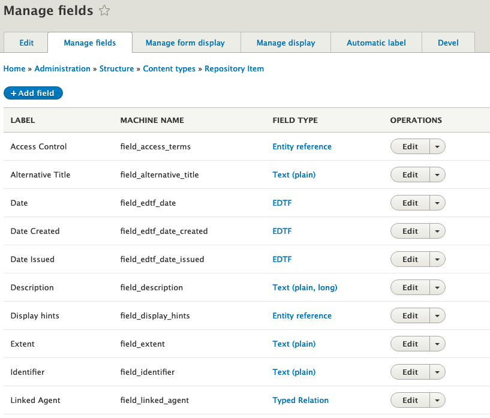
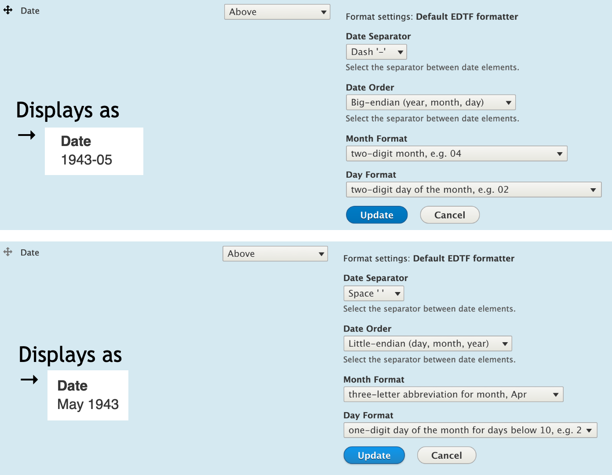
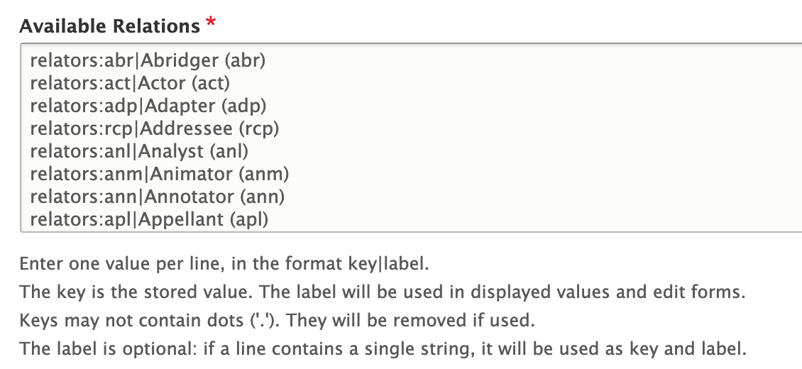

# Metadata in Islandora 8

> TL;DR: In Islandora 8 metadata values are stored in _fields_ attached to _entities_ (objects) which are then serialized as JSON-LD before being submitted to Fedora and/or indexed in a triple-store.

!!! note "Drupal 8 Terminology"
    In Drupal 8, Fields can be attached to _entity sub-types_ (e.g. Content types, Vocabularies) or _entities_ (Users, Files). For more on Fields, see ["2.3 Content Entities and Fields"](https://www.drupal.org/docs/user_guide/en/planning-data-types.html) and ["6.3 Adding Basic Fields to a Content Type"](https://www.drupal.org/docs/user_guide/en/structure-fields.html) in the Official Guide.

As described in the [objects section](objects.md), Islandora 8 digital objects are comprised of _nodes_ for descriptive metadata, _media_ for technical metadata, and _files_ for the binary objects. This section describes how descriptive metadata is managed in Islandora 8.

## Content Types

In Drupal, _Content Types_ are groupings of fields and their configurations, forming what is essentially a _metadata profile_ for a digital object's descriptive record. The field configurations include how data is entered, how it is displayed, how many values can be stored, and how long the value can be. Some configurations, such as data entry and display, can be changed at any time. Others, such as how long a value can be, cannot be changed once content has been created without first deleting all content of that type.

For example, the 'islandora_demo' module provides a _Repository Item_ content type that defines several fields including "Alternative Title" and "Date". The "Manage fields" page for Repository Item shows a list of the fields it includes as well as tabs for changing the input forms and display modes. The "Title" field does not appear in this list but it is still included with every content type. (See the "[Create / Update a Content Type](content_types.md)" section for more details on creating and configuring fields.)



!!! tip "Titles"
    The included title field is limited to 255 characters; if your content has longer titles it is encouraged to create a separate long_title field to store the full title and reserve the default title field for a display title.

!!! tip "7.x Migration Note: What about my XML?"
    In 7.x, metadata were (usually) stored within XML datastreams such as MODS or DC. In Islandora 8 we are breaking out
    individual metadata elements into fields instead of using an attached XML document. The Metadata Interest Group is developing a default mapping which will provide a basic, yet customizable, transform between MODS metadata and Drupal fields in Islandora Demo.

    It is still possible to attach an XML file to a Islandora 8 object as a Media (see Datastreams), however there is no mechanism in Islandora 8 for editing XML in a user-friendly way.

A specific instance of a content type is called a _node_. In other words, a _node_ is the descriptive metadata for a particular digital object and the _content type_ is the node's metadata profile. Once a node is created, it cannot change its content type. To change a digital object's metadata profile (content type) a repository manager would need to create a new descriptive record (node) using the new metadata profile and then update the corresponding media records to point to the new descriptive record.

## Vocabularies

In Drupal, _Taxonomy Vocabularies_ (or simply 'Vocabularies') are also entity subtypes that group fields and their configurations. Unlike content types, they are intended to be used as descriptive attributes of content and have hierarchy built in. Whereas instances of content types are called nodes, items in a vocabulary are called _terms_.

For example, Islandora includes the 'Islandora Models' vocabulary which includes the terms 'Audio', 'Binary', 'Collection', 'Image', and 'Video'. By linking to one of these terms in the 'Islandora Models' vocabulary a repository manager can tell that the node (digital object) should be considered an 'Image' or 'Audio', et cetera. The Controlled Access Terms module provides additional vocabularies representing Corporate Bodies, Persons, Families, Geographic Locations, and Subjects. Each of these vocabularies has its own set of fields allowing repositories to further describe them. Repository item nodes can then reference terms in these vocabularies. See 'Entity Reference fields' in the 'Field Types' section below.

<!--[Geographic Location currently has hierarchy turned off. This section will apply once https://github.com/Islandora/controlled_access_terms/pull/21 is merged.] Another example, this time illustrating hierarchy, is the 'Geographic Location' vocabulary. Although no terms are listed by default, a repository could create a 'Western Hemisphere' term and then create a 'North America' term as a child of the 'Western Hemisphere' term, et cetera.


-->

## Field Types

Each field in Drupal has a _type_ that defines its _properties_ and behavior such as text, date, number, and Boolean fields. These field types also have _widgets_ and _formatters_ that control entry forms and display, respectively. The [Drupal 8 documentation on FieldTypes, FieldWidgets, and FieldFormatters](https://www.drupal.org/docs/8/api/entity-api/fieldtypes-fieldwidgets-and-fieldformatters) includes a list of the core field types.

_Entity Reference_ fields are a special type of field that creates a relationship between two entities. The field's configuration options include which kind of entities can be referenced. The 'Repository Item' content type, provided by islandora_demo, includes several entity reference fields that reference vocabularies defined by the islandora and controlled_access_terms modules.

The 'Member Of' field is an entity reference field that allows creating digital object hierarchies (collections and, potentially, complex digital objects) by "pointing" one or many Repository items at another common "parent".

Modules can provide their own field types, formatters, and widgets. The controlled_access_terms module provides two custom field types: EDTF and Typed Relations.

### EDTF ([Extended Date Time Format](https://www.loc.gov/standards/datetime/edtf.html))

The EDTF field type is stored as a string in the database; however the corresponding widget validates the value submitted in the data entry form and will not accept an invalid value while the corresponding formatter can be configured to display the EDTF value in a variety of ways.

Example of a valid EDTF value ('1943-05') and an invalid value ('1943 May') with the corresponding error message:


Example of how the EDTF formatter settings can change the display of an EDTF value:


### Typed Relation

The standard Entity reference fields are limited to a single type of relationship. For example, the islandora_demo module could use an entity reference field in the 'Repository item' content type for the 'creator' field, linking nodes to terms in the People, Corporate Body, and Family vocabularies. However, there are many different types of 'creators', including 'authors', 'illustrators', and 'architects'. To enable all these types of relationships using entity reference fields a repository manager would need to create a new field for each of them, which would quickly become unwieldy. The Controlled Access Terms module resolves this problem by providing a _Typed Relation_ field type.

The Typed Relation field type combines an entity reference _property_ and a 'relation type' property in a single field and extends the JSON-LD serialization to override a field's RDF mapping in favor of the selected 'relation type'. For example, instead of a 'creator' field, Repository item content type defines a 'Linked Agent' field and is configured with a list of available relationships that comes from the MARC relators list. (Configurable at '/admin/structure/types/manage/islandora_object/fields/node.islandora_object.field_linked_agent'.) The available relations are configured by providing the RDF namespace, a colon, the RDF relationship value, a pipe delimiter, and a display value for the user interface. (See the RDF Mapping section of '[Create / Update a Content Type](content_types.md)' for more details.)




# Getting Metadata into Fedora and a Triple-store

The above sections described how Drupal manages and stores metadata, but the key feature of Islandora 8 is pushing that metadata into a Fedora 4+ repository and a triple-store. Islandora does this by using Drupal's serialization capabilities to provide a JSON-LD serialization that can be ingested by Fedora 4+ repository and triple-stores. In response to write operations, it sends notifications to the repository and triple-store that a node or term is available to ingest.

The JSON-LD module works by taking node or term and its corresponding RDF mapping to create a JSON-LD serialization. The RDF mapping for a content type or vocabulary lists its fields and the RDF predicates that should be used for them.

For example, below is the JSON-LD serialization for an example Repository item node created in a standard islandora-playbook based vagrant VM:
```
{
  "@graph":[
    {
      "@id":"http://localhost:8000/node/1?_format=jsonld",
      "@type":[
        "http://pcdm.org/models#Object"
      ],
      "http://purl.org/dc/terms/title":[
        {
          "@value":"New York, New York. A large lobster brought in by the New England fishing boat [Fulton Fish Market]",
          "@language":"en"
        }
      ],
      "http://schema.org/author":[
        {
          "@id":"http://localhost:8000/user/1?_format=jsonld"
        }
      ],
      "http://schema.org/dateCreated":[
        {
          "@value":"2019-03-14T19:05:24+00:00",
          "@type":"http://www.w3.org/2001/XMLSchema#dateTime"
        }
      ],
      "http://schema.org/dateModified":[
        {
          "@value":"2019-03-14T19:20:51+00:00",
          "@type":"http://www.w3.org/2001/XMLSchema#dateTime"
        }
      ],
      "http://purl.org/dc/terms/date":[
        {
          "@value":"1943-05",
          "@type":"http://www.w3.org/2001/XMLSchema#string"
        },
        {
          "@value":"1943-05",
          "@type":"http://www.w3.org/2001/XMLSchema#gYearMonth"
        }
      ],
      "http://purl.org/dc/terms/extent":[
        {
          "@value":"1 negative",
          "@type":"http://www.w3.org/2001/XMLSchema#string"
        }
      ],
      "http://purl.org/dc/terms/identifier":[
        {
          "@value":"D 630714",
          "@type":"http://www.w3.org/2001/XMLSchema#string"
        }
      ],
      "http://purl.org/dc/terms/type":[
        {
          "@id":"http://localhost:8000/taxonomy/term/11?_format=jsonld"
        }
      ],
      "http://purl.org/dc/terms/rights":[
        {
          "@value":"No known restrictions. For information, see U.S. Farm Security Administration/Office of War Information Black & White Photographs(http://www.loc.gov/rr/print/res/071_fsab.html)",
          "@type":"http://www.w3.org/2001/XMLSchema#string"
        }
      ],
      "http://purl.org/dc/terms/subject":[
        {
          "@id":"http://localhost:8000/taxonomy/term/26?_format=jsonld"
        }
      ],
      "http://schema.org/sameAs":[
        {
          "@value":"http://localhost:8000/node/1?_format=jsonld"
        }
      ]
    },
    {
      "@id":"http://localhost:8000/user/1?_format=jsonld",
      "@type":[
        "http://schema.org/Person"
      ]
    },
    {
      "@id":"http://localhost:8000/taxonomy/term/11?_format=jsonld",
      "@type":[
        "http://schema.org/Thing"
      ]
    },
    {
      "@id":"http://localhost:8000/taxonomy/term/26?_format=jsonld",
      "@type":[
        "http://schema.org/Thing"
      ]
    }
  ]
}
```

Because the Repository item's title field is mapped to 'dc:title' in the RDF mapping, the node's title value appears like this in the JSON-LD output:
```
"http://purl.org/dc/terms/title":[
  {
    "@value":"New York, New York. A large lobster brought in by the New England fishing boat [Fulton Fish Market]",
    "@language":"en"
  }
],
```

Also note that the URI (`@id`) value is 'http://localhost:8000/node/1?_format=jsonld'. To see how any node or term in a repository will be serialized to JSON-LD add `?_format=jsonld` to the node's URI.

When a node or term is updated a Drupal Context condition emits an indexing event to notify the repository and triple-store that it is should be ingested/updated. <!-- We should link our documentation on Contexts and events, wherever that is. -->
