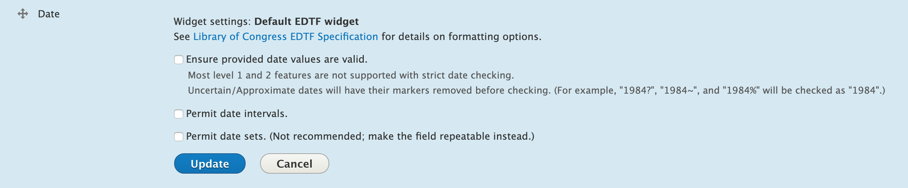
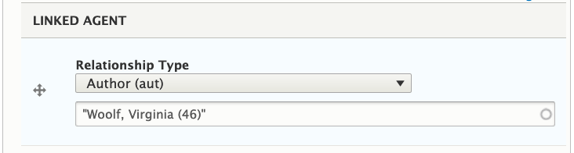

# Metadata in Islandora 8

> TL;DR: In Islandora 8, metadata is stored in Drupal, in _fields_ attached to _entities_ (nodes or media). This allows us to interact with metadata (add, edit, remove, display, index in a search engine...) almost entirely using standard Drupal processes. If exporting this metadata to Fedora and/or a triplestore, the values are serialized to RDF using mappings that can be set for each bundle.

!!! note "Drupal 8 Terminology"
    In Drupal 8, Fields can be attached to _bundles_ (sometimes called _entity sub-types_ -- e.g. Content types, Media types, Vocabularies) or _entities_ (e.g. Users). For more on Fields, see ["2.3 Content Entities and Fields"](https://www.drupal.org/docs/user_guide/en/planning-data-types.html) and ["6.3 Adding Basic Fields to a Content Type"](https://www.drupal.org/docs/user_guide/en/structure-fields.html) in the Official Drupal Guide.

<!-- Next revision: check status of changing 'bundles' to 'entity sub-types' (https://www.drupal.org/project/drupal/issues/1380720). -->


As described in the [Nodes section](objects.md), Islandora 8 digital objects are comprised of _Drupal nodes_ for descriptive metadata, _Drupal media_ for technical metadata, and _Drupal files_ for the binary objects. This section describes how Islandora 8 uses and extends Drupal fields to manage descriptive metadata.

## Content Types

In Drupal, _Nodes_ come in different sub-types called _Content Types_ (e.g. Article, Basic page, Repository item). Content types contain fields, and configurations for how those fields can be edited or displayed. Each content type is essentially a _metadata profile_ that can be used for a piece of web content, or to describe a digital resource. For each field in a content type, an administrator can configure how data is entered, how it can be displayed, how many values can be stored, and how long the value can be. Some configurations, such as data entry and display, can be changed at any time. Others, such as how long a value can be or what options are available in a select list, cannot be changed once content has been created without first deleting all content of that type. However, fields can be added to existing content types with no consequence.


For example, the 'islandora_defaults' module provides a _Repository Item_ content type that defines many fields including "Alternative Title" and "Date Issued". Under the management menu for Repository Item you can see a list of the fields it includes ("Manage fields" as well as tabs for changing the input forms ("Manage form display") and display modes ("Manage display"). (See the "[Create / Update a Content Type](content_types.md)" section for more details on creating and configuring fields.)


!!! tip "Titles"
    Note that the "Title" field does not appear in this list, as it is built-in and included with every content type. You can edit the label if you want it called something other than "Title" under the "Edit" tab for that content type. This built-in title "field" is limited to 255 characters; if your content has longer titles it is encouraged to create a separate long_title field to store the full title and reserve the default title field for a display title. There is a contributed module called [Node Title Length](https://www.drupal.org/project/title_length), which allows an administrator to configure the length of the title field in the core node table. However, this only works on nodes (not media or other entities) and involves meddling in a core Drupal database schema, which makes some people uneasy.

!!! tip "7.x Migration Note: What about my XML?"
    In 7.x, metadata were usually stored using an XML schema such as MODS or DC, as datastreams attached to an object. In Islandora 8, metadata is stored as fields.
    This means we are breaking out individual elements from a hierarchical structure to being individual independent values. Where some hierarchy or field grouping
    is necessary, this can be done in Drupal using [Paragraphs](https://www.drupal.org/project/paragraphs), a widely-used Drupal contrib module. At the moment
    (Nov 2019) we are working on the technical challenge of mapping data from paragraphs into RDF in Fedora.
    The Metadata Interest Group has developed a default mapping ([spreadsheet](https://docs.google.com/spreadsheets/d/18u2qFJ014IIxlVpM3JXfDEFccwBZcoFsjbBGpvL0jJI/edit#gid=0), [guidance document](https://docs.google.com/document/d/15qSO9YcALtYSqd6CUuGx0t8FwUJ5pPwVPz0PA5rU898/edit?ts=5c5852f3#)) which provides a basic, yet customizable, transform between MODS metadata and Drupal fields in Islandora Defaults. It is suggested that individual institutions customize the mapping to meet their unique needs.

    That said, if keeping the "legacy" XML metadata from 7.x is important to you, it can be attached to an Islandora 8 resource node as a Media entity.
    However, there is no mechanism in Islandora 8 for editing XML in a user-friendly way.

When you create a node (i.e. an instantiation of a content type, such as by using Drupal's "Add Content" workflow), the fields defined by its content type become available. Once a node is created, its content type cannot be changed. To "switch" a node to a different content type, a repository manager would need to create a new node of the target content type, map the field values (programmatically or by copy-paste), and update any Media or children that refer to the old node to refer to the new one.

Not all content types in your Drupal site need be Islandora "resource nodes". A "resource node" content type will likely have behaviours (such as syncing to Fedora or causing derivatives to be generated) associated with it. This configuration, and the communication to the user of which content types are and are not considered to be Islandora resource nodes is left to the discretion of the site manager. In Islandora, a "resource node" is usually considered a descriptive record for "a thing", and is conceptually similar to an "Islandora Object" in 7.x, i.e. a "Fedora Object" in Fedora 3.x and below.

## Vocabularies

In Drupal, _Taxonomy Vocabularies_ (or simply _Vocabularies_) are also entity sub-types that define a set of fields and their configurations. Whereas instances of content types are called _nodes_, items in a vocabulary are called _taxonomy terms_ (or simply _terms_). Traditionally, taxonomy terms are used to classify content in Drupal. For instance, the Article content type includes a field `field_tags` that can refer to terms in the Tags vocabulary. 

There are two ways that users can interact with taxonomies: they can be "closed," e.g. a fixed list to pick from in a dropdown, or "open," e.g. `field_tags` where users can enter new terms, which are created on the fly. This is not set on the _vocabulary_ itself, but in the configuration of the field (typically on a node). Terms within vocabularies have an ordering, and can have hierarchical structure, but do not need to.

Islandora (through the Islandora Core Feature) creates the 'Islandora Models' vocabulary which includes the terms 'Audio', 'Binary', 'Collection', 'Digital Document', 'Image', 'Page', 'Paged Content', 'Publication Issue', and 'Video'. Islandora Defaults provides contexts that cause certain actions (e.g. derivatives to happen, or blocks to appear) based on which term is used. 

<!-- Is it possible to add your own terms to this vocabulary? Is it recommended? -->

<!-- field_model is a "special field" in terms of the RDF mapping, because the drupal URI gets replaced by the 'external URI' but I'm not sure if this is where to mention this.-->

The Controlled Access Terms module provides additional vocabularies:
- Corporate Body
- Country
- Family
- Form
- Genre
- Geographic Location
- Language
- Person
- Resource Types
- Subject
 
Each of these vocabularies has its own set of fields allowing repositories to further describe them. The Repository Item content type has fields that can reference terms in these vocabularies. See 'Entity Reference fields' in the 'Field Types' section below.

The vocabularies provided by default are a starting point, and a repository administrator can create whatever vocabularies are desired.


## Field Types

Fields are where Drupal entities store their data. There are different _types_ of fields including boolean, datetime, entity reference, integer, string, text, and text_with_summary. These field types also have _widgets_ (controlling how data is entered) and _formatters_ (controlling how data is displayed). The [Drupal 8 documentation on FieldTypes, FieldWidgets, and FieldFormatters](https://www.drupal.org/docs/8/api/entity-api/fieldtypes-fieldwidgets-and-fieldformatters) includes a list of the core field types. Modules can provide their own field types, formatters, and widgets. The Controlled Access Terms module provides two additional types for use with Islandora: ETDF, and Typed Relation. These are described below.

_Entity Reference_ fields are a special type of field built into Drupal that creates a relationship between two entities. The field's configuration options include which kind of entities can be referenced. The 'Repository Item' content type, provided by islandora_defaults, includes several entity reference fields that reference vocabularies defined by the islandora and controlled_access_terms modules.

The 'Member Of' field is an entity reference field, defined by Islandora, which is the Islandora way of creating hierarchies of resource nodes. This can be used to show membership in a collection, pages that are members of a paged item, and members of a complex object.

### EDTF 

The EDTF field type is for recording dates in [Extended Date Time Format](https://www.loc.gov/standards/datetime/edtf.html), which is a format based off of the hyphenated form of ISO 8601 (e.g. 1991-02-03 or 1991-02-03T10:00:00), but also allows expressions of different granularity and uncertainty. The Default EDTF widget has a validator that only allows strings that conform to the EDTF standard. The Default EDTF formatter allows these date string to be displayed in a variety of human readable ways.

Example of a valid EDTF value ('1943-05') and an invalid value ('1943 May') with the corresponding error message:


The Default EDTF Widget can be set to allow date intervals, but doing this prevents the widget from accepting values that include times.


Example of how the EDTF formatter settings can change the display of an EDTF value:


### Typed Relation

Drupal's Entity Reference fields allow a site editor to link entities to related entities, but do not allow the editor to qualify anything about that relationship. Therefore, if we wanted to be able to describe contributors and their roles (e.g. 'author', 'illustrator', 'architect') we would have to define one field per role. The Typed Relation field, provided by Controlled Access Terms, pairs two inputs into a single field: an entity reference, and a relation type.



!!! tip "Nerd note:"
    The parts of a field are called properties, so 'entity reference' and 'relation type' are properties of the Typed Relation field type.

 The Typed Relation field type combines an entity reference _property_ and a 'relation type' property in a single field and extends the JSON-LD serialization to override a field's RDF mapping in favor of the selected 'relation type'. For example, instead of a 'creator' field, Repository item content type defines a 'Linked Agent' field and is configured with a list of available relationships that comes from the MARC relators list. (Configurable at '/admin/structure/types/manage/islandora_object/fields/node.islandora_object.field_linked_agent'.) The available relations are configured by providing the RDF namespace, a colon, the RDF relationship value, a pipe delimiter, and a display value for the user interface. (See the RDF Mapping section of '[Create / Update a Content Type](content_types.md)' for more details.)


# Getting Metadata into Fedora and a Triple-store

The above sections described how Drupal manages and stores metadata, but the key feature of Islandora 8 is pushing that metadata into a Fedora 4+ repository and a triple-store. Islandora does this by using Drupal's serialization capabilities to provide a JSON-LD serialization that can be ingested by Fedora 4+ repository and triple-stores. In response to write operations, it sends notifications to the repository and triple-store that a node or term is available to ingest.

The JSON-LD module works by taking node or term and its corresponding RDF mapping to create a JSON-LD serialization. The RDF mapping for a content type or vocabulary lists its fields and the RDF predicates that should be used for them.

For example, below is the JSON-LD serialization for an example Repository item node created in a standard claw-playbook based vagrant VM:
```
{
  "@graph":[
    {
      "@id":"http://localhost:8000/node/1?_format=jsonld",
      "@type":[
        "http://pcdm.org/models#Object"
      ],
      "http://purl.org/dc/terms/title":[
        {
          "@value":"New York, New York. A large lobster brought in by the New England fishing boat [Fulton Fish Market]",
          "@language":"en"
        }
      ],
      "http://schema.org/author":[
        {
          "@id":"http://localhost:8000/user/1?_format=jsonld"
        }
      ],
      "http://schema.org/dateCreated":[
        {
          "@value":"2019-03-14T19:05:24+00:00",
          "@type":"http://www.w3.org/2001/XMLSchema#dateTime"
        }
      ],
      "http://schema.org/dateModified":[
        {
          "@value":"2019-03-14T19:20:51+00:00",
          "@type":"http://www.w3.org/2001/XMLSchema#dateTime"
        }
      ],
      "http://purl.org/dc/terms/date":[
        {
          "@value":"1943-05",
          "@type":"http://www.w3.org/2001/XMLSchema#string"
        },
        {
          "@value":"1943-05",
          "@type":"http://www.w3.org/2001/XMLSchema#gYearMonth"
        }
      ],
      "http://purl.org/dc/terms/extent":[
        {
          "@value":"1 negative",
          "@type":"http://www.w3.org/2001/XMLSchema#string"
        }
      ],
      "http://purl.org/dc/terms/identifier":[
        {
          "@value":"D 630714",
          "@type":"http://www.w3.org/2001/XMLSchema#string"
        }
      ],
      "http://purl.org/dc/terms/type":[
        {
          "@id":"http://localhost:8000/taxonomy/term/11?_format=jsonld"
        }
      ],
      "http://purl.org/dc/terms/rights":[
        {
          "@value":"No known restrictions. For information, see U.S. Farm Security Administration/Office of War Information Black & White Photographs(http://www.loc.gov/rr/print/res/071_fsab.html)",
          "@type":"http://www.w3.org/2001/XMLSchema#string"
        }
      ],
      "http://purl.org/dc/terms/subject":[
        {
          "@id":"http://localhost:8000/taxonomy/term/26?_format=jsonld"
        }
      ],
      "http://schema.org/sameAs":[
        {
          "@value":"http://localhost:8000/node/1?_format=jsonld"
        }
      ]
    },
    {
      "@id":"http://localhost:8000/user/1?_format=jsonld",
      "@type":[
        "http://schema.org/Person"
      ]
    },
    {
      "@id":"http://localhost:8000/taxonomy/term/11?_format=jsonld",
      "@type":[
        "http://schema.org/Thing"
      ]
    },
    {
      "@id":"http://localhost:8000/taxonomy/term/26?_format=jsonld",
      "@type":[
        "http://schema.org/Thing"
      ]
    }
  ]
}
```

Because the Repository item's title field is mapped to 'dc:title' in the RDF mapping, the node's title value appears like this in the JSON-LD output:
```
"http://purl.org/dc/terms/title":[
  {
    "@value":"New York, New York. A large lobster brought in by the New England fishing boat [Fulton Fish Market]",
    "@language":"en"
  }
],
```

Also note that the URI (`@id`) value is 'http://localhost:8000/node/1?_format=jsonld'. To see how any node or term in a repository will be serialized to JSON-LD add `?_format=jsonld` to the node's URI.

When a node or term is updated a Drupal Context condition emits an indexing event to notify the repository and triple-store that it is should be ingested/updated. <!-- We should link our documentation on Contexts and events, wherever that is. -->
