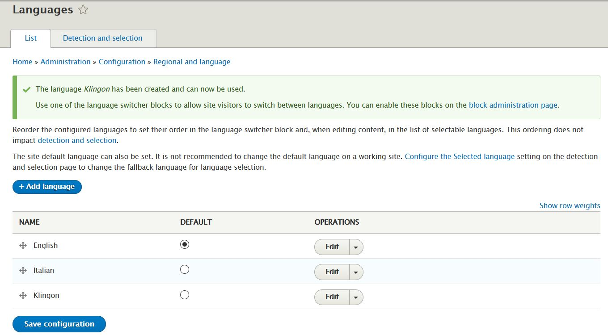
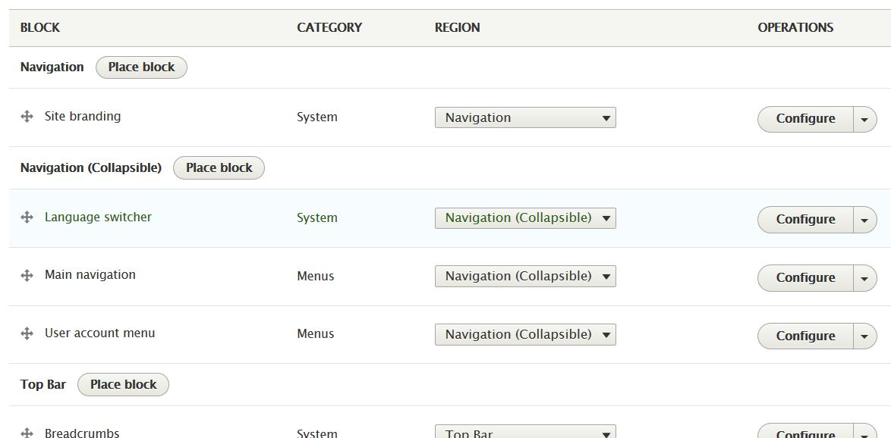
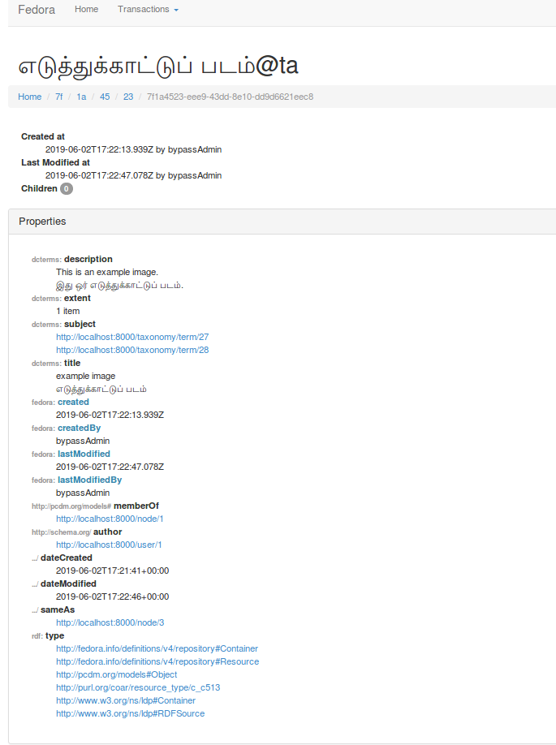

Islandora enables you to build full-fledged multilingual repositories leveraging the multilingual support provided by Drupal core modules. The multilingual content gets indexed into Fedora repository as well as the Triplestore (Blazegraph), and can be queried using the SPARQL endpoint. In this guide, we will describe the steps needed to set up a basic multilingual Islandora site.

## Drupal Concepts
Drupal allows you to translate user interface text, configuration text, and content. See [section 2.7 of the Drupal documentation for details](https://www.drupal.org/docs/user_guide/en/language-concept.html).

## Islandora Configuration
Islandora enables Drupal's _Language_ and _Content Translation_ modules by default. Drupal provides additional modules for [multilingual support](https://www.drupal.org/docs/8/multilingual/choosing-and-installing-multilingual-modules), for instance for translating the built-in user interface or editable interface text.

### Adding Languages
From the top menu, go to Configuration >> Regional and language >> Languages. Add a language.



### Adding Language switcher
You can place the default language selector block to switch between languages. To create the language switcher block go to Structure >> Block layout. Click Place block in a region of your choice. Search for `Language switcher` block and click `Place block`.


You can place the language switcher block in different regions of the user interface. You might have to customize the theme to style the language switcher block.



### Adding Multilingual Menus
From the top menu, go to Configuration >> Regional and language >> Content language and translation. Check `Custom menu link` under `Custom language settings`. Scroll down to `Custom menu link` section and check all the relevant fields and Save the configurations. Clear the cache (Configuration >> Development >> Performance).

From the top menu, go to Structure >> Menu. Edit "Main navigation" menu. Default home menu item cannot be translated due to [this issue](https://www.drupal.org/project/drupal/issues/2838106). Disable that menu item. Click `Add link` to create a new menu item. Provide a menu title (i.e. Home) and input `<front>` for the link field. Save. Right-click on the Operations beside the new menu link and click the Translate button. Translate the menu link title for the language added above and save.

Go back to home. The language switcher will enable you to switch the language/content of the menu and content.

### Adding a Multilingual Repository Item
From the top menu, go to Content >> Add content >> Repository item. Provide the required fields and save the object. Click the _Translate_ tab of the object, provide a title in the second language and fill any translatable fields (i.e description). Add the media for the object. Media objects can be translated similar to the repository item node.

Go back to home, you should be able to view content in the language selected in the language switcher.

### Field Label Translations
If you need the field labels of the repository Item displayed in a different language, additional configuration is needed. The Drupal module `Configuration translation` module in the core needs to be enabled. Note that this will enable the module `User Interface translation` as well.

Each field label needs to be translated through the Drupal GUI (Configuration >> Regional and Language: User interface translation). Alternatively, you can import existing translations, or translations generated with an external translation editor (for example [Gtranslator](https://en.wikipedia.org/wiki/Gtranslator)). Go to `Interface translation import` (Configuration >> Regional and Language: User interface translation >> Import tab). Set the ` Treat imported strings as custom translations` option, select the import file, the target language, and click import. Clear the cache to see the changes. An example second language display is shown below.


## Fedora Representation
Islandora indexes the multilingual metadata values in Fedora as RDF literals using language tags. An example representation is shown below.



## Triplestore Representation
Islandora indexes the multilingual metadata values in Blazegraph as RDF literals using language tags. An example representation is shown below.


You can query the result and filter the results by a specific language. For example, to get all titles and filter by language, the following query can be used:

```
PREFIX dcterm: <http://purl.org/dc/terms/>
select ?s ?o {
  ?s dcterm:title ?o
FILTER (lang(?o) = 'ta')
}
```
## Further Reading
* [Multilingual guide](https://www.drupal.org/docs/8/multilingual)
