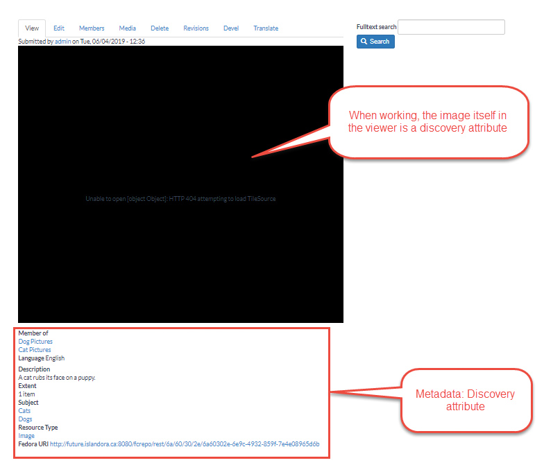

 # From Objects to Resource Nodes: Shifting Concepts from Islandora 7 to 8

This document attempts to show the shift in how objects work from Islandora version 7 to version 8, from a non-developer perspective.

## Building resources in Islandora 8

Islandora 8 represents a fundamental shift forward from Islandora 7. Islandora 8 turns what are known as traditional Islandora objects into Drupal nodes. It is possible to manipulate all aspects of objects through the Drupal user interface. Non-developers can configure and set up a myriad of content and functions in Islandora that enhance the discovery of and support access to objects in the repository. Improving the discovery of and access to objects is a significant theme in Islandora. 

Another difference between Islandora 7 and 8 are Islandora objects. In Islandora 7, _objects_ (video files, audio files, PDFs, etc.) are loaded through the user interface, and Datastreams are generated automatically. These consist of access and display copies, the metadata, OCH/HOCR, technical metadata, and more. All of these Datastreams are directly connected to the object and accessed through the admin interface. 

In Islandora 8, the traditional Islandora 7 objects (video files, audio files, etc.) are now _Drupal nodes_. Islandora object nodes are a special kind of Drupal node, distinct from nodes that exist for other content types such as a blog post, an article, a page (like the About page on a site), and others. These Islandora objects are still loaded through the interface and described with the data entry form and derivatives are still generated. However, the Datastreams are no longer connected to the original object in the same immutable way. Each of these Datastreams can be manipulated through Drupal by non-developers.  You can create a variety of ways to view this metadata and information related to the objects. Doing so requires knowledge of Drupal 8, but this essentially means that there are many ways to view the metadata and access the related objects in Islandora 8. 

## Traditional objects become resource nodes

Until now we have thought of objects in Islandora 8 in the conventional Islandora 7 way: A file loaded in the repository with associated derivatives. It can be helpful to move away from this when learning about Islandora 8. 

One way to do this is to think of objects in Islandora 8 as _resource nodes_. While using the term “object” is traditional with Islandora it can get in the way of understanding the differences and possibilities in Islandora 8. Using the term “resource node” reflects the fact that files such as JPEGs, MP3s, .zip, etc. that get loaded through the data entry (formerly ingest) form are now fully integrated within Drupal and can take advantage of everything that represents. 

The term resource node does not just refer to the individual files, however. The term reflects the new nature of objects in Islandora 8. A resource node encompasses multiple elements that all relate to each other, even if they are no longer directly connected like objects in Islandora 7. 

The typical elements of a resource node:

-   Content types (one or more)
-   Media files (the actual files of JPEGs, MP3s, .zip, etc.) that get loaded through the form
-   Metadata fields submitted in the data entry, for example:
    -   A field denoting the 'type' of thing you're persisting (image, book, newspaper, etc...)
    -   A field that creates the familiar collection hierarchy
    -   Descriptive custom fields
-   Derivative files (thumbnails, web-friendly service files, technical metadata, and more)

It is possible to configure all elements of a resource node in Islandora 8. This fact allows full control over how one accesses the node and how nodes are displayed and discovered online. It also allows a repository to take full advantage of all third-party Drupal modules, themes, and distributions available.  

## Islandora 8: Empowering resource nodes through Drupal

These resource nodes are what the librarian, student, archivist, technician, or general non-developer creates through the data entry form. It is a lot more than just the file (JPEG, .MP3, etc.). This user is creating the node and elements that make it possible to access, manage, and preserve the resource. Islandora 8 is all about empowering this access to repository resources. It makes it possible to touch and manipulate the file itself and the elements that make it a wholly preserved and shareable digital object. This shift is actually at the core of Digital Asset Management (DAM) and librarianship – making things accessible. Islandora 8 is about doing that through Drupal 8 and the web, making it that much more available, flexible, and viable for the future. It does this by making more elements of what was a traditional DAM object configurable and manageable by more users – _non-developers_. Work is ongoing by the community to increase the ease of use of the admin user interface to make this even more feasible. 

### Concept: Resource node discovery attributes

Discovery attributes would include metadata fields, fields that define the collection hierarchy/structure, and any custom fields. They are any attributes of the resource node element that help manage how the resource node can be discovered through the interface and accessed by the public online. 

For example, the following are discovery attributes:

### Concept: Resource node management attributes

Management attributes of the resource node help to clarify and manage its relationship within the repository and to other content. Management attributes define if a node is a resource node, which collection it belongs to, the type of resource a node is (image, book, newspaper, etc.), and similar actions. When looking at Drupal functions, the following are examples of management attributes: 

- Content types 
    -   Default content types available include article, basic page, repository item, video
    -   Ability to add any content type needed to help define the resource node 
-   Drupal Views
    -   Manages the display of all aspects of the resource node 

## More Information

The following pages expand on the concepts discussed above:

- [Resource Nodes](resource-nodes.md)
- [Media](media.md)
- [Make an Image](creating-an-object.md)
- [Content Types](content_types.md)

### Copyright and Usage

This document was originally developed by [Alex Kent](https://github.com/alexkent0) and has been adapted for general use by the Islandora community. 

