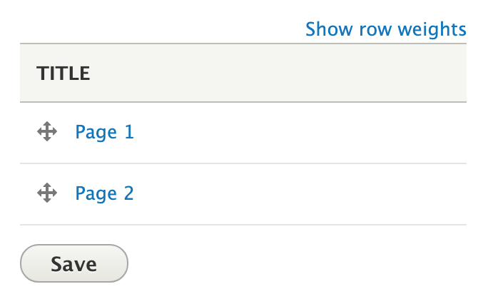
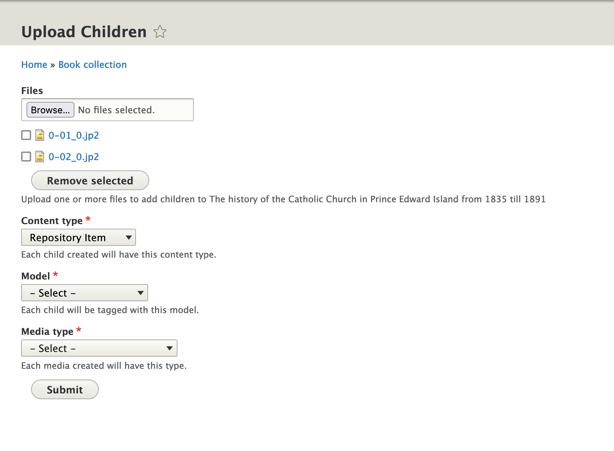

# Paged Content

Paged content, such as books, periodicals, photographs with the front and back, etcetera,
 can use the [membership](content_models.md#members) structure provided by Islandora, namely, `field_member_of`.
This involves creating a resource node for the root record (i.e. the entire book or the photograph)
and child resource nodes for each sub-component (e.g. "Page 1", "Page 2", etc., or "recto" and "verso")
with their corresponding media. Each "child" resource node contains a reference to their "parent" resource node
using the `field_member_of` property.

!!! Note "Child v. Member"
    Islandora uses the "child" and "member" descriptor for resource nodes that
    store a reference to another resource node in the "Member Of" field interchangeably.
    Administrators will more often see the "member" terminology more often while
    front-end users will usually see "child" terminology.

Similar to the collection view showing members of a collection, Islandora provides
 taxonomy terms _Paged Content_ and _Page_ in the _Islandora Model_ vocabulary,
that can be used to trigger paged
content behaviors. Islandora Starter Site provides a Context for _Paged Content_
resource nodes to trigger displaying an OpenSeadragon viewer showing the child
resource nodes' service files.

To enable this, use _Paged Content_ for the Islandora Model of the parent
resource node and _Page_ for the Islandora Model of the child resource node. After the
child resource nodes have "service file" media (either generated via the built-in derivative
creation or added manually), they will be included in the OpenSeadragon paginated
viewer displayed on the parent resource node's page.
(See the [IIIF Documentation](../iiif#using-iiif-in-islandora)
for more details on controlling the viewer's behavior.)

However, repository managers can use any method they like, such as a Views-based
list of teasers, a gallery, or a slide-show to display child resource nodes.

## Ordering (weight)

By default, child resource nodes are un-ordered. To order the subcomponents of a
paged content resource node, Islandora provides a _Weight_ field to store an
integer value on  child resource nodes.
Children resource nodes with smaller weight values will float to the top and come
before child resource nodes with heavier weight values.

Weight values do not need
to be sequential, just ordered from smallest to largest. For example, the first
child resource node can have a value of `10` and the next could have a value of
`20` and they will be ordered accordingly. Should a new child be added with the
weight value of `15` it will automatically be sorted after the child with the
weight value `10` and before the child with the weight value `20`.

Child resource nodes can be reordered using a drag-and-drop interface by clicking
on the _Re-order Children_ button on the _Children_ tab of the parent resource node.

Re-ordering children resource nodes on this page and clicking _Save_ will cause
each child resource node's weight value to be updated using sequential values.

!!! note "Why not Drupal's book or weight modules?"
    Drupal provides the [book module in core](https://www.drupal.org/docs/8/core/modules/book)
    for creating multi-level ordered content, such as books and manuals.
    However, this module stores structure and pagination separately from the nodes making serializing
    these relationships as RDF we can provide to Fedora more difficult than simply using `field_member_of`
    with an RDF mapping. Support for the book module may be added in the future.

    Drupal also has a [weight module](https://www.drupal.org/project/weight)
    that provides a weight field and a drag-and-drop
    reordering user-interface. However, this module requires users to set a
    specified range of values which includes their negative corresponding value.
    E.g. a range setting of '20' will require all children to have a value between
    '-20' to '20'. This presumes a repository manager can predict how many pages
    the largest paged content item in their repository will be beforehand. Also,
    these weight values are serialized into RDF using the Collections Ontology 'index'
    predicate which assumes positive integer values which cannot be guaranteed
    using the weight module.

## Adding children

Islandora provides an interface on the **Children** tab to either **Batch upload children** or **Add Child**.
Both methods will result in new resource nodes that are _member of_ the current node. It is also possible
to create child nodes separately, then edit their _Member Of_ field to point to the desired parent.

### Batch upload children

If you want to add a number of pages to this node, for example, the **Batch Upload Children** button may
suit your needs. It allows you to upload multiple files, after selecting a content type for the child nodes and the media type and media use for the media that will hold the uploaded files. If selecting a node with the _Model_ (`field_model`) field, it will also let you select a model from the Islandora Models vocabulary. These settings will apply to all nodes and media created for this batch.

This method does not create full metadata for the child nodes. It uses the filename as the node title.
 It also does not accept zip files; individual files must be uploaded. For more methods of bulk uploading content,
see [Islandora Workbench](../technical-documentation/migration-islandora-workbench.md)
 and [Migrate Islandora CSV](extending.md#batch-uploading-via-csv)
