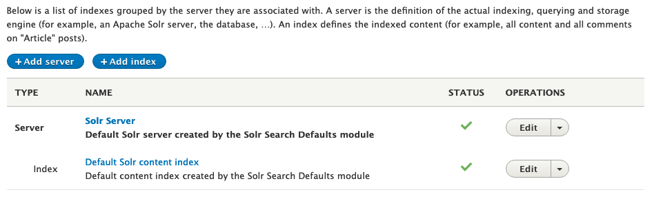
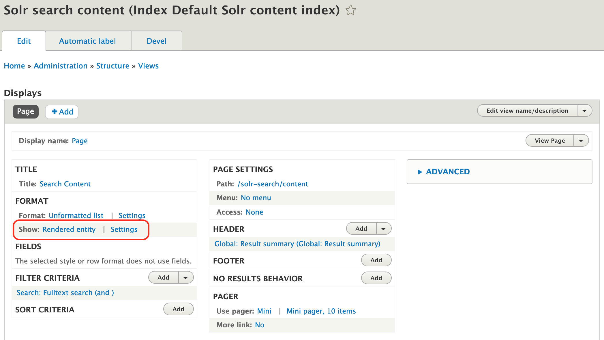

# Setup and Configure Search

Islandora 8 comes with the Drupal 8 [Search API](https://www.drupal.org/project/search_api) and [SOLR](https://www.drupal.org/project/search_api_solr) modules enabled with a corresponding SOLR instance. This guide gives an overview to the setup provided by the claw-playbook. Much more detail is available in the [Search API documentation](https://www.drupal.org/docs/8/modules/search-api). Another helpful resource is [Adam Fuch's "Drupal 8 Custom Site Search with Search API"](https://www.electriccitizen.com/blog/drupal-8-custom-site-search-search-api) (https://www.electriccitizen.com, 2018-01-10; last accessed 2019-03-08).

## Indexing Islandora 8 with SOLR

To access the search indexing settings navigate to '/admin/config/search/search-api'.

### SOLR Server Configuration

Use the 'Solr Server' link to view the SOLR server's configuration and the 'Default Solr content index' link to view or update the index settings. In most cases, where the site was built using ansible, the 'Solr Server' settings that were configured during installation should be left alone.

### SOLR Index Configuration

The Default Solr content index user interface is divided into four tabs: 'View', 'Edit', 'Fields', and 'Processors'.

#### View Tab

The 'View' tab gives an overview of the index and its status:
- 'Index status' is a progress bar that indicates how many items have been indexed.
- 'Status' allows you to enable/disable the index from being used.
- 'Datasource' indicates what types of entities are being indexed and how many have.
- 'Tracker' states which item tracker is being used.
- 'Server' provides a link to the SOLR server's configuration page.
- 'Server index status' is a count of the total number of items returned from an unfiltered empty search. Generally speaking, this should match the total number of items indexed. See the [Drupal 7 Search API FAQ](https://www.drupal.org/node/2009804#server-index-status) for more details.
- 'Cron batch size' displays how many items will be indexed when Drupal's cron runs.

The 'View' tab also provides links to some common actions. 'Start Indexing Now' allows you to start a indexing job for a specified number of items (default is 'all'). You can also specify how many items should be indexed in each batch (default is '50'). The other links allow a repository manager to queue all objects for reindexing, clear the index, or rebuild tracking information.

#### Edit Tab

The 'Edit' tab allows repository managers to configure how the index works as a whole, including the Index name, the data sources—entity types—it can index (including which specific content types or taxonomies will be indexed), which server it is connected to, and other SOLR-specific options.

'Content' (types) is the only data source enabled by default. Selecting 'Taxonomy term' will enable searching taxonomies which is recommended if the repository uses taxonomies for subjects or other discovery points. Once the data sources are enabled a configuration box for each of them will appear in a section just below the list of data sources. This allows repository managers to select which content types (or taxonomy vocabularies) will be included in the index. By default all the content types, and vocabularies if the taxonomy data source is enabled, are indexed.

**Note:** the defaults assume a repository is adding content using the web interface. If a repository manager plans on bulk-loading content they should disable the 'Index items immediately' option in the expandable 'Index Options' box and increase the 'Cron batch size' option.

#### Fields Tab

The 'Fields' tab allows repository managers to select which fields will be indexed. The default set of fields enabled come from a standard Drupal installation and do not reflect the fields Islandora adds for 'Repository Item'. **Repository managers need to add the fields necessary for their Islandora instance.**

To add a field, click the '+ Add fields' button. A shadow-box will appear with a list of the fields available for the index.

Some fields, such as the 'Body' ('body') field provided by Drupal, have multiple properties which can be completely different values or variations on the same value. Click on the plus-sign next to the field to show the properties available to index. In most cases repository managers can ignore the properties list and click the 'Add' button by the field to index the default property ('value'). Only select a different field property if you understand how it will impact user searching. Entity reference fields, such as Tags ('field_tags'), allow you to select fields or their properties from the referenced entity for indexing, such as a referenced taxonomy term's name field.

Once the fields are added they can be configured further on the 'Fields' tab, although the label, machine name, and type usually don't need to be changed. The 'Type' dropdown has several different Full-text processing options available, which may be of interest. Each is described in the expandable 'Data Types' box at the bottom of the page. The 'Boost' setting allows repository managers to increase the weight of particular fields when calculating search relevancy.

#### Processors Tab

The 'Processors' tab allows repository managers to adjust how data and search queries are processed to adjust results. The defaults are acceptable in most cases.

## Searching Islandora 8

The Search API SOLR module comes with a search page pre-configured (accessible at '/solr-search/content'). To edit the search page, navigate to '/admin/structure/views/view/solr_search_content'.

Repository managers may want to change the URL used to access the page, add it to the site navigation, or add a search box. In the 'Page Settings' box in the middle of the page, click on the existing path to open a shadow-box with an edit field. Change the URL as desired, for example, to 'search' and click 'Apply'. Then, click the 'No menu' link just below it to open the menu settings shadow-box. Selecting 'Normal menu entry' will allow a repository manager to add a menu link text, description, and place it within the site menu tree (the default, `<Main navigation>` works for most sites). A search box can be added by expanding the 'Advanced' options and changing the 'Exposed form in block' setting and then use the 'Block Layout' interface (found at '/admin/structure/block') to place the block where desired. After making changes to the View's settings, click the 'Save' button to ensure the changes are not lost.

Islandora's Repository Items are displayed in the search results as a fully rendered entity by default. Repository managers can choose which view mode should be used for each search datasource by clicking the 'Settings' link next to the 'Show:' setting under the 'Format' section of the search view configuration page (shown in a red box in the screenshot below). The 'Teaser' and 'Search result highlighting input' are the two most likely options. Alternatively, repository managers can select specific fields to display instead by clicking the 'Rendered Entity' link and changing it to 'Fields' and then choosing which fields will be displayed in the 'Fields' section underneath. **Note:** thumbnails will not immediately be available using the Fields display option without more advanced configurations.

