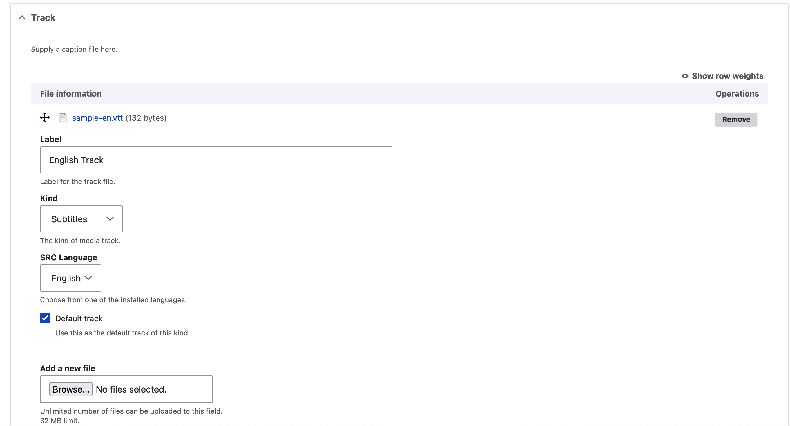

# Transcripts

WEBVTT transcripts, captions, or subtitles may be displayed along with audio and video media.
Transcripts must be added to the media entity that will be playing, using a
special field type ("Media track"). When the media is configured to use the
"Audio with Captions" and "Video with Captions" field formatters, tracks in
"Media track" fields will be available.

## Media track field type

The Islandora module provides a field type, Media Track, that accepts .vtt files.
Once a file has been uploaded, additional options relevant to media tracks become
available to configure.

## Using Transcripts with the Islandora Starter Site

In the Islandora Starter Site, Audio and Video media are pre-configured to work with tracks.

!!! note "Sandbox"
    On the public sandbox, or other sites using the Islandora Install Profile Demo,
    you will first need to make the "Track" field visible in the media form, at
    Structure > Media > Audio|Video > Manage Display.

### Video

- Navigate to the Service File media (or whichever media is configured to play)
for a Video item.
- Click "Edit" to get to the Media's edit form.
- In the "Track" field, add one or more WebVTT files.
- Enter the details about each audio track.
    - Under "Kind", select "Captions" or "Subtitles". (Per the HTML standard, the others are valid track types but won't be played in the viewer)
    - The "Label" will be visible by the user when they select a track to play.
- Save the media and refresh it.

### Audio

- Follow the same instructions as for Video.
- For audio, only upload one Track file (others will not be displayed).
- For audio, ensure that the Track file is marked "Default track" (otherwise it will not be displayed).
- For audio, the selected "Kind" of media track does not have any effect.

## Caveats

!!! info "Selecting the correct media"
    Note that if you add the transcript file to the Original File, but you have configured
    the site to play the Service File, then you will not see the transcript.

!!! info "Languages"
    While you can add subtitles in different languages, you may only choose from
    the site's installed languages.

!!! tip "Types"
    The five options: **captions**; **subtitles**; **descriptions**; **chapters**; and **metadata** come from
    the [HTML standard's `<track>` element](https://html.spec.whatwg.org/multipage/media.html#the-track-element).
    As per their definitions, captions and subtitles will be displayed as optional text over the video,
    available through the usual [cc] icon in the viewer controls. Descriptions, chapters, and metadata
    will not be displayed as they are intended for programmatic use.

## Tracing the components of this feature

| Feature Component | Source |
|---|---|
| Define Field type "Media track" | Islandora module |
| Add "Media track" fields to audio and video media types | Islandora Starter Site |
| Define IslandoraFileMediaFormatterBase, which finds Media Track fields on media, and adds them as playable tracks | Islandora module |
| Define "Audio with Captions" field formatter, extending IslandoraFileMediaFormatterBase | Islandora Audio |
| Define "Video with Captions" field formatter, extending IslandoraFileMediaFormatterBase | Islandora Video |
| Select these field formatters for the Default and Source display modes for audio and video media | Islandora Starter Site |

