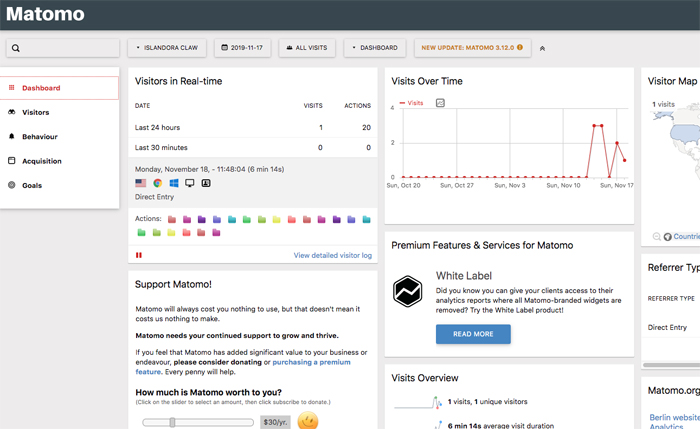

Drupal 8 supports various web analytics integrations such as [Google Analytics](https://www.drupal.org/project/google_analytics) and [Matomo](https://www.drupal.org/project/matomo). For privacy reasons, Islandora integrates Matomo web analytics platforms by default.

The Matomo server is installed here: http://localhost:8000/matomo. The default configurations can be found in `http://localhost:8000/admin/config/system/matomo`. You can log in to the Matomo server using username `admin` and password `islandora`. The dashboard will look like this:

To see page views, login to Matomo and go to Behaviour >> Pages.

## Further Reading
* [Matomo User Guides](https://matomo.org/docs/)