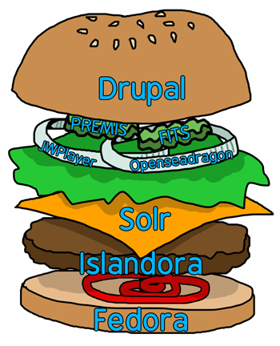

This _User Documentation_ section is aimed at site admins and repository managers who need to understand and configure their Islandora.
It will go in depth on how Islandora allows you to use the various features of Drupal to construct and display repository items.

Islandora, like Drupal, provides tools to create a site, but does not force you to conform to any specific site structure,
organization, or navigation. There is a hope that we can provide something useful out of the box, while also allowing the
full suite of Drupal configuration options. This out-of-the-box configuration is the Islandora Demo module.

It is recommended to be familiar with the basics of Drupal, including content types, fields, users, and views.
The [Official Drupal User Guide](https://www.drupal.org/docs) and the
[Community Guide to Drupal](https://www.drupal.org/docs/user_guide/en/index.html) are a good place to start.

## Object Modeling

In Islandora, we often want to store (and manage, and preserve) sets of metadata with binaries (digital files). 
We used to call this an "_object_" but in Islandora 2.0, are represented as multiple interconnected entities. 

- Metadata is stored in _nodes_ (a.k.a. _content_).
- Specifically, metadata values are stored in _fields_ which are configurable properties attached to _nodes_.
- Different types of nodes can have different configurations of fields; these are called _content types_. 
- Binary files are stored in are _media_, which are wrapper entities to help manage files.
- Media can have fields too, and come in different _media types_.
- Metadata values can be stored as _taxonomy terms_, which let you reuse the same value in multiple places.
- Taxonomy terms can also have fields, and their version of "types" are called _vocabularies_.
They can represent everything from simple labels to more complex concepts such as people, places, and subjects.

## Fedora

Islandora 7.x basically inherits its object model from Fedora 3.x. In 7.x, Fedora stores all properties and content associated with an object - not only its owner, dc.title, status, PID, and status, but also any content files such as OBJ, DC, MODS, and RELS-EXT. In Islandora 7.x, Fedora is the authoritative, primary source for all aspects of an object. Fedora 3.x is not an optional component of an Islandora 7.x repository, it is the primary datastore.

In Islandora 2.0, using Fedora is optional. That's right, optional. Drupal, and not Fedora, is the primary source of all aspects of an Islandora 2.0 object, and, with some variations, Drupal, not Fedora, is the primary datastore in an Islandora repository. If Fedora is present in an Islandora 2.0 repository, content in it is a tightly synchronized copy of object properties and files managed by Drupal.

Even though Fedora is optional in Islandora 2.0, most repositories will use it since it provides its own set of services that are worth taking advantage of, such as:

* flexible, and configurable, disk storage architecture
* fixity digest generation
* Memento versioning
* integration with RDF/Linked Data triplestores
* Integration with Microservices via API-X
* WebAC Policies for access control (not currently leveraged by default)

In Islandora repositories that use Fedora, all properties about Drupal nodes are mirrored in Fedora as RDF properties. But, even if an Islandora instance does not use Fedora, Drupal can provide an object's properties as RDF (again, Drupal is the primary source of data in Islandora). In addition, the Drupal media associated with Islandora objects are persisted to Fedora, although exactly which media is configurable within the Islandora admin interface. Just as Drupal out of the box has a public and private filesystem, Islandora adds a third filesystem to Drupal called, not surprisingly, "fedora", and it is to this filesystem that media are persisted. We will provide more information about Fedora's role in an Islandora 2.0 repository in the [metadata](metadata.md) and [media](media.md) sections.

## Architecture
 
### Conceptual Diagram
 
Many users of Islandora may be familiar with the metaphorical diagram of Islandora 7 as a cheeseburger, which provides a memorable approximation of how the different parts of the software stack interact in a vertically-integrated, relatively customizable fashion (ie, Drupal, Solr, Islandora, and Fedora are stable layers, and the "toppings" stand in for Solution Packs and other utilities that can be added or removed to customize Islandora):
 

 
For a similar conceptual approach to Islandora, we present it as a bento box: a very modular platform, in which each piece may be removed and replaced with something different, without disrupting other parts of the stack:
 

 
For a true diagram of how the various parts of Islandora 2.0 interact, please see the full [Architecture Diagram](../technical-documentation/diagram.md)

