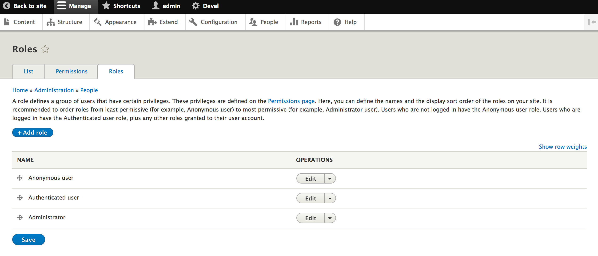

# Managing Users

## Overview

Anyone who visits your Drupal site is a user. There are three different default users in Drupal:

- _Anonymous user_. This is anyone who is not logged in.
- _Authenticated user_. These are all users who have an account on your site and can log in.
- _Administrator_. This is a special class of user that can access the administrative menus in your Drupal site and make changes.

Islandora adds an additional default role:

- _fedoraAdmin_. This is a specialized role needed for a user to write to Fedora from Islandora.

Additional user roles can be created and assigned customized permissions, as described below.

## Before you start

- This How-To assumes a very basic familiarity with Drupal.
- This How-To is generally appliable for any Islandora site, but the examples given are taken from an Islandora demo using the (optional) **[Islandora Defaults](https://github.com/Islandora/islandora_defaults)** configuration. This configuration is deployed automatically if you build your Islandora site using the [Ansible Playbook](/installation/playbook), [ISLE with Docker-Compose](/installation/docker-compose), or are using the [sandbox or a Virtual Machine Image](https://www.islandora.ca/get-islandora).

## How to Add a User
1. Log in to Drupal. You will need the _Administrator_ role to manage users.
1. Click the **Manage** tab from the top toolbar.
1. Select the **People** tab from the resulting menu to bring up the *People* page.

1. Click the blue **Add user** button to bring up the *Add user* page.
1. Enter all required fields, as indicated by red asterisks, in the *Add user* page.
1. In the *Roles* section, click on the roles that the new user will need.
  - Click on "Administrator" if the new user will need to be able to run administrative tasks in Drupal or Islandora.
  - Click on "fedoraAdmin" if the new user will need to be able to write to Fedora. This is required by the WebAC authentication so Islandora and Fedora can communicate.
1. Review other settings available for a new user such as:
  - Site language
    - *English* selected by default.
  - Contact Settings section
    - *Personal contact form* selected by default.
1. Click on the **Create New Account** button at the bottom of the *Add user* page to finish adding a new user.

To review/edit the permission for each role, in the *People* page click the **Permissions** tab in the set of tabs above the **Add user** button.

## How to Create a New User Role
1. Log in to Drupal. You will need the _Administrator_ role to edit or add roles.
1. Click the **Manage** tab from the top toolbar.
1. Select the **People** tab from the resulting menu.
1. Click the **Roles** tab in the set of tabs above the **Add user** button.
1. Click the blue **Add role** button to bring up the *Add role* page.

1. Name the role in a way that it can be disambiguated from related activities or similar groups.
    * For example: use the course code for a particular class of students working on a particular collection.
1. Click the blue **Save** button.

## How to Edit Role Permissions
1. Log in to Drupal. You will need the _Administrator_ role to edit permissions.
1. Click the **Manage** tab from the top toolbar.
1. Select the **People** tab from the resulting menu.
1. Click the **Roles** tab in the set of tabs above the **Add user** button.

1. To edit the permissions for a role click the **Edit** dropdown menu to the right of a role and select **Edit Permissions** to bring up the *Edit role* page.
1. Scroll down or search for options that have an *Islandora* prefix or contain the word *Islandora*. For example, *Islandora Access: Create terms*.

!!! Tip "Islandora Quick Lessons"
    Learn more with this video on how to [Add a User](https://youtu.be/XSokAFRVBuE).

### Video Walkthrough: Users, Roles, and Permissions

Click the image below to open the **Users, Roles, and Permissions** video tutorial on the Islandora Youtube channel.

See more videos from the Drupal 101 series [here.](https://www.youtube.com/watch?v=meRNdBxaiTE&list=PL4seFC7ELUtogpsYoN8WZLLOjJVRZFGTZ)

## Further Reading

For more information on managing users in Drupal visit the section
[Managing User Accounts](https://www.drupal.org/docs/user_guide/en/user-chapter.html) of Drupal.org.
